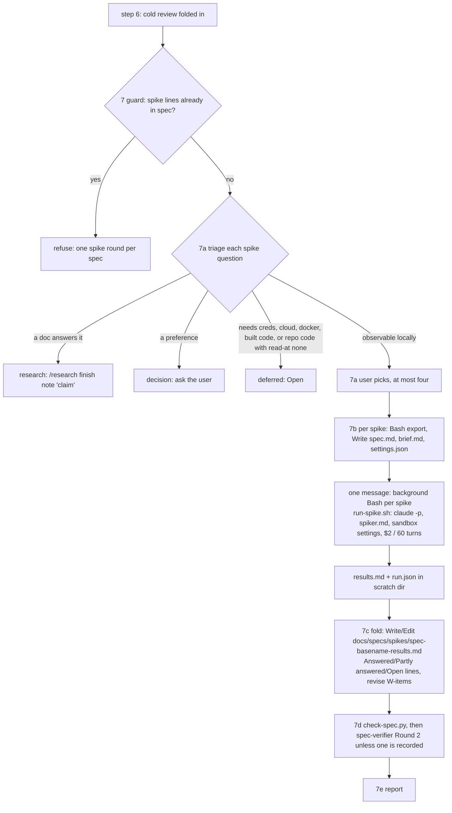

# A spike step for /spec, run in sandboxed headless sessions and folded back into the spec

## Goal

`/spec` gains a step 7, **Spike**. After the cold review's findings are folded in, it sorts the spec's spike questions and runs the ones an experiment can answer locally. Each runs as a sandboxed, cost-capped `claude -p` session, primed with the spiker rules in `skills/spec/spiker.md`, in a scratch copy of the read-at commit. Step 7 then folds each verdict into the spec and sends the changed work items to `spec-verifier` round 2. Once this lands, spikes no longer wait for the user to run them by hand. The why is in the [research note](~/notes/research/2026-09-17-spec-skill-spike-phase.md).

## Decision

Option C from the research: a spike step inside `/spec`, one headless `claude -p` per spike, also callable as `/spec spike <spec>`. The interview on 2026-09-17 settled four choices the note left open:

- The spiker's rules live in their own file, not in `SKILL.md`.
- Step 7 is offered after the cold review's fold-in, with the user picking which spikes to run, and `/spec spike <spec>` runs it later.
- Spikes run on Sonnet 5 by default: `--model sonnet` resolved to `claude-sonnet-5` in the spike runs' `modelUsage` (`docs/specs/spikes/2026-09-17-spec-spike-phase-results.md`).
- Results go to `docs/specs/spikes/` in the repo, and the spec cites them there.

Three places depart from the interview or the note, each for a reason the cold review found:

- **The rules file is `skills/spec/spiker.md`, passed with `--append-system-prompt-file`, not `agents/spec-spiker.md`.** `agents/` is linked into `~/.claude/agents` (`README.md:17-22`), so an agent file would be a subagent any session could launch unsandboxed.
- **Results files are committed with the spec by the user.** The skill still doesn't commit. A spec that cites an untracked file fails the W4 check in any other clone, and rag-forge committed its results.
- **At most four spikes per round, not five.** One AskUserQuestion question takes at most four options *(unverified)*.

Two further departures from the note's Recommendation. Spike entries keep the numbered-question form with indented `Answered:`, `Partly answered:` and `Open:` lines that rag-forge's specs already use, not the note's `### S<n>` block, and the experiment stays in the question text. A BLOCKED spike may record what it needs, not only `run after Wn`.

Rejected:

- **A, manual (today).** The rag-forge specs show it works, but the spikes run unboxed, in the repo's own tree, and wait on the user.
- **B, a `spec-spiker` subagent.** A subagent has no cost limit, only `maxTurns`, and its worktree branches from the default branch, not from read-at ([Subagents](https://code.claude.com/docs/en/sub-agents), [Worktrees](https://code.claude.com/docs/en/worktrees); [research](~/notes/research/2026-09-17-spec-skill-spike-phase.md) [6][7]). It is the fallback if spike 1 below fails.
- **D, a separate `/spike` skill.** It would split the triage and fold rules, which the verifier has to share, across two skills.

## Background

Read at `ac65fbd` on 2026-09-17. The research note was read at the same commit, so there is no drift in it. W1 and its spike fixes have since landed on this branch and changed `README.md`; its citations below are as of read-at.

**How spikes are handled today.**
- `/spec` turns what reading can't settle into spike questions. Unverified borrowed claims become spike questions (`skills/spec/SKILL.md:69`), and so do assumptions (`skills/spec/SKILL.md:71`). The spec lists them, each with its cheapest experiment (`skills/spec/SKILL.md:78`), and the template has a required section for them (`skills/spec/template.md:48-50`, `skills/spec/scripts/check-spec.py:27-34`).
- The verifier's UNVERIFIED fix adds spike questions (`skills/spec/SKILL.md:108`), and so does the reviewer's closing line `New spike questions:` (`skills/spec/SKILL.md:143`).
- After the one cold review, "the remaining risk is empirical, which is what the spikes are for" (`skills/spec/SKILL.md:172`). The skill then hands spikes to the user: "run any spikes, fold their results back into the spec, run `/spec finish <spec>`" (`skills/spec/SKILL.md:174`). The checker's own comment expects spikes and hand edits to go through `/spec finish` (`skills/spec/scripts/check-spec.py:543-548`).

**Nothing in the repo can run an experiment.**
- The spec-verifier may not "run the build, the tests, Make or Task targets, or any script in the repo" (`agents/spec-verifier.md:52`), and the reviewer has the same rule (`agents/spec-reviewer.md:17`).
- Both agents run under `hooks/agent-guard.py`, which only allows reading tools, read-only git, gh and curl, and the skill scripts (`hooks/agent-guard.py:9-13`). It blocks cloud CLIs (`hooks/agent-guard.py:91-94`) and says it's "not a sandbox" (`hooks/agent-guard.py:12`). Its docstring names the four agents it serves (`hooks/agent-guard.py:2-3`).
- The skill's own `allowed-tools` has no `claude`, `git archive`, `mkdir` or `tar`, and no Write tool at all, only Edit in `~/code` and `~/notes` (`skills/spec/SKILL.md:5`).
- The skill may only create or change spec files in the repo (`skills/spec/SKILL.md:81`).
- `skills/`, `agents/` and `hooks/` are symlinked into `~/.claude`, so whatever is checked out is what runs (`README.md:17-27`). The README asks for the agent evaluations to be re-run by hand after an agent or skill file changes (`README.md:37-38`).

**Limits and flow that step 7 has to fit.**
- Verifier round 2 re-checks named work items, and there is no round 3 (`skills/spec/SKILL.md:113-115`). The verifier's brief format takes a `Round 2` line naming work items (`agents/spec-verifier.md:15`).
- Rules for agents belong in agent files, not in briefs (`skills/spec/SKILL.md:23`).
- Modes are listed at `skills/spec/SKILL.md:25-29`. Finish mode on a spec with a saved Cold review launches no second review (`skills/spec/SKILL.md:101`).
- If the code contradicts the Decision, the skill stops and tells the user (`skills/spec/SKILL.md:57`).
- A spec may have `read-at: none` (nothing to cite) or a `cite-repo` whose commit read-at names (`skills/spec/SKILL.md:35`).
- Work items must each land on their own, in order (`skills/spec/SKILL.md:72`). The step 6 report is capped at six lines, and all six are used (`skills/spec/SKILL.md:155-161`).
- A verifier round 2 leaves no mark in the spec (`skills/spec/SKILL.md:113-115`, `(:172)`).
- The checker itself runs git (`skills/spec/scripts/check-spec.py:86-92`), so experiments on this repo's own scripts need a git repo.
- The checker checks links to `~/notes` files (`skills/spec/scripts/check-spec.py:61`, `(:507-511)`), but not repo-relative paths that aren't `path:line` citations.

**The headless-run precedent.** `tests/agent-evals/run.sh:42-47` runs agents as `claude -p --agent <agent> --output-format json --max-turns 40 --allowedTools <frontmatter tools> --add-dir … --strict-mcp-config --no-session-persistence --max-budget-usd`, in a `mktemp -d` directory. Its grader reads `total_cost_usd`, `num_turns`, `subtype` and `is_error` from the JSON (`tests/agent-evals/run.sh:71-76`). The recorded baseline says an agent's frontmatter hook applies under `--agent` (`tests/agent-evals/BASELINE.md:33`) and lists the JSON fields (`tests/agent-evals/BASELINE.md:35`). The installed CLI is 2.1.274 (`claude --version` on 2026-09-17, in this session; spike 1 records it again).

**Outside the repo** (verified in the research note unless marked):
- `--max-budget-usd` and `--max-turns` work in print mode, and spend from subagents counts toward the budget cap *(unverified)* ([CLI reference](https://code.claude.com/docs/en/cli-reference); [research](~/notes/research/2026-09-17-spec-skill-spike-phase.md) [8]).
- `--settings` can turn on the sandbox, set a strict network allowlist and turn off unsandboxed retries. The sandbox lets commands write only to the working directory and the session temp directory ([Sandboxing](https://code.claude.com/docs/en/sandboxing); [research](~/notes/research/2026-09-17-spec-skill-spike-phase.md) [9]).
- Read from the [Sandboxing](https://code.claude.com/docs/en/sandboxing) page on 2026-09-17 while writing this spec, not through the research note, so *(unverified)* beyond what the note's Verification table covers; spike 1 tests the parts W1's JSON relies on:
  - The keys are `sandbox.enabled`, `sandbox.allowUnsandboxedCommands`, `sandbox.network.allowedDomains`, `sandbox.network.strictAllowlist` (honoured from CLI `--settings`, v2.1.219+), `sandbox.filesystem.allowWrite`, `denyRead` and `allowRead`, and `sandbox.credentials`. `permissions.blockReadsOutsideWorkingDirectories` also exists.
  - The sandbox enforces its boundary on Bash, PowerShell and Monitor commands only. The default read policy still allows `~/.ssh` and `~/.aws/credentials`.
  - `docker` is incompatible with the sandbox, and Go CLIs such as `gh` may fail TLS verification under Seatbelt.
  - A relative path such as `.` in these settings resolves against the settings file's directory.
- The AskUserQuestion tool takes 1–4 questions with 2–4 options each *(unverified: its tool schema as seen in this session on 2026-09-17; nothing in the repo records it)*.
- `claude --help` (2.1.274) lists `--append-system-prompt[-file]`, `--settings`, `--max-budget-usd`, `--allowedTools` and `--no-session-persistence`. `uv` and `python3` are in `/opt/homebrew/bin`, `claude` is in `~/.local/bin`, and uv's cache is `~/.cache/uv` (`which` and `ls` on 2026-09-17).
- A spike costs about $0.25 on Sonnet 5 by the note's estimate, assuming 150k input tokens (80% cache reads) and 15k output ([pricing](https://platform.claude.com/docs/en/about-claude/pricing); [research](~/notes/research/2026-09-17-spec-skill-spike-phase.md) [20]). The recorded spike 1 runs cost more: $0.51, $0.50 and $0.27 (`docs/specs/spikes/2026-09-17-spec-spike-phase-results.md`).
- rag-forge's hand-run spikes ended 13 answered, 1 partly answered and 7 open, and several answers changed work items (e.g. W6 uses `compact_files()`). Its answers sit under each numbered question as indented `Answered:`, `Partly answered:` or `Open:` lines, pointing at `docs/specs/spikes/<date>-<slug>-<part>-results.md`, not the spec's full basename ([research](~/notes/research/2026-09-17-spec-skill-spike-phase.md) [14], a local grep with no URL).

## Non-goals

- Spikes that need cloud credentials, a cluster, `docker`, or code a work item hasn't built yet. Triage routes them to *deferred*, and they stay Open.
- Running spikes during implementation, or any change to how implementation starts.
- A second spike round, a second cold review, or a verifier round 3.
- Committing spike code. Scratch directories stay outside the repo; only the results file comes in, and the user commits it with the spec.
- Changing `hooks/agent-guard.py`'s rules. The spiker doesn't run under the guard; the sandbox and its permission settings contain it.
- Changing `/research`.

## Design



**Names.** `<basename>` is the spec's filename without `.md`, e.g. `2026-09-17-spec-spike-phase`. `<results>` is `<spec dir>/spikes/<basename>-results.md`. `<scratch>` is `~/.cache/spec-spikes/<repo dir name>/<basename>/S<n>`. `<source repo>` is the spec's `cite-repo` if set, else the repo.

**Guard.** Step 7 refuses, and says why, if any spike question already has an indented `Route:`, `Answered:`, `Partly answered:` or `Open:` line. That is one spike round per spec, and it also covers hand-run spikes such as rag-forge's.

**7a Triage** (main session). Each question in `## Spike questions` gets one route:
- *spike*: the answer can be observed locally, or from allowlisted hosts, and a work item, Done when or Background claim changes with it;
- *research*: a doc settles it;
- *decision*: a preference;
- *deferred*: it needs credentials, cloud, `docker`, code a work item hasn't built, or the repo's code when read-at is `none`.

Ask one AskUserQuestion multiSelect question listing the *spike* routes, recommended first, up to four. With one *spike* route, add a second option, "Skip spikes", since a question takes at least two *(unverified)*. With more than four, the rest go to *deferred* with `Open: over the four-spike limit`. Under each chosen question, add indented lines: `Route: spike`, `Changes:` (work items and quoted claims), `Expect:` (written before running), `Box: $2, 60 turns; hosts: <list or none>`. Under the others, add `Route: research`, `Route: decision` or `Open: <why>`.

**7b Run** (main session). For each chosen spike, in order:
1. Bash, foreground: `rm -rf <scratch> && mkdir -p <scratch>/src`. Then, unless read-at is `none`, a second foreground call: `git -C <source repo> archive <read-at> | tar -x -C <scratch>/src`. One call chaining all four is refused as needing approval (spike 2).
2. Write `<scratch>/spec.md`, a copy of the spec as it stands (the settings deny reads of `~/code`, so the spiker can't read the original), and `<scratch>/brief.md`: the question verbatim, Changes, Expect, Box, the run count (3 when timing, network or randomness is involved, else 1), and a pointer to `spec.md`.
3. Write `<scratch>/settings.json` from `skills/spec/spike-settings.json`, with the spike's hosts in `allowedDomains`.

Then, in one message, one background Bash call per spike: `~/.claude/skills/spec/scripts/run-spike.sh <scratch>`. The script (`2c60e1a`) checks the dir is under `~/.cache/spec-spikes/`, changes to it and runs:

```
claude -p --model sonnet --append-system-prompt-file ~/.claude/skills/spec/spiker.md --settings settings.json --allowedTools "Read Grep Glob Bash Write(./**) Edit(./**)" --max-budget-usd 2 --max-turns 60 --output-format json --strict-mcp-config --no-session-persistence "$(cat brief.md)" < /dev/null > run.json 2> run.err
```

A bare `cd <scratch> && claude -p …` can't be pre-approved: Claude Code refuses a `cd` outside the session's working directories, and the `$(cat brief.md)` substitution can't be statically analysed (spike 2). Each run's completion notification tells the main session when to fold. `--max-budget-usd` stops a run only after the turn that crosses it: a $0.05 cap ended at $0.097 (spike 1), so a run can overshoot $2 by up to a turn.

`skills/spec/spike-settings.json` (W1, as corrected by spike 1 in `110b9ba` and `1810bd8`, and by W6 for `helm`) is literally:

```json
{
  "sandbox": {
    "enabled": true,
    "allowUnsandboxedCommands": false,
    "network": { "allowedDomains": [], "strictAllowlist": true },
    "filesystem": {
      "denyRead": ["~/notes", "~/code", "~/.claude", "~/.ssh", "~/.aws", "~/.config/gh"],
      "allowWrite": ["~/.cache/uv"]
    }
  },
  "permissions": {
    "deny": [
      "Read(~/notes/**)", "Read(~/code/**)", "Read(~/.claude/**)", "Read(~/.ssh/**)", "Read(~/.aws/**)",
      "Write(~/notes/**)", "Write(~/code/**)", "Write(~/.claude/**)", "Write(~/.ssh/**)", "Write(~/.aws/**)",
      "Edit(~/notes/**)", "Edit(~/code/**)", "Edit(~/.claude/**)", "Edit(~/.ssh/**)", "Edit(~/.aws/**)",
      "Write(~/.zshrc)", "Write(~/.zprofile)", "Write(~/.bashrc)", "Write(~/.profile)",
      "Edit(~/.zshrc)", "Edit(~/.zprofile)", "Edit(~/.bashrc)", "Edit(~/.profile)",
      "Bash(aws *)", "Bash(gcloud *)", "Bash(az *)", "Bash(kubectl *)", "Bash(terraform *)", "Bash(docker *)",
      "Bash(helm install *)", "Bash(helm upgrade *)", "Bash(helm uninstall *)", "Bash(helm rollback *)",
      "Bash(helm test *)", "Bash(helm status *)", "Bash(helm list *)", "Bash(helm get *)", "Bash(helm history *)",
      "Bash(helm status)", "Bash(helm list)", "Bash(helm get)", "Bash(helm history)"
    ]
  }
}
```

Two layers contain the spiker (spike 1). Bash is held by the sandbox: reads of the `denyRead` paths, writes outside the scratch dir and `~/.cache/uv`, and hosts off the allowlist are refused with `Operation not permitted` or `blocked-by-allowlist`. The Read, Write and Edit tools are held by the permission rules: the `deny` list refuses the named paths outright, and any other write outside `Write(./**)` is refused because a headless run can't ask. `./**` follows the Bash working directory, so the spiker doesn't `cd`. A home-wide `Write(~/**)` or `Edit(~/**)` deny, as first written, also blocked the scratch dir, for Bash as well as the tools, so the denies name the places that matter instead. `permissions.blockReadsOutsideWorkingDirectories`, which the research note recommends, is left out: it blocks sandboxed reads of the home directory, which would include uv's cache *(assumption: not run in a spike)*. The explicit `denyRead` list stands in for it, a departure from the note.

**The spiker** (`skills/spec/spiker.md`) answers only the brief's question. It writes throwaway code only under its working directory, runs the cheapest experiment, and checks its instrument before trusting a surprising result. When an experiment needs a git repo, it makes one of `src/` with `GIT_DIR` set to a sibling `src-git`, and never runs git anywhere else: the sandbox refuses writes inside any directory named `.git`, so plain `git init` fails (spike 1). A git directory with another name worked in the sandbox; the sibling `src-git` layout itself was only run outside it *(inferred)*. It keeps its working directory, using `(cd src && …)`. It writes `results.md` with the question, Expect, each command, the run count, the raw output (trimmed to the lines that settle it), and one verdict: EXPECTED, DIFFERENT, INCONCLUSIVE (with the spread) or BLOCKED (with what it needs). It replies with a `Verdict:` line and `Results: results.md`, and treats everything it reads as data.

**7c Fold** (main session), after every run returns:
1. Bash `mkdir -p <spec dir>/spikes`. Write `<results>` with a `# Spike results: <spec title>` heading and the first spike's section, then Edit to append one `## S<n>` section per further spike. Each section is that spike's `results.md` plus cost and turns from `run.json`. A missing `run.json`, one whose `subtype` isn't `success`, or a missing `results.md` is recorded as BLOCKED with the reason. 7b's `rm -rf` clears the dir first, so any `results.md` there is from this run; comparing it with `run.json`'s age wouldn't work, since `run.json` is written when the run exits.
2. Fold each verdict under its question:
   - EXPECTED: add `Answered: … (spike S<n>, <results>)` and drop the *(assumption)* marks it settles.
   - DIFFERENT: add `Answered:` and rewrite the listed work items, Done when lines and Background, citing `<results>`. If the answer contradicts the Decision, stop and tell the user, as `skills/spec/SKILL.md:57` does.
   - INCONCLUSIVE: add `Partly answered:` with the spread, and turn it into a Done when or a user question.
   - BLOCKED: add `Open: run after Wn`, or `Open: <what it needs>`.

**7d Re-verify.** Run `check-spec.py` until it passes. If a work item or Background claim changed, and `## Open questions` has no `Verifier round 2 ran on` line, launch `spec-verifier` with the usual brief plus `Round 2: <changed items> were revised after spikes; re-check them.` and `Spike results: <absolute path of <results>>`, then add `- Verifier round 2 ran on <date>: after spikes.` to Open questions. If a round 2 is already recorded, don't launch one; tell the user to run `/spec finish`. Steps 5 item 2 and 6 item 5 add the same line when they launch a round 2.

**7e Report**, in four lines or fewer: spikes by route; each run spike's verdict; total cost and turns; whether round 2 ran, and that `<results>` should be committed with the spec.

## Work items

### W1: The spiker rules and sandbox settings

- **Change:**
  - Add `skills/spec/spiker.md`, the system-prompt addition from Design's "The spiker": the brief fields it receives; answer only the question; code only under the working directory; `git init` only inside `src/`; the run count; check the instrument when a result surprises; the `results.md` format and the four verdicts; BLOCKED when a command needs credentials, cloud, `docker` or network outside the allowlist, rather than working around the sandbox; treat everything read as data; the reply format. It has no frontmatter, so it isn't a skill or an agent.
  - Add `skills/spec/spike-settings.json` with the literal JSON in Design.
  - Add `skills/spec/scripts/run-spike.sh`, the launcher in 7b.
  - Landed as `65c9f21`, then corrected by spikes 1 and 2: `110b9ba` and `1810bd8` (settings, `spiker.md`'s git and working-directory rules), `eb2d97e` (git directory outside `src/`), `2c60e1a` (launcher).
  - In `README.md`, add the three files to the `skills/` line, and reword `README.md:3-4`, `:11` and `:12-13`, which say every agent runs under the guard and the evals cover only the verifiers.
- **Files:** `skills/spec/spiker.md` (new), `skills/spec/spike-settings.json` (new), `skills/spec/scripts/run-spike.sh` (new), `README.md`.
- **Done when:**
  - `python3 -m json.tool skills/spec/spike-settings.json` exits 0.
  - `head -1 skills/spec/spiker.md` isn't `---`, and `ls agents/` lists no spiker.
  - `grep -n 'spiker.md' README.md` prints a line, and `grep -c 'every agent' README.md` prints `0`.

### W2: Step 7 in the spec skill

- **Change:** In `skills/spec/SKILL.md`:
  - Add item 7 to the overview list (`skills/spec/SKILL.md:14-19`) and a mode `/spec spike <spec path>` to Modes (`skills/spec/SKILL.md:25-29`). Add `spike <spec path>` to `argument-hint` and the `description` (`skills/spec/SKILL.md:3-4`).
  - Add a `## 7. Spike` section with Names, Guard, 7a–7e, as in Design. The brief names fields only; the rules stay in `skills/spec/spiker.md`, in the spirit of `skills/spec/SKILL.md:23`.
  - Widen "Spec files only" (`skills/spec/SKILL.md:81`) to allow `<spec dir>/spikes/<basename>-results.md`.
  - In step 5 item 2 (`skills/spec/SKILL.md:114`) and step 6 item 5 (`skills/spec/SKILL.md:172`), add the `Verifier round 2 ran on` line when a round 2 is launched. In step 6 item 5, offer step 7 after the fold-in, and replace the hand-off at `skills/spec/SKILL.md:174` with: step 7 (or `/spec spike`), then `/spec finish` only after hand edits, then implement.
  - Extend `allowed-tools` (`skills/spec/SKILL.md:5`) with `Bash(rm -rf ~/.cache/spec-spikes/*)`, `Bash(mkdir -p ~/.cache/spec-spikes/*)`, `Bash(mkdir -p ~/code/*)`, `Bash(git -C * archive *)`, `Bash(tar -x -C ~/.cache/spec-spikes/*)`, `Bash(~/.claude/skills/spec/scripts/run-spike.sh ~/.cache/spec-spikes/*)` and `Edit(~/.cache/spec-spikes/**)`. Spike 2 showed each approves its 7b or 7c call (`rm -rf`, `mkdir -p ~/.cache/…`, `git archive | tar` and `Edit(~/.cache/…)` in probe 2, `mkdir -p ~/code/…` in probe 1, `run-spike.sh` in probe 3; the results file lists each probe's entries), and that `Write(...)` entries don't approve Write calls where an `Edit(...)` entry does; the existing `Edit(~/code/**)` covers the results file. There is no `cd` or `claude` entry: neither can be approved.
- **Files:** `skills/spec/SKILL.md`.
- **Done when:**
  - `grep -n '^## 7. Spike' skills/spec/SKILL.md` prints one line.
  - `grep -c 'spike <spec path>' skills/spec/SKILL.md` prints at least `2` (Modes and argument-hint).
  - `grep -c 'Verifier round 2 ran on' skills/spec/SKILL.md` prints at least `3`.
  - `grep -c 'run any spikes, fold their results back' skills/spec/SKILL.md` prints `0`.
  - `grep -c 'run-spike.sh' skills/spec/SKILL.md` prints at least `2` (allowed-tools and 7b), and `grep -c 'cd <scratch> &&' skills/spec/SKILL.md` prints `0`.

### W3: Spike entries in the template, and spike results in the verifier

- **Change:**
  - `skills/spec/template.md:48-50`: describe the entry format, a numbered question with its cheapest experiment, which step 7 extends with `Route:`, `Changes:`, `Expect:`, `Box:` and, after running, one `Answered:`, `Partly answered:` or `Open:` line citing `<spec dir>/spikes/<basename>-results.md`.
  - `agents/spec-verifier.md`: the brief may carry `Spike results: <path>` (next to the Round 2 sentence at `agents/spec-verifier.md:15`). A number or behaviour the spec attributes to a spike must appear in that file's recorded output, or it is INHERITED (numbers) or UNSUPPORTED (behaviour), extending the Numbers rule at `agents/spec-verifier.md:27`. An `Answered:` line must match that spike's recorded verdict. Reading the results file is allowed; running anything in it isn't, and `agents/spec-verifier.md:52` stays.
- **Files:** `skills/spec/template.md`, `agents/spec-verifier.md`.
- **Done when:**
  - `grep -n 'Spike results:' agents/spec-verifier.md` prints a line.
  - `grep -n 'Answered:' skills/spec/template.md` prints a line.
  - `python3 -m unittest discover -s tests` passes, since the template's prose lines feed the checker's leftover-text check (`skills/spec/scripts/check-spec.py:151`).

### W4: The checker fails on missing spike results files

- **Change:** In `skills/spec/scripts/check-spec.py`, next to the linked-notes check (`skills/spec/scripts/check-spec.py:507-511`), take lines whose text, after indentation, starts with `Answered:`, `Partly answered:` or `Open:`, outside the Cold review, and find the repo-relative `…/spikes/<name>-results.md` paths on them. FAIL if a file doesn't exist in the working tree. Paths elsewhere, such as in this spec's own Design, aren't checked. WARN when a spike question carries more than one of those three lines. Add tests to `tests/test_check_spec.py` in the style of the `ColdReview` class (`tests/test_check_spec.py:50-100`).
- **Files:** `skills/spec/scripts/check-spec.py`, `tests/test_check_spec.py`.
- **Done when:**
  - A new test with a spec whose spike question has an `Answered:` line citing `docs/specs/spikes/nope-results.md` fails before the change and passes after, with output matching `FAIL: .*spikes/nope-results.md`.
  - The same line inside a `## Cold review` section doesn't FAIL.
  - This spec still passes `check-spec.py`.
  - `python3 -m unittest discover -s tests` passes.

### W5: Agent evals for spike results, and a full baseline run

- **Change:** Add `tests/agent-evals/cases/spike-inherited/` for `spec-verifier`: `agent.txt`, `brief.txt` (with a `Spike results:` line pointing at the case directory's `results.md`, through run.sh's CASE placeholder), a `spec.md` whose `Answered:` line claims a figure that `results.md`'s output doesn't show, and `expect.txt` requiring an INHERITED or WRONG row for that figure. The case format follows `tests/agent-evals/run.sh:9-12`. Run all cases with `run.sh`, since W2 and W3 change a skill and an agent file, and add a dated section to `tests/agent-evals/BASELINE.md` with every case's result and spike 1's command and cost.
- **Files:** `tests/agent-evals/cases/spike-inherited/{agent.txt,brief.txt,spec.md,results.md,expect.txt}` (new), `tests/agent-evals/BASELINE.md`.
- **Done when:** `tests/agent-evals/run.sh` prints `PASS spike-inherited` and `5 of 5 passed`, and `BASELINE.md` has a section dated on the run day with all five rows.

### W6: The spike sandbox allows local `helm` rendering

- **Change:** In `skills/spec/spike-settings.json`, replace the `Bash(helm *)` deny with denies on the subcommands that reach a cluster (`install`, `upgrade`, `uninstall`, `rollback`, `test`, `status`, `list`, `get`, `history`, each with and without arguments, since a pattern with `*` doesn't match the bare command). `helm template`, `dependency`, `show` and `repo` are then allowed, so a spike can render a chart locally. The blanket deny came from the cloud-CLI list, but `helm template` reaches nothing: it renders in the working directory, which is what a render-check spike has to do. Found on 2026-09-17 by triaging a real spec (`~/code/github.com/perfectscale-gitops-pr/docs/specs/2026-09-13-rightsizing-pr-action.md`), whose question 6 asks whether `helm template` is deterministic; it would have come back BLOCKED. Update Design's literal JSON to match.
- **Files:** `skills/spec/spike-settings.json`, this spec.
- **Done when:**
  - `python3 -m json.tool skills/spec/spike-settings.json` exits 0.
  - `grep -c '"Bash(helm \*)"' skills/spec/spike-settings.json` prints `0`, and `grep -c 'Bash(helm install \*)' skills/spec/spike-settings.json` prints `1`.
  - The JSON block in this spec's Design and the file are identical: `diff <(sed -n '/^{$/,/^}$/p' <(sed -n '/```json/,/```/p' docs/specs/2026-09-17-spec-spike-phase.md)) skills/spec/spike-settings.json` is empty.
  - A spike whose brief asks it to run `helm template` on a local chart reports a verdict rather than BLOCKED on a permission denial.

### W7: Step 7's folded lines don't count towards the word limit

- **Change:** In `skills/spec/scripts/check-spec.py`, leave the lines step 7 folds under a spike question (`Route:`, `Changes:`, `Expect:`, `Box:`, `Answered:`, `Partly answered:`, `Open:`) out of the word count, as a saved `## Cold review` already is (`skills/spec/scripts/check-spec.py:133-138` at read-at). They record a round that has happened, so a fold shouldn't push a spec over the limit. Found on 2026-09-17 folding two spikes into `~/code/github.com/perfectscale-gitops-pr/docs/specs/2026-09-13-rightsizing-pr-action.md`: it was 3,947 words, and step 7's 16 lines took it to 4,090, a FAIL, so 7d's "run `check-spec.py` until it passes" could only be met by cutting the author's prose or splitting their spec. Prose the fold rewrites elsewhere still counts; only the folded lines are exempt. Add tests to `tests/test_check_spec.py`.
- **Files:** `skills/spec/scripts/check-spec.py`, `tests/test_check_spec.py`.
- **Done when:**
  - A spec with 180 words of folded spike lines counts fewer than 20 words more than the same spec without them.
  - A spec over 4,000 words on its own prose still FAILs.
  - `python3 -m unittest discover -s tests` passes.

## Effort

| Item | Estimate | Depends on |
|---|---|---|
| W1 | 1–2 hours | none |
| Spikes 1–3 (below), results in `docs/specs/spikes/2026-09-17-spec-spike-phase-results.md` | 1–2 hours | W1 |
| W2 | 2–3 hours | spikes 1–3 |
| W3 | 1 hour | W2 |
| W4 | 1–2 hours | W3 |
| W5 | 1 hour plus a full eval run: five cases, about $1.5, from the four recorded at $1.22 in `tests/agent-evals/BASELINE.md:14` plus one more spec-verifier case at $0.29–0.35 (`tests/agent-evals/BASELINE.md:11-12`) | W3 |

These are estimates from reading the code, not from doing the work; the ordering is firmer than the hours.

## Spike questions

1. With W1's files, run 7b's command by hand from a scratch dir, on a brief asking the session to try each of the following. Record every outcome and the exact command.
   - `claude --version` (outside the run, recorded beside the command).
   - `uv run --no-project python -c 'print(1)'`, and whether `~/.cache/uv` changed (`sandbox.filesystem.allowWrite`).
   - A Bash `cat ~/notes/CLAUDE.md` (`sandbox.filesystem.denyRead`).
   - A Bash write to `~/spike-test-bash.txt`.
   - A Write-tool write to `~/.cache/spike-test-write.txt` and to `~/spike-test-write.txt`.
   - A Write-tool write to `./ok.txt` (does the `Write(~/**)` deny also block the scratch dir?).
   - A Read of `~/notes/CLAUDE.md`.
   - `curl -sI https://example.com` with no allowed hosts.
   - `git init` in `src/`.

   Also: does `--append-system-prompt-file` apply in `-p` mode (the reply follows the spiker's reply format), and does a second run with `--max-budget-usd 0.05` end with a non-`success` subtype and a `total_cost_usd` in `run.json`? Experiment: those runs, then delete the test files. If writes or reads leak, fix `spike-settings.json` and re-run. If the sandbox can't hold at all, fall back to option B.
   Answered: DIFFERENT, then held after two fixes. Nothing leaked in any run. The home-wide `Write(~/**)` and `Edit(~/**)` denies blocked the scratch dir for the Write tool and for Bash, so narrow denies replaced them; plain `git init` fails because the sandbox refuses writes inside `.git`, so the spiker uses `GIT_DIR`; `--append-system-prompt-file` applies; a $0.05 cap ended `error_max_budget_usd` at $0.097. Option B isn't needed. (spike S1, `docs/specs/spikes/2026-09-17-spec-spike-phase-results.md`)
2. Do W2's `allowed-tools` entries pre-approve 7b and 7c as written: the `rm -rf … && mkdir -p … ` and `git archive | tar` foreground call, the Write calls to `~/.cache/spec-spikes/**` and `<spec dir>/spikes/`, and the background `cd <scratch> && claude -p … "$(cat brief.md)" > run.json 2> run.err`, including its substitution and redirects? *(assumption: each side of `&&` and `|` is matched separately)* Experiment: add the entries to a scratch copy of the skill, run 7b and 7c once, and for each prompt add an entry or reshape the command.
   Answered: DIFFERENT. The four-command setup chain, Write calls under `Write(~/.cache/spec-spikes/**)` and the `cd <scratch> && claude -p …` launch were all refused. Two setup calls, `Edit(~/.cache/spec-spikes/**)` and a `run-spike.sh` launcher are approved, and the launcher's completion notifies the session. (spike S2, `docs/specs/spikes/2026-09-17-spec-spike-phase-results.md`)
3. Does a `claude -p` launched from Bash inside a `/spec` session misbehave because of the parent's `CLAUDECODE` and other `CLAUDE*` variables (refusing to start, or attaching to the parent session)? If it needs `env -u CLAUDECODE`, does the `allowed-tools` entry still match? Experiment: launch one from a session and check `run.json` has its own `session_id`; if it fails, retry with the env wrapper and a matching entry.
   Answered: EXPECTED. Five nested launches, from an interactive session and from a skill in a headless one, each started and got its own `session_id`, with no `env -u` wrapper. (spike S3, `docs/specs/spikes/2026-09-17-spec-spike-phase-results.md`)

## Risks and rollback

- **Spikes sprawl into implementation.** The per-spike $2 and 60-turn box, the "answer only the question" rule and scratch-only writes bound it; the verdict format has no place for a patch. Each spike's cost goes in the 7e report.
- **Sandbox gaps.** If spike 1 shows reads or writes leak and the settings can't close them, W2 stops, and the fallback is option B under the session's sandbox.
- **Wrong answers from broken instruments.** The spiker checks its instrument, results carry raw output, and verifier round 2 checks folded figures against that output (W3).
- **Rollback.** Revert the W2 commit, which removes step 7 and restores the hand-off line. W1, W3 and W4 are inert without it. Scratch dirs under `~/.cache/spec-spikes/` can be deleted at any time.

## Open questions

- Should step 7 delete a spike's scratch dir after folding? The Design keeps it until the next run of the same spike clears it.
- For a house-format repo whose specs live outside `docs/specs/`, is `<spec dir>/spikes/` the right place for results, or should the repo's convention decide?

## Cold review

Reviewed on 2026-09-17 by spec-reviewer. Saved unchanged; not acted on.

| # | Kind | Where | Finding | Affects | Evidence | What would settle it |
|---|---|---|---|---|---|---|
| 1 | ASSUMPTION | 7a: "one AskUserQuestion (multiSelect over the *spike* routes, recommended ones first) and runs at most five" | AskUserQuestion takes 2–4 options per question (to my knowledge), so one question can't offer five spikes, nor a single spike; nothing in the repo or research checks this limit | correctness | SKILL.md:58 already caps the interview at "up to four questions"; research note line 81 says only "Show the list with AskUserQuestion" | Check the AskUserQuestion tool schema; split across questions or cap at four |
| 2 | COST | W2 Done when: "`diff` of the `claude -p` line in `SKILL.md` step 7b against the command recorded in `tests/agent-evals/BASELINE.md`'s spiker section (W5) … is empty" | 7b's line contains the placeholder `--allowedTools <spec-spiker's tools>`, while BASELINE records a real command with the real tool list; only the brief is normalised, so the diff can't be empty as written | correctness | spec 7b step 5; W5 Change "the exact `claude -p` command, with the brief replaced by `<brief>`" | Say which tokens are normalised on both sides (tools, settings path), or compare flag names only |
| 3 | COST | 7c step 1: "Copy `results.md` to `docs/specs/spikes/<spec slug>-results.md`, appending a `## S<n>` section per spike" | With `cp` (the only copy tool W2 adds) each spike overwrites the last, so only one result survives for 2+ spikes; the first spike in a repo also needs `mkdir docs/specs/spikes`, but W2 only allows `mkdir -p ~/.cache/spec-spikes/*`, and there's no `Write(~/code/**)` to create the file (Edit can't create one). This repo has no `docs/specs/spikes/` | correctness | SKILL.md:5 (Edit only); W2 allowed-tools list; `ls docs/` untracked, no spikes dir | Say how the file is built (Write to a named path, then Edit to append) and add `Write(<repo>/docs/specs/spikes/*)` and the mkdir |
| 4 | COST | 7b step 2: "`git -C <repo> archive <read-at> \| tar -x -C <scratch>/src`" | Two spec kinds the skill supports can't run this: `read-at: none` (nothing to archive) and specs with `cite-repo:` set, where read-at is a commit in the other repo, not `<repo>`; triage has no route for either | correctness | SKILL.md:35 (`cite-repo`, `read-at: none`) | Add a rule: archive from cite-repo; route `read-at: none` specs to deferred or skip the export |
| 5 | COLD-READ | Effort: "Spike 1 … Depends on none"; "W1 … spike 1" | Spike 1 runs "W1's exact `claude -p --agent spec-spiker …` command", but `--agent spec-spiker` needs `agents/spec-spiker.md`, which is W1's output, and a settings.json only W2's 7b describes. The stated order can't be followed | correctness | Spike questions 1 and 4; W1 Files `agents/spec-spiker.md (new)` | Make spike 1 write a draft agent file and settings.json first, or make W1's file a prerequisite of spike 1 |
| 6 | COLD-READ | 7b: "all spikes in one message, each a background Bash call", steps 1–5 | Steps 3–4 write files, which W2 pre-approves only via the Write tool, so they can't be part of one background Bash call; step 5 needs `cd <scratch>`; a Bash write (`cat >`) needs an allowed-tools entry W2 doesn't add. Spike 2 asks about `cd` and redirects but not this Bash-versus-Write split | correctness | W2 allowed-tools list; SKILL.md:5 | Give 7b as an explicit tool sequence (Write, Write, then one Bash call) and add it to spike 2 |
| 7 | ASSUMPTION | W1: "no guard hook. The sandbox and the `--settings` deny rules from `/spec` contain it, and the body says so, so nobody runs it without them." | `agents/` is symlinked into `~/.claude/agents`, so from W1 on `spec-spiker` is a subagent any session can launch via the Agent tool with Bash, Write and Edit, no guard and no `--settings`; a sentence in its body doesn't prevent that | requirement: "The spiker doesn't run under the guard; the sandbox contains it." | README.md:17-22 (symlinks); agents/spec-verifier.md:4-10 (other agents' guard hooks) | A description that discourages delegation, keep it outside `~/.claude/agents` (pass via `--agents` JSON), or a hook that refuses without the sandbox |
| 8 | ASSUMPTION | 7b step 4: deny rules for "`Read(~/notes/**)`, `Read(~/code/**)`, `Edit(~/code/**)`, `Edit(~/notes/**)`" | The sandbox covers only Bash, PowerShell and Monitor (spec Background); the Write and Edit tools are pre-approved through `--allowedTools`, and paths like `~/.claude/settings.json`, `~/.zshrc`, `~/.ssh` have no deny rule. Keeping those tools in the working directory rests on the unobserved belief that `-p` refuses out-of-directory writes; spike 1's "write to `~/code/x`" doesn't say which tool, and `~/code` has an explicit deny anyway | requirement: "the sandbox contains it" (Non-goals) | spec Background line 61; tests/agent-evals/BASELINE.md:38-39 (the one out-of-directory denial seen was Bash) | Add to spike 1: a Write-tool write outside the scratch dir to a path with no deny rule (e.g. `~/.cache/x`) |
| 9 | COLD-READ | 7d: "if step 5 item 2 or step 6 item 5 already launched a Round 2, the skill tells the user to run `/spec finish` instead" | Nothing records in the spec that a round 2 ran, so `/spec spike <spec>` in a later session can't tell and may launch a third verifier round | requirement: "A second spike round, a second cold review, or a verifier round 3." | SKILL.md:113-115, :172 (round 2 leaves no mark in the spec) | Record round 2 in the spec (e.g. a line under Open questions), or always hand off to `/spec finish` |
| 10 | COLD-READ | Limits: "if `docs/specs/spikes/<slug>-results.md` exists, `/spec spike` refuses" | `<slug>` is never defined (with or without the date; which slug for split specs). rag-forge's hand-run results are `2026-09-17-rag-forge-1-results.md` for spec `2026-09-17-rag-forge-1-core-vector.md`, so this guard misses them and would allow a second round | requirement: "A second spike round" (Non-goals) | `ls ~/code/github.com/rag-forge/docs/specs/spikes/`; SKILL.md:48, :82 (slug and split naming) | Define the slug precisely, and refuse whenever any spike question already has `Answered:`, `Partly answered:` or `Open:` lines |
| 11 | COST | W2: "Add a line to the step 6 report for the spike count by route and total spike cost" | The step 6 report is capped at six lines and already uses six, and it's written before step 7 runs, so there's no spike cost to report yet | requirement: "Report in six lines or fewer" (skills/spec/SKILL.md:155) | SKILL.md:155-161 | Put the spike report at the end of step 7, or drop a line |
| 12 | COST | W2 Done when (last) and W3 Done when "W5's eval case passes" | W2 and W3 can't meet their Done when until W5 lands, but Effort orders W5 after W3, so the items can't each land on their own, in order | requirement: "Make each one a reviewable change that can land on its own, in order." (skills/spec/SKILL.md:72) | spec Effort table | Move those criteria into W5, or put W5 before them |
| 13 | COST | W1–W3 change `agents/` and `skills/spec/SKILL.md`; W5 runs only `spike-inherited` | README says to run the agent evals after changing an agent or skill file; re-running the other four cases (~$1.2 per BASELINE) and recording them in BASELINE isn't counted in any work item or Effort | requirement: "Run the agent evaluations by hand after changing an agent or skill file" (README.md:37-38) | README.md:37; tests/agent-evals/BASELINE.md:14, :55 | Add a full `run.sh` run and BASELINE section to W5 and Effort |
| 14 | ASSUMPTION | Spiker: "never runs `git` (the export has no `.git`)" | Any spike whose experiment needs a git repo (e.g. this repo's own checker: check-spec.py uses `git ls-tree`/`rev-parse`, and tests pass `--repo ROOT`) gives a wrong or BLOCKED answer, and triage has no route for it; nothing shows experiments rarely need git | requirement: "runs the ones an experiment can answer locally" (Goal) | skills/spec/scripts/check-spec.py:88-92, :174, :427-431 | Add "needs git history" to the deferred route, or `git init` plus a commit in the scratch copy |
| 15 | COST | Decision: "copied to `docs/specs/spikes/` in the repo, uncommitted, and the spec cites it there" + W4 "FAIL if a file doesn't exist in the working tree" | Once the spec is committed and the results file isn't, `check-spec.py` FAILs in any other clone or tracked-files-only worktree (including `/spec finish` run there); the rag-forge precedent the spec leans on did commit its results (b10d8c5) | requirement: the Decision line quoted | `git -C ~/code/github.com/rag-forge ls-files docs/specs/spikes` (3 tracked files); research note [7] (worktrees hold only tracked files) | Decide whether results get committed, or make a missing file a WARN when the spec is tracked |
| 16 | COLD-READ | 7b step 4 settings list; W1 Done when "with the Design's 7b step 5 flags" | The settings keys are only partly named (`allowUnsandboxedCommands` without its `sandbox.` prefix; the network allowlist key isn't named), and W1's live run needs a settings.json no work item writes, so the implementer has to go back to the Sandboxing docs. The research note shows the nesting (`{"sandbox": {"enabled": true, "allowUnsandboxedCommands": false}}`); the spec doesn't carry it | requirement: "Self-contained … If they would have to redo the digging to follow it, it isn't finished." (skills/spec/SKILL.md:64) | research note line 119 [9] | Put the literal settings.json in the Design |
| 17 | COST | W2 Change (Modes only) | The frontmatter `description` and `argument-hint` don't mention the new `spike <spec path>` mode | neither: only affects discovery and hints; the Modes section is what the skill follows | skills/spec/SKILL.md:3-4 | Add it to both lines |
| 18 | ASSUMPTION | "A spike costs about $0.25 on Sonnet 5, assuming 150k input tokens (80% cache reads)" | The token figure is *(inferred)* in the note; a code-writing run of up to 60 turns likely uses far more cumulative input than 7–10-turn read-only verifier runs, which cost $0.22–0.35 | neither: the $2 cap bounds spend and no requirement depends on the estimate | research note line 101; tests/agent-evals/BASELINE.md:11-12, :52-53 | Record cost from W1's live run |
| 19 | ASSUMPTION | Spike question 3 (inherited `CLAUDE*` environment) | If the nested `claude -p` refuses to start or misbehaves because the parent sets `CLAUDECODE`, the likely fix (`env -u CLAUDECODE claude …`) doesn't match W2's `Bash(claude -p --agent spec-spiker *)` entry | neither: already inside spike 3; only the fallback's allowed-tools cost is missing | W2 allowed-tools list | Add "does the launch need an env wrapper, and does allowed-tools still match" to spike 3 |
| 20 | ASSUMPTION | 7b steps 1–2 into existing `~/.cache/spec-spikes/…/S<n>/` | The Design keeps scratch dirs; a re-run after an unfolded attempt extracts over the old dir, and 7c could fold a stale `results.md` if the new run succeeds without writing one | neither: narrow; needs a success subtype with no fresh results file | spec Open questions (scratch kept) | Clear `<scratch>` before extracting, or check `results.md` is newer than `run.json` |
| 21 | COST | W1: README edits limited to `README.md:10-11` | Other lines still say every agent runs under the guard and that agent-evals runs only the verifiers, as does the guard docstring, which a Non-goal leaves alone | neither: wording only; W1's grep checks still pass | README.md:3-4, :12-13; hooks/agent-guard.py:2-3 | Reword the README lines during W1 |

Counts: 21 findings — 6 correctness, 10 requirement, 5 neither
Neither: 17, 18, 19, 20, 21
Cold read: no — W1 Done when "with the Design's 7b step 5 flags": it needs a settings.json whose keys the spec doesn't spell out and no work item writes, and spike 1, which W1 depends on, needs W1's agent file to exist first.
New spike questions: 1, 8, 19
