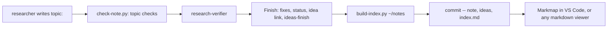

# A topic field and a generated mind-map index for ~/notes

## Goal

Every research note gets one `topic: <area>/<sub-area>` frontmatter field. `/research`'s Finish step rebuilds `index.md` in `~/notes` from those fields and commits it next to the note. The index is a nested markdown outline: topics are headings, research notes are links under them, and idea and decision notes hang under the research note they name. Markmap shows it as a clickable mind map, and any markdown viewer shows it as a list. The why is in the [research note](~/notes/research/2026-09-27-research-notes-mindmap-index.md).

## Decision

Option A from the research: a generated Markmap outline. There's no decision record in `~/notes/decisions/` (the folder is empty), so the note's Recommendation stands.

- B, a generated Mermaid mindmap, is rejected because its nodes can't link to notes ([mermaid #4099](https://github.com/mermaid-js/mermaid/issues/4099), [research](~/notes/research/2026-09-27-research-notes-mindmap-index.md) [9]).
- C, Obsidian's graph or a canvas, is rejected because it needs `related` rewritten as wikilinks ([Obsidian Help: Properties](https://obsidian.md/help/properties), [research](~/notes/research/2026-09-27-research-notes-mindmap-index.md) [20]) *(unverified: not in the note's Verification table)*, and it gives a web of links rather than a topic tree.
- D, doing nothing, is rejected because tags are too coarse to make a tree: a note has several of them, and `ai` is on 62 notes, counted on 2026-09-27 with the tag-listing command in `~/notes/CLAUDE.md` (the research counted 58 before a research note and three idea notes were added in `~/notes` commit 83b78b5, [research](~/notes/research/2026-09-27-research-notes-mindmap-index.md) [4]).
- Moving notes into subfolders is rejected because it breaks every `related` path that names them (the `related` rule in `~/notes/CLAUDE.md`, Rules for a session).

Settled with the user on 2026-09-27: the `~/notes` side (templates, conventions, backfill) is in scope as work items; the "missing" and "more than two levels" topic checks become FAILs after the backfill, while a first-use topic only ever warns; only `/research`'s Finish step rebuilds the index; the research's one-hour trial is a spike question.

## Background

Read at `a69b04a` on 2026-09-27, the same commit the research note was read at, so the code hasn't moved since. The working tree has two other uncommitted specs and their records (`docs/specs/2026-09-26-build-skill-1-tools.md`, `-2-skill.md`), which don't touch these files.

**`/research` Finish step.**
- `allowed-tools` pre-approves the commands the skill runs, script by script (`skills/research/SKILL.md:5`). `build-index.py` isn't among them.
- Every `~/notes` commit names its files after `--`, because another session may have staged files of its own (`skills/research/SKILL.md:19`).
- Section 3 is the Finish step (`skills/research/SKILL.md:87`). Its step 7 runs `ideas-finish.md` at ideas depth (:127), step 8 commits only the files the step created or changed (:128), and step 9 reports (:129-137). Section 3 also runs in `finish` mode, after its own verifier round (:76-85).
- `ideas-finish.md` names "step 7 of section 3" and "its commit step", not the commit step's number (`skills/research/ideas-finish.md:3`). It gives each filed idea note a `related` holding the research note's `~` path (:8).

**The researcher.**
- It reads `~/notes/CLAUDE.md` and the template for its depth before writing (`agents/researcher.md:37`).
- Its frontmatter rule lists `status`, `depth`, tags, `related` and `question`, with no topic (`agents/researcher.md:62`).
- It runs `check-note.py --headroom` until it passes (`agents/researcher.md:79`).
- The guard lets it write only in `~/notes/research` (`hooks/agent-guard.py:6`), and lets it run only the scripts listed in `SCRIPTS` (`hooks/agent-guard.py:72-80`). `index.md` in `~/notes` is outside `research/`, so only the main session can write it.

**`check-note.py`.**
- It loads `mdcheck` by path (`skills/research/scripts/check-note.py:26-31`). `mdcheck.frontmatter` returns the fields as strings, with a trailing ` # comment` stripped (`skills/research/scripts/mdcheck.py:47-68`).
- Templates are read from `~/notes/templates` (`skills/research/scripts/check-note.py:33-34`).
- `check_related` fails on a `related` path that doesn't exist (`skills/research/scripts/check-note.py:207-219`).
- An empty `tags` is a WARN (`skills/research/scripts/check-note.py:551-552`). The new topic checks go next to it.

**Tests.**
- `tests/test_check_note.py` writes each note alone into a temporary directory and runs the checker on it (`tests/test_check_note.py:20-31`). Its baseline test needs the fixture `tests/fixtures/notes/verified-full.md` to pass (`tests/test_check_note.py:44-49`). The fixture has no `topic` (`tests/fixtures/notes/verified-full.md:1-9`).
- The agent evals give the researcher a hidden output file, `~/notes/research/.eval-<case>-<timestamp>.md`. They check it with `check-note.py --headroom` (it must pass), grade it against the case's `note-expect.txt`, and delete it (`tests/agent-evals/run.sh:17-22`, :66-70). So a script that reads `~/notes/research/*.md` can meet a half-written dotfile.

**`~/notes`** (a separate git repo, not cited by line number from here except its `CLAUDE.md`).
- Counted on 2026-09-27 with `ls ~/notes/research | wc -l`: 31 research notes (the research counted 29, before two more were written). 40 idea notes, three of them added after the research note (`~/notes` commit 83b78b5). `~/notes/decisions/` exists and is empty.
- Each of the 40 idea notes names exactly one research note in `related` (counted with `grep -o 'notes/research/[^],]*'` on each note's `related:` line).
- `~/notes/CLAUDE.md`'s Tags convention (under Conventions) gives the tag rules and a command that lists tags in use. `templates/research.md` and `templates/research-ideas.md` have `tags: []` and `related: []` in their frontmatter, and no topic.
- The README's Layout lists the research scripts (`README.md:215-220`). Every README change is logged in `records/README-record.md` (`CLAUDE.md:31-32`).

**Outside the repo.**
- Markmap draws a markdown outline's headings and lists as a mind map ([Markmap docs](https://markmap.js.org/docs/markmap), [research](~/notes/research/2026-09-27-research-notes-mindmap-index.md) [12]); not in the note's Verification table, but spike S1's render confirmed it (`docs/specs/spikes/2026-09-27-notes-mindmap-index-results.md`). A markdown link in a node becomes a real link, and `<!-- markmap: fold -->` folds a branch ([markmap-lib snapshot](https://raw.githubusercontent.com/markmap/markmap/master/packages/markmap-lib/test/__snapshots__/index.test.ts.snap), [research](~/notes/research/2026-09-27-research-notes-mindmap-index.md) [15]).
- Options such as `initialExpandLevel` go under a `markmap:` frontmatter key ([Markmap JSON options](https://markmap.js.org/docs/json-options), [research](~/notes/research/2026-09-27-research-notes-mindmap-index.md) [14]).
- `markmap-cli --offline` writes one self-contained HTML file ([markmap-cli docs](https://markmap.js.org/docs/packages--markmap-cli), [research](~/notes/research/2026-09-27-research-notes-mindmap-index.md) [13]), and the VS Code extension works offline ([Marketplace](https://marketplace.visualstudio.com/items?itemName=gera2ld.markmap-vscode), [research](~/notes/research/2026-09-27-research-notes-mindmap-index.md) [16]).

The research note's Verification table confirms the claims cited to [13], [14], [15] and [16]. The one cited to [12] has no row and is marked above.

## Non-goals

- Rebuilding the index from `/idea` or `/spec`. An idea captured with `/idea` appears at the next `/research` Finish, or when the script is run by hand.
- A `topic` on idea or decision notes. They take their place from the research note they name.
- A Mermaid overview (option B) or Obsidian support (option C). The research names these as later switches.
- Generating the HTML with `markmap-cli`. The index is markdown; turning it into HTML is the user's choice at viewing time.
- Moving notes into subfolders.

## Design

**The field.** `topic: <area>` or `topic: <area>/<sub-area>`, each part lowercase and hyphenated like a tag. The researcher reuses a topic already in use where one fits. It lists them with a command documented in `~/notes/CLAUDE.md`, the same way it lists tags:

```
grep -h '^topic:' ~/notes/research/*.md | sed 's/^topic: *//; s/ *#.*//' | sort | uniq -c | sort -rn
```

**The checks** in `check-note.py`, next to the tags WARN:

| Check | Until W7 | After W7 |
|---|---|---|
| `topic` missing or empty | WARN | FAIL |
| more than two `/`-separated parts, or a part that isn't lowercase-hyphenated | WARN | FAIL |
| no other note in the same folder has this topic | WARN | WARN |

"The same folder" is the note's parent directory, skipping dotfiles and the note itself. For a real note that's `~/notes/research`. For a test, it's the temporary directory the test built, so tests control what counts as "in use". The first-use check stays a WARN because every topic is new once *(assumption: a WARN on a note's first check is a useful nudge, not noise)*.

**The script**, `skills/research/scripts/build-index.py`, stdlib only, loading `mdcheck` the way `check-note.py` does:

- Usage: `build-index.py <notes dir>`. The Finish step always passes `~/notes`, so the `allowed-tools` pattern `Bash(~/.claude/skills/research/scripts/build-index.py *)` matches it the same way `check-note.py`'s pattern matches `check-note.py <note>` (`skills/research/SKILL.md:5`).
- Reads the frontmatter of `research/*.md`, `ideas/*.md` and `decisions/*.md`, skipping dotfiles (so an eval note is never indexed).
- A research note goes under `## <area>`, and under `### <sub-area>` if it has one. A research note with no usable topic goes under `## Unfiled`.
- An idea or decision note is a sub-item under the first research note in its `related` that exists. `related` holds `~/notes/...` paths (`~/notes/CLAUDE.md`, Rules for a session), so an entry starting `~/notes/` is resolved by replacing that prefix with `<notes dir>/`. That way a scratch copy or a test folder resolves against itself, not the real `~/notes`. Other entries (repos) are ignored. A note that names no research note in the folder goes under `## Unfiled` too.
- Each item is `- [<title>](<path relative to ~/notes>) · <status>`, with `[` and `]` in titles escaped.
- Areas, sub-areas and items are sorted by name and filename, so the same notes always give the same bytes. `Unfiled` comes last.
- It writes `<notes dir>/index.md` and prints one line: the path and counts of topics, notes and unfiled notes.

The output looks like this:

```markdown
---
title: Notes index
markmap:
  initialExpandLevel: 2
---

<!-- Generated by ~/.claude/skills/research/scripts/build-index.py from each note's topic. Don't edit by hand. -->

# Notes

## claude-code

### research-skill

- [A mind-map index for ~/notes, …](research/2026-09-27-research-notes-mindmap-index.md) · final

## kubernetes

- [Kubernetes AI side projects](research/2026-09-12-kubernetes-ai-side-projects.md) · final
  - [Some idea](ideas/2026-09-12-some-idea.md) · parked

## Unfiled
```

The whole file is rebuilt from disk each time, so two sessions finishing close together each commit a complete index, and the later commit wins *(inferred, as in [research](~/notes/research/2026-09-27-research-notes-mindmap-index.md) Recommendation step 5)*.



## Work items

### W1: Topic checks in check-note.py, as warnings

- **Change:** add a `check_topic(fields, note, warns)` function, called next to the tags WARN (`skills/research/scripts/check-note.py:551-552`). It gives the three checks in Design, all as WARN, reading sibling notes' `topic` with `frontmatter`. Update the module docstring.
- **Files:** `skills/research/scripts/check-note.py`, `tests/test_check_note.py`.
- **Done when:** `python3 -m unittest discover -s tests` passes, with new tests showing: a note with no `topic` gets `WARN: frontmatter 'topic' is empty` and still `RESULT: PASS`; `topic: a/b/c` and `topic: Kubernetes` each get a WARN; a note whose topic a sibling file in the temporary directory also has gets no first-use WARN, and one without such a sibling gets it; a dotfile sibling doesn't count. `~/.claude/skills/research/scripts/check-note.py ~/notes/research/2026-09-27-research-notes-mindmap-index.md` still prints `RESULT: PASS`.

### W2: The topic convention in ~/notes

- **Change:** in `~/notes`, add `topic:` after `tags: []` in `templates/research.md` and `templates/research-ideas.md`, with a comment giving the form (`# area or area/sub-area, reused from those in use`). Add a **Topics** paragraph to `~/notes/CLAUDE.md` after its Tags paragraph: one per research note, at most two levels, reuse before adding, the listing command from Design, and that `index.md` is generated and not edited by hand. Add `index.md` to its Layout. Commit in `~/notes` as `notes: a topic field for research notes`, naming the three files.
- **Files:** `~/notes/templates/research.md`, `~/notes/templates/research-ideas.md`, `~/notes/CLAUDE.md` (another repo).
- **Done when:** `grep -c '^topic:' ~/notes/templates/research*.md` gives 1 for each file. The listing command in `CLAUDE.md` runs and prints nothing yet, without error. `check-note.py` still passes on the newest research note: template prompts are only lines over 20 characters that aren't `key:` lines (`skills/research/scripts/mdcheck.py`, `template_prompts`), so the new frontmatter line can't count as leftover template text.

### W3: The researcher sets a topic

- **Change:** add `topic` to the frontmatter rule (`agents/researcher.md:62`): one `area` or `area/sub-area` from `~/notes/CLAUDE.md`'s Topics, reused where one fits. Add `(?m)^topic: [a-z0-9-]+(/[a-z0-9-]+)?(\s+#.*)?\s*$` to both researcher cases' `note-expect.txt`. The optional `#` part allows a template comment the researcher keeps, which `frontmatter` strips anyway (`skills/research/scripts/mdcheck.py:63`).
- **Files:** `agents/researcher.md`, `tests/agent-evals/cases/research-quick/note-expect.txt`, `tests/agent-evals/cases/research-ideas/note-expect.txt`, `tests/agent-evals/BASELINE.md`.
- **Done when:** `tests/agent-evals/run.sh` passes every case, and both researcher notes have the topic line. A new dated section in `tests/agent-evals/BASELINE.md` records every case's result and cost.

### W4: build-index.py

- **Change:** the new script as Design describes. Add it to the README's Layout (`README.md:217-220`), add `build-index.py` to the README's list of what the fast tests cover (:246-247) and to the same list in this repo's `CLAUDE.md` (`CLAUDE.md:9-10`), and log the README change as a dated `- Not reviewed:` line at the end of `records/README-record.md`.
- **Files:** `skills/research/scripts/build-index.py` (new, executable), `tests/test_build_index.py` (new), `README.md`, `CLAUDE.md`, `records/README-record.md`.
- **Done when:** `python3 -m unittest discover -s tests` passes, with new tests that build a temporary notes folder and check that: a two-level topic gives `##` and `###` headings; a one-level topic puts its notes straight under `##`; an idea whose `related` names `~/notes/research/<file>` is indented under that note's line when the script is given the temporary folder, not `~/notes`; a research note with no topic, and an idea naming no research note, land under `## Unfiled`; a dotfile in `research/` is left out; two runs give byte-identical files; the file starts with the `markmap:` frontmatter. `build-index.py <scratch copy of ~/notes>` runs on a copy of the real notes and lists every research and idea note in the copy (31 and 40 on 2026-09-27; compare with `ls <copy>/research/*.md <copy>/ideas/*.md | wc -l`), with the research notes under Unfiled until W6 and each idea under its research note.

### W5: The Finish step rebuilds and commits the index

- **Change:** in `skills/research/SKILL.md` section 3, insert a new step 8 between step 7 (`skills/research/SKILL.md:127`) and the commit step (:128): run `~/.claude/skills/research/scripts/build-index.py ~/notes`. If it fails, report that and commit the note without the index. Renumber the commit and report steps to 9 and 10. In the commit step, add `index.md` in `~/notes` to the files named. Add `Bash(~/.claude/skills/research/scripts/build-index.py *)` to `allowed-tools` (:5). The `finish` mode gets the same steps, since it runs section 3 (:76-85). Nothing else refers to these step numbers (`grep -rn 'step 8\|step 9' skills/research agents` finds none today).
- **Files:** `skills/research/SKILL.md`, `tests/agent-evals/BASELINE.md`.
- **Done when:** `/research quick <a narrow question>` in a fresh session ends with a commit whose `git -C ~/notes show --stat HEAD` lists the new note and `index.md`, with no permission prompt for the script. `tests/skill-evals/run.sh` and `tests/agent-evals/run.sh` pass, recorded in the same `BASELINE.md` section.

### W6: Backfill the existing notes

- **Change:** the implementing session proposes a topic for each research note as a table (note, topic), starting from spike 1's topic list. The user approves or edits it. Then it writes the `topic:` lines, runs `build-index.py ~/notes`, and commits the research notes and `index.md` in `~/notes` as `notes: add topics`, naming the files.
- **Files:** every `~/notes/research/*.md`, `index.md` in `~/notes` (new), all in another repo.
- **Done when:** `grep -L '^topic:' ~/notes/research/*.md` prints nothing. `for f in ~/notes/research/*.md; do ~/.claude/skills/research/scripts/check-note.py "$f"; done | grep -i 'WARN:.*topic'` prints no WARN except first-use ones. `index.md` in `~/notes` has an empty `## Unfiled`, except idea notes that name no research note. Counted from `index.md`, it has at most 12 `##` areas and no `##` or `###` heading holds more than 15 notes, counting research notes only (idea sub-items don't count), and only the ones listed directly under that heading (a `##` area doesn't count the notes in its `###` sub-areas) (these two numbers are this spec's own stand-in for the research's "fits on one screen at two expanded levels"; use spike 1's instead if it settles on others). Clicking one note link in the Markmap VS Code extension opens that note (spike 2; the user checks this by hand).

### W7: Missing and malformed topics fail

- **Change:** turn the first two checks from W1 into FAILs, leaving first-use as a WARN. Add a `topic:` to `tests/fixtures/notes/verified-full.md` so the baseline test still passes, and update the W1 tests. Update the docstring and `~/notes/CLAUDE.md`'s Topics line if it mentions warnings.
- **Files:** `skills/research/scripts/check-note.py`, `tests/test_check_note.py`, `tests/fixtures/notes/verified-full.md`, `tests/agent-evals/BASELINE.md`, possibly `~/notes/CLAUDE.md`.
- **Done when:** the no-topic and `a/b/c` tests now expect `RESULT: FAIL`, and `python3 -m unittest discover -s tests` passes. Before changing the checks, record the output of `for f in ~/notes/research/*.md; do ~/.claude/skills/research/scripts/check-note.py "$f"; done | grep -c 'RESULT: FAIL'`; after W7 the same command gives the same count (topics add no new failures). `check-note.py` isn't on PATH, so the full path matters: with a bare name both counts would be 0. `tests/agent-evals/run.sh` passes every case (the two researcher cases matter most, since their notes are now checked with the FAIL in place), and a new dated section in `tests/agent-evals/BASELINE.md` records every case's result and cost, as this repo's `CLAUDE.md` requires (`CLAUDE.md:12-15`).

## Effort

| Item | Estimate | Depends on |
|---|---|---|
| W1 | 1 hour: one function and five tests | spike 1 |
| W2 | 20 minutes | spike 1 |
| W3 | 15 minutes, plus an eval run (about $4) | W1, W2 |
| W4 | 2 hours: the script and seven tests | – |
| W5 | 30 minutes, plus a live `/research quick` and both eval runs | W4 |
| W6 | 1 hour, most of it the user reviewing 31 topics | W2, W4, spike 1 |
| W7 | 30 minutes, plus a full eval run (about $4) | W3, W6 |

These come from reading the code, not from building it: the order is more reliable than the hours. The first-use check reads every sibling note's frontmatter on each run: 31 small files, well under a second *(assumption)*.

## Spike questions

Spike 1 runs before W1, through `/spec spike <this spec>` (`/spec`'s step 7), because its answer can change W1's depth check and W2's wording. Its results go in `docs/specs/spikes/2026-09-27-notes-mindmap-index-results.md`.

1. Does a two-level topic tree over the current 31 research notes and 40 idea notes read well as a mind map? Experiment: in a scratch copy of `~/notes`, give each research note a topic, run a prototype `build-index.py`, and count the branches at levels 1 and 2 and the leaves under each. Render it with `npx markmap-cli --offline index.md` so the user can open the HTML. Keep two levels if there are at most about 12 areas and no `##` or `###` heading holds more than about 15 notes, counting research notes only (idea sub-items don't count), and only the ones listed directly under that heading (a `##` area doesn't count the notes in its `###` sub-areas) (this spec's stand-in for the research's "fits on one screen"; the user can adjust it on seeing the render), and each link resolves to a note. The render also tests that Markmap draws the outline's headings and lists as a mind map, the claim from [12] the research didn't verify. If not, cut `topic` to one level, and change Design, W1's depth check and W2's wording to match.
   Answered: yes. A proposed two-level tree gave 5 areas and 11 headings, with at most 7 research notes under one heading. All 71 links resolved, two runs gave identical bytes, and markmap-cli 0.18.12 rendered it with its links and `initialExpandLevel: 2`. It was run by hand, since the sandbox can't read `~/notes`. Two levels stand, and the proposed topics are W6's starting list (spike S1, `docs/specs/spikes/2026-09-27-notes-mindmap-index-results.md`).
2. Does the Markmap VS Code extension read the nested `markmap: initialExpandLevel: 2` frontmatter, and does clicking a relative link like `research/x.md` in the map open that file? The docs cover the key ([research](~/notes/research/2026-09-27-research-notes-mindmap-index.md) [14]) and links becoming `<a href>` ([research](~/notes/research/2026-09-27-research-notes-mindmap-index.md) [15]), but not what a click does inside VS Code *(assumption)*. Experiment: open spike 1's `index.md` in VS Code with the extension and click one link. This needs a person at a screen; if a sandboxed spike can't do it, route it to the user as part of W6's Done when.
   Open: needs a person at VS Code; the user checks it in W6's Done when.

## Risks and rollback

- **Markmap changes or goes away.** It's thinly maintained, and a planned rewrite moves HTML nodes into plugins ([markmap #357](https://github.com/markmap/markmap/issues/357), [research](~/notes/research/2026-09-27-research-notes-mindmap-index.md) [17][18]) *(unverified: the Verification table covers only [17]'s health figures)*. The index is plain markdown, so it still reads as a nested list with no Markmap at all.
- **An index linking a note that isn't committed yet.** Another session's draft note on disk is indexed and committed in this session's `index.md` before that session commits the note. The next Finish fixes it, and the link resolves once the other session commits.
- **Topics drift** into near-duplicates (`k8s` and `kubernetes`). The first-use WARN and the listing command push the researcher to reuse. Merging two topics is a hand edit and a rebuild.
- **Rollback.** Revert W5's step to stop rebuilding. `index.md` is a generated file and can be deleted. The `topic` fields are harmless if nothing reads them. W7 can be reverted on its own to go back to warnings.

## Open questions

- None about the plan.
