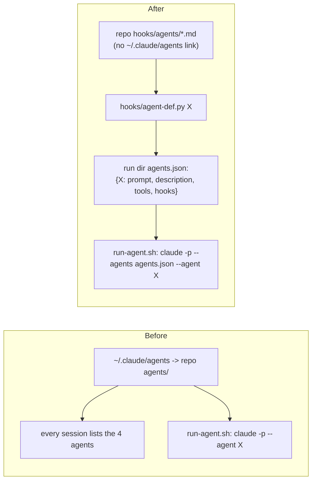

# Skill best practices, part 1 - who can start the skills and agents

## Goal

Close the gaps between this repo and Anthropic's published guidance for skills and subagents that decide *when* things run and with what permissions. Once done:
- `/research`, `/spec` and `/cold-review` start only when the user types them.
- All four descriptions are in the third person.
- `/spec` and `/cold-review` pre-approve edits only to the files they write.
- The four agents can no longer be launched inside a session, where they'd run without their sandbox.

Part 2 (`docs/specs/2026-09-28-skill-best-practices-2-structure.md`) covers the skill files' structure, models and evals.

## Decision

The approach was settled in the authoring session by comparing the repo against the guidance, and then with the user. No research note was written.
- **Invocation:** set `disable-model-invocation: true` on the three skills that launch paid agents. `/idea` stays model-invocable: it's cheap, and "jot this down" is a natural trigger.
- **Agents:** move the agent files out of `~/.claude/agents`. Pass each one's definition per run with `claude -p --agents <file>`.
- **Rejected:** narrowing the descriptions instead of disabling invocation, because a narrower trigger still fires on near misses. Also rejected: leaving the agents in place with a "never launch with the Agent tool" warning, because that is advice, not a control.

## Background

Read at `5ed0e66` on 2026-09-28.

**Anthropic's guidance** *(unverified)*. These pages were fetched on 2026-09-28 in the authoring session. The spec verifier's sandbox can't reach them, so it can't recheck them. The behaviour this spec depends on is tested by W1's Done when and by spike questions 1 and 3.
- [Skill authoring best practices](https://platform.claude.com/docs/en/agents-and-tools/agent-skills/best-practices): "**Always write in third person**. The description is injected into the system prompt, and inconsistent point-of-view can cause discovery problems."
- [Claude Code skills](https://code.claude.com/docs/en/skills):
  - `disable-model-invocation: true` means "Only you can invoke the skill. Use this for workflows with side effects". Its table row reads "Description not in context, full skill loads when you invoke".
  - `allowed-tools` "grants permission for the listed tools during the turn that invokes the skill … The grant clears when you send your next message".
- [Subagents](https://code.claude.com/docs/en/sub-agents):
  - "Claude uses each subagent's description to decide when to delegate tasks".
  - "**User subagents** (`~/.claude/agents/`) are personal subagents available in all your projects".
  - An `--agents` definition takes `prompt` plus frontmatter fields including `description`, `tools`, `model`, `mcpServers` and `hooks`.
- `claude --help` on CLI 2.1.283, run in the authoring session, lists `--agents <json-or-file>`: "JSON object defining custom agents, or with --print the path to a file that holds one" *(unverified)*.
- **A typed command still runs a disabled skill under `claude -p`:** checked by hand on 2026-09-28, while checking part 2. A throwaway project skill with `disable-model-invocation: true`, started by the prompt `/probe`, ran and followed its instructions. The run used the skill-eval runner's flags, `--allowedTools "Read Write Edit Glob Grep Bash Skill"` included (`tests/skill-evals/run.sh:37`). It is logged in `docs/specs/records/2026-09-28-skill-best-practices-2-structure-record.md` under Spikes. Spike S3 settled how: a typed `/name` runs a disabled user skill with or without `Skill` allowed, and makes no Skill tool call, so the prompt is expanded as a typed command (`docs/specs/spikes/2026-09-28-skill-best-practices-1-invocation-results.md`).
- **The start event:** in `claude -p --output-format stream-json --verbose`, a session's first `system`/`init` event has `agents`, `skills` and `slash_commands` lists. Run in the authoring session, its `agents` held `cold-reviewer`, `research-verifier`, `researcher` and `spec-verifier`, and its `skills` held `cold-review`, `idea`, `research` and `spec`. Spike S3 found that the `skills` list also holds a skill with `disable-model-invocation: true`, so it can't show the field is set. The Skill tool does show it: asked for a disabled skill, it refuses with "cannot be used with Skill tool due to disable-model-invocation" (`docs/specs/spikes/2026-09-28-skill-best-practices-1-invocation-results.md`).

**The skills.**
- None of the four skills sets `disable-model-invocation`.
- **Descriptions:** all four start with an imperative ("Give", "Capture", "Research", "Turn": `skills/cold-review/SKILL.md:3`, `skills/idea/SKILL.md:3`, `skills/research/SKILL.md:3`, `skills/spec/SKILL.md:3`).
- **Mode syntax in descriptions:** three of them spell it out. `/research`'s says "asks to research, investigate or dig into something" and lists `quick`, `ideas` and `finish` (`skills/research/SKILL.md:3`). `/spec`'s lists `quick`, `finish`, `spike` and `done` (`skills/spec/SKILL.md:3`). The same modes are already in each `argument-hint` (`skills/research/SKILL.md:4`, `skills/spec/SKILL.md:4`).
- **`/cold-review`'s edit grant:** it pre-approves `Edit(~/code/**)` and `Edit(~/notes/**)` (`skills/cold-review/SKILL.md:5`). Yet it says "The reviewer edits nothing, and neither do you" (`skills/cold-review/SKILL.md:16`), and writes new review history only to a record (`skills/cold-review/SKILL.md:25`).
- **`/spec`'s edit grant:** it pre-approves `Edit(~/code/**)` (`skills/spec/SKILL.md:5`), but may "create or change only the spec (or its parts), its record and, in step 7, its spike results file" (`skills/spec/SKILL.md:88`). All three are markdown.

**The agents.**
- **Install:** the README installs `~/.claude/agents` as a link to this repo's `agents/` (`README.md:175-181`). So all four agents are user subagents in every session.
- **Descriptions:** all four end "not for general use", for example `agents/researcher.md:3` and `agents/cold-reviewer.md:3`.
- **The README's claim:** it says agents "don't run inside your session, because Claude Code can't put a sandbox around an agent that does" (`README.md:256-258`). Nothing enforces that.
- **`run-agent.sh`:** it reads `~/.claude/agents/<agent>.md` (`hooks/run-agent.sh:52`) and takes the `tools:` line from it (`hooks/run-agent.sh:65`). It then runs `claude -p --agent "$agent"` (`hooks/run-agent.sh:94`).
- **The agent-eval runner:** it does the same, from `$HOME/.claude/agents` (`tests/agent-evals/run.sh:39`, `tests/agent-evals/run.sh:63`, `tests/agent-evals/run.sh:71`).
- **The agents' hooks:** each agent's guard hooks are in its frontmatter, for example the researcher's write hook limited to `~/notes/research`. They apply under `--agent` because the frontmatter is loaded (`tests/agent-evals/run.sh:28-29`).
- **Other references to the location:**
  - `skills/research/SKILL.md:23`, `skills/spec/SKILL.md:29` and `skills/research/ideation-rules.md:3`.
  - `tests/test_run_agent.py:17` and `:42` build the agents path, and `tests/test_run_agent.py:102` asserts `--agent cold-reviewer`.
  - `tests/test_agent_guard.py:720` and `:737` use `~/.claude/agents` as an example of a readable path.
  - `.github/workflows/tests.yml:24` links `skills`, `agents` and `hooks` into `~/.claude`.
  - `README.md:330`, the layout table's `agents/` row.
  - `CLAUDE.md:3`, which says `~/.claude/skills`, `agents` and `hooks` are links into the repo, and `CLAUDE.md:20`, which names `agents/spec-*`.
  - `tests/agent-evals/run.sh:30`, a comment saying the `~/.claude` links, agents included, point into the repo.
- **No eval grades a refusal:** the agent-eval cases grade only the reply's verdict text, for example `tests/agent-evals/cases/spec-miscite/expect.txt`, so a pass doesn't show that a tool list or guard hook was enforced.

## Non-goals

- The structure of the skill files, the models, and new skill evals: all in part 2.
- Changing what any agent is allowed to do: its tools, hooks, sandbox and cost caps stay as they are.
- Renaming the skills. The guide suggests gerund names like `processing-pdfs`, but renaming would break the commands.
- The draft `/implement` specs (`docs/specs/2026-09-26-implement-skill-2-skill.md`). They add an `implementer` agent and a skill. Whoever builds them follows the layout this spec sets.

## Design

- **Where the agent files go:** they move from `agents/` to `hooks/agents/`, so their `~` path becomes `~/.claude/hooks/agents/<name>.md`. That keeps the repo's `~/.claude/...` path convention. Claude Code doesn't load subagents from `~/.claude/hooks` *(assumption)*: W3's second Done when observes it.
- **`hooks/agent-def.py <agent>` (new):** prints the JSON `--agents` takes:
  - `prompt` is the file's body.
  - `name` becomes the JSON key, and must match the file's name. `description` and `tools` come from its frontmatter.
  - `hooks` is its `hooks:` block, parsed by a small reader for that one shape: matcher, then `type: command` and `command`.
  - It fails loudly on anything it doesn't recognise.
- **The runners:** `run-agent.sh` and the eval runner write that JSON to the run dir, then pass `--agents <file> --agent <name>`.

## Work items

### W1: the three costly skills start only when typed, and every description is third person

- **Change:**
  - **Frontmatter:** add `disable-model-invocation: true` to `research`, `spec` and `cold-review`.
  - **Descriptions:** rewrite all four in the third person, saying what the skill does and when to use it, with no mode syntax:
    - `idea`: "Captures a new idea as a markdown note in ~/notes/ideas, from the idea template. Use when the user runs /idea, or asks to capture, save or jot down an idea for later."
    - `research`: "Researches a question or idea and writes a cited markdown note to ~/notes/research, which an independent agent then verifies. Runs when the user types /research."
    - `spec`: "Turns a research note or a described change into an implementation spec in the repo it changes, grounded in file:line citations, then verifies it and gives it a cold review. Runs when the user types /spec."
    - `cold-review`: "Gives a markdown document one adversarial read by an agent that never saw the conversation that wrote it, and relays what it found; on a reviewed document, reviews only the changes logged since. Runs when the user types /cold-review."
  - **README:** add one line to Install (`README.md:166`) saying that the three costly commands start only when typed.
- **Files:** `skills/research/SKILL.md`, `skills/spec/SKILL.md`, `skills/cold-review/SKILL.md`, `skills/idea/SKILL.md`, `README.md`, `records/README-record.md`.
- **Done when:**
  - `grep -c '^disable-model-invocation: true' skills/{research,spec,cold-review,idea}/SKILL.md` prints 1, 1, 1 and 0.
  - `grep -nE '^description: (Give|Capture|Research|Turn) ' skills/*/SKILL.md` prints nothing.
  - `tests/skill-evals/run.sh` exits 0. Both of its cases start their skill as `/cold-review …` and `/spec done …` in a `claude -p` prompt with the Skill tool allowed, as the by-hand check in Background did.
  - For each of `research`, `spec` and `cold-review`, `claude -p --output-format stream-json --verbose --allowedTools Skill --strict-mcp-config 'Call the Skill tool with skill "<name>". Then reply with the tool'"'"'s result, quoted exactly.'` gets a Skill tool result containing `cannot be used with Skill tool due to disable-model-invocation`. For `idea`, the same call launches the skill. This is the check spike S3 found, in place of the `init` event's `skills` list, which keeps disabled skills.

### W2: `/spec` and `/cold-review` pre-approve edits only to what they write

- **Change:**
  - **`cold-review`:** replace `Edit(~/code/**)` and `Edit(~/notes/**)` with `Edit(~/code/**/records/*-record.md)` and `Edit(~/notes/**/records/*-record.md)`. Keep `Edit(~/.cache/agent-runs/**)`.
  - **`spec`:** replace `Edit(~/code/**)` with `Edit(~/code/**/*.md)`. A spec, its record and its spike results are all markdown. Keep `Edit(~/notes/**)`: `/spec` edits a note's `related` and an idea's `status`.
- **Files:** `skills/cold-review/SKILL.md`, `skills/spec/SKILL.md`.
- **Done when:**
  - `grep -c 'Edit(~/code/\*\*)' skills/{spec,cold-review}/SKILL.md` prints 0 for both.
  - Spike S2 showed each pattern allows the file it names and refuses a `.py` file beside it (`docs/specs/spikes/2026-09-28-skill-best-practices-1-invocation-results.md`). After the change, `/cold-review` and `/spec` still write their records and specs without a permission prompt.

### W3: the agents live outside `~/.claude/agents`, and the runners pass them by `--agents`

- **Change**, in this order. The files are live, since `~/.claude` links into the repo, and `CLAUDE.md` asks that every file stay valid at each step. So the runners learn the new place before the files move, and forget the old one only after:
  1. **Add `hooks/agent-def.py`**, as the Design describes, with its tests. It takes the agent file's path, so it works with the files where they are now.
  2. **`run-agent.sh`:** find the agent file at `$here/agents/$agent.md`, and fall back to `~/.claude/agents/$agent.md` while the old place exists. Write `$run/agents.json` from `agent-def.py`, then run `claude -p --agents "$run/agents.json" --agent "$agent"`. The `tools` line comes from the same JSON.
  3. **`tests/agent-evals/run.sh`:** the same, with `$repo/hooks/agents` first and the same fallback. It writes each case's JSON to `$out/$c.agents.json`, since it has no run dir.
  4. **Move the files, and update every reference** listed in Background, in one commit, so nothing names a path that no longer exists. Run `git mv agents hooks/agents`; both runners now find the files at the new place. Then update:
     - the three skill files;
     - README Install: two links, not three, plus a line saying to remove an existing `~/.claude/agents` link;
     - the README layout table;
     - `tests/test_run_agent.py`, `tests/test_agent_guard.py:720` and `:737`;
     - the CI workflow's link loop, which becomes `for d in skills hooks`;
     - the comment in `tests/agent-evals/run.sh`;
     - CLAUDE.md, lines 3 and 20.
  5. **Drop the fallback** from both runners, and remove the `~/.claude/agents` link.
  - **Add an agent-eval case, `guard-applies`:** the cold reviewer is asked to run `awk 'NR==1' README.md` and quote the tool's response word for word. Its `expect.txt` requires `Blocked by agent-guard`. That shows the hooks apply to an agent passed by `--agents`.
  - **Add `tests/test_agent_def.py`**, covering: each of the four files converts; the researcher's write hook keeps its `$HOME/notes/research` argument; its MCP tool names survive; and an unknown frontmatter key fails.
- **Files:** `agents/*.md` → `hooks/agents/*.md`, `hooks/agent-def.py` (new), `hooks/run-agent.sh`, `tests/agent-evals/run.sh`, `tests/agent-evals/cases/guard-applies/` (new), `tests/test_agent_def.py` (new), `tests/test_run_agent.py`, `tests/test_agent_guard.py`, `.github/workflows/tests.yml`, `skills/research/SKILL.md`, `skills/spec/SKILL.md`, `skills/research/ideation-rules.md`, `README.md`, `records/README-record.md`, `CLAUDE.md`.
- **Done when:**
  - `python3 -m unittest discover -s tests` passes, including `test_agent_def.py`.
  - After `rm ~/.claude/agents`, the `system`/`init` event of `claude -p --output-format stream-json --verbose 'ok'` has none of `researcher`, `research-verifier`, `spec-verifier` or `cold-reviewer` in its `agents` list.
  - `tests/agent-evals/run.sh` exits 0 with all eleven cases passing, `guard-applies` included, recorded in a dated `BASELINE.md` section. That case shows the guard hook applies under `--agents`, and spike question 1 shows the `tools` allowlist does.
  - `python3 tests/replay_guard.py` exits 0.

## Effort

| Item | Estimate | Depends on |
|---|---|---|
| W1 | 1 h, plus a skill-eval run (about $0.64, the last two-case total in `tests/agent-evals/BASELINE.md:621`) | spike 3 |
| W2 | 30 min, plus spike 2 | - |
| W3 | 4 h, plus a full agent-eval run (about $4: "$3.70 and $4.68", `README.md:300`) | spike 1 |

These come from reading the code, not from building it; the order is firmer than the hours.

## Spike questions

1. Does an agent passed as `claude -p --agents <file> --agent <name>` keep its `tools` allowlist, its PreToolUse `hooks` and its listed MCP tools, as the file-based agent does? Experiment: pass a two-agent JSON, one with `tools: ["Read"]` and a PreToolUse hook on Read that exits 2, and ask each to read a file. Also ask it to run `ls`, to check a tool not on its list is refused. A few cents.
   Answered: yes. The agent's `init` tools held only Read and its MCP tool, with Glob and Bash missing though the session allowed them, and its PreToolUse hook blocked Read (spike S1, `docs/specs/spikes/2026-09-28-skill-best-practices-1-invocation-results.md`).
2. Do `Edit(~/code/**/records/*-record.md)` and `Edit(~/code/**/*.md)` in a skill's `allowed-tools` allow a write to a matching file, and refuse `~/code/x/records/a.py`? Experiment: a throwaway skill with each pattern, run by `claude -p` in a scratch repo under `~/code`, asked to write both files. Record which writes happen. A few cents.
   Answered: yes. Each pattern allowed its file and refused the `.py` beside it (spike S2, `docs/specs/spikes/2026-09-28-skill-best-practices-1-invocation-results.md`).
3. Does `disable-model-invocation: true` take a skill out of the `system`/`init` event's `skills` list, while leaving it in `slash_commands`? Experiment: a throwaway skill in a scratch `~/.claude` layout with the field set, and one without, then read the init event of `claude -p --output-format stream-json --verbose 'ok'`. In the same runs, start the disabled skill with a typed `/name` prompt, once with `Skill` in `--allowedTools` and once without, and record whether it runs. That shows whether a typed command depends on the Skill tool. A few cents.
   How to read the second part:
   - **It runs both ways:** the typed command runs the skill itself, and W1 stands.
   - **It runs only with `Skill` allowed:** the model reached the skill through the Skill tool. Then `disable-model-invocation: true` doesn't stop the model starting a skill, and W1 can't meet the Goal as written, even though its skill-eval Done when would pass. Stop before W1, and revisit its approach with the user. One candidate: take `Skill` out of the skill-eval runner's `--allowedTools` and check the typed commands still run.
   - **It runs neither way:** a typed command can't start a disabled skill under `claude -p`. The skill evals can't run the three skills after W1, and W1 has to change before it lands.
   Answered: it runs both ways, so W1 stands. But the `init` event's `skills` list keeps a disabled skill; W1's Done when now asks the Skill tool instead, which refuses a disabled skill (spike S3, `docs/specs/spikes/2026-09-28-skill-best-practices-1-invocation-results.md`).

## Risks and rollback

- **Moving `agents/` breaks anything else that loads them from `~/.claude/agents`.** The grep in Background found only the files W3 lists. Rollback: re-create the link and revert W3.
- **The small hooks reader in `agent-def.py` misses a future frontmatter shape.** It fails loudly on unknown keys, so a new shape stops the run instead of dropping a hook.
- **With `disable-model-invocation`, the description is out of context**, so Claude can't suggest `/research` unprompted. `/research`'s own report still names `/spec` as the next step.

## Open questions

- None.
