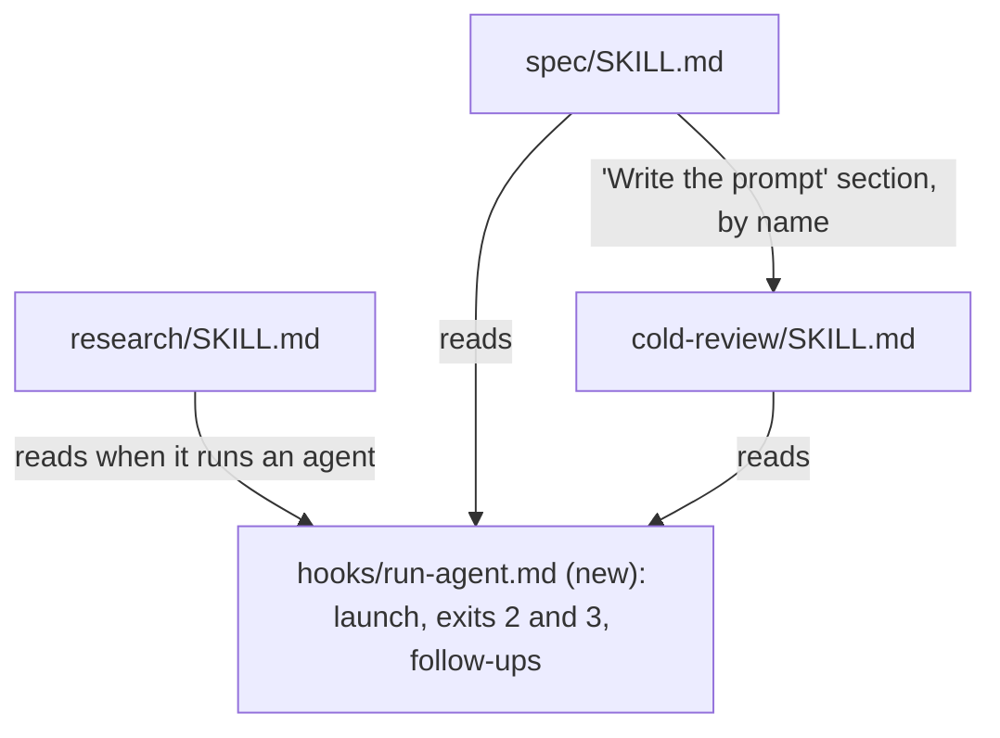

# Skill best practices, part 2 - shorter, decoupled skills, tested on each model

## Goal

Make the three large skill files shorter and independent of each other's step numbers, and give their multi-turn workflows a progress checklist. Test the skills on each model they run on, including two main paths no skill eval covers today. Once done:
- The steps for running an agent live in one file.
- No skill points at another file's step by number.
- `BASELINE.md` has results for each model.
- `/research`, `/spec` and `/cold-review` are each about a third shorter, with every eval still passing.

Prerequisite: part 1, `docs/specs/2026-09-28-skill-best-practices-1-invocation.md`. Its W3 moves the agent files, which this part's shared file names.

## Decision

The approach was settled with the user in the authoring session, from a comparison against Anthropic's guidance; no research note was written.
- **Models:** test each skill and agent on each model the user runs them on, rather than pinning a model in the agent files. The agents keep following the user's default model.
- **Order of the rewrite:** the checklists and the trim come last. By then the shared agent-running file has landed and the new evals give a baseline, so each skill file is rewritten once and checked against evals that already pass.
- **Rejected:** pinning models, because the user switches default models and wants the agents to follow. Also rejected: deferring the trim, because the skill files are what every run pays for in context.

## Background

Read at `5ed0e66` on 2026-09-28.

**Anthropic's guidance** *(unverified)* ([Skill authoring best practices](https://platform.claude.com/docs/en/agents-and-tools/agent-skills/best-practices), fetched 2026-09-28 in the authoring session; the spec verifier's sandbox can't reach it). It says:
- **Conciseness:** "Only add context Claude doesn't already have", and "Keep SKILL.md body under 500 lines".
- **References:** "Keep references one level deep from SKILL.md".
- **Checklists:** "For particularly complex workflows, provide a checklist that Claude can copy into its response and check off as it progresses".
- **Models:** "Test your Skill with all the models you plan to use it with".

**Size.**
- **Word counts:** `wc -w` at read-at gives `skills/research/SKILL.md` 2,990 words, `skills/spec/SKILL.md` 3,191 and `skills/cold-review/SKILL.md` 2,883.
- **Line lengths:** they meet the 500-line guidance only because each line is a paragraph. `awk` gives longest lines of 1,084 characters in `research` and 1,004 in `spec`.
- **Loading two skills:** `/spec` reads all of `cold-review/SKILL.md` to build its review prompt (`skills/spec/SKILL.md:117`).

**Duplication and coupling.**
- **"Running an agent":** three skills each have their own version, in `skills/research/SKILL.md:25-33`, `skills/spec/SKILL.md:31-39` and inline in `skills/cold-review/SKILL.md:162-177`.
- **Cross-file references by step number:**
  - `/spec` builds the cold review "from its steps 2 to 4" (`skills/spec/SKILL.md:117`), while `/cold-review` says `/spec` uses "steps 3 and 4 of this file" (`skills/cold-review/SKILL.md:27`). The two already disagree.
  - `skills/spec/SKILL.md:123` and `:125` point at "`/cold-review`'s step 5 items 1 and 2", and at its "step 5 item 3".
  - `skills/spec/spike-step.md:68` points at "`SKILL.md`'s step 5, item 2", "its step 4 brief" and "`SKILL.md`'s Running an agent".
  - Six more lines point at the "Running an agent" heading by name: `skills/research/SKILL.md:54`, `:75`, `:76` and `:85`, and `skills/spec/SKILL.md:95` and `:117`.
  - `grep -rnE "(its|SKILL\.md's|/cold-review's|/spec's) steps? [0-9]|steps [0-9] (to|and) [0-9]" skills/*/SKILL.md skills/spec/*.md skills/research/*.md` finds these five lines, plus two that refer within their own file (its overlapping file lists print the `spec` lines twice) (`skills/cold-review/SKILL.md:47`, `skills/idea/SKILL.md:17`).
- **No copyable progress checklist:** none of the skill files has one. `grep -rln -- '- \[ \]' skills` finds nothing outside `skills/synced`. Yet `/research` and `/spec` end their turn while agents run, and pick up again several turns later (`skills/spec/SKILL.md:106`, `skills/research/SKILL.md:76`).

**Models and evals.**
- **Agent evals:** they take `EVAL_MODEL` (`tests/agent-evals/run.sh:9`).
- **Skill evals:** they take no model setting. They run `claude -p` with `--no-session-persistence` in a `mktemp -d` fixture (`tests/skill-evals/run.sh:33-37`).
- **Where models are set:** no agent or skill file sets `model:`. Only spikes pass a model, `--model sonnet` (`skills/spec/scripts/run-spike.sh:40`).
- **Skill-eval cases:** there are two, `cold-review-delta` and `spec-done`. Both prompts tell the skill it's running unattended and answer its questions in advance (`tests/skill-evals/cases/cold-review-delta/prompt.txt:3`, `tests/skill-evals/cases/spec-done/prompt.txt:3`). Neither runs an agent.
- **Where agents live:** the skills launch every agent with `run_in_background: true` and end the turn (`skills/research/SKILL.md:30`, `skills/spec/SKILL.md:36`). In a `claude -p` run, that end of turn is the end of the run.
- **The skill evals' sandbox:** they run with `--settings hooks/agent-sandbox.json` (`tests/skill-evals/run.sh:36`). That file:
  - exempts only `gh` and the research scripts from the OS sandbox (`hooks/agent-sandbox.json:5`), not `run-agent.sh`;
  - allows network only to a list of hosts (`hooks/agent-sandbox.json:8`);
  - denies reading `~/.cache/agent-runs` (`hooks/agent-sandbox.json:12`, `:31`).

  So a skill eval as set up today can't run an agent, whose own `claude -p` needs the API, nor read the agent's `reply.md`.
- **Agent models:** `run-agent.sh` passes no `--model` (`hooks/run-agent.sh:94`), so an agent always runs on the user's default model.
- **Location rules:** `/spec` works only in a repo under `~/code` (`skills/spec/SKILL.md:52`). The agent evals keep a researcher's note as a hidden `~/notes/research/.eval-<case>-<timestamp>.md`, and fail the case if anything else in `~/notes` changed (`tests/agent-evals/run.sh:19-25`).

## Non-goals

- Who can start the skills and agents, and their permissions: part 1.
- Changing what any skill or agent does. The trim removes explanation, not steps or rules. Any behaviour change it causes is a regression, which the evals should catch.
- Pinning models in the agent files.
- Skill evals for `/idea`, `/spec spike` and `/research ideas`: `/idea` is cheap and short, and the other two are the costliest paths to run. A spike is capped at $2 (`skills/spec/scripts/run-spike.sh:44`), and an ideas researcher cost $2.31 (`tests/agent-evals/BASELINE.md:341`).

## Design

- **Shared agent-running file:** `hooks/run-agent.md` sits next to the script it describes. Each skill keeps only its own run dir naming and briefs, and says "Read `~/.claude/hooks/run-agent.md`" where it runs an agent.
- **Cross-file references:** they name a heading ("`/cold-review`'s *Write the prompt*"), never a number.
- **The checklist:** each of the three skills opens with a fenced checklist of its stages. It tells the model to paste the list, ticked to date, at the end of every turn that ends while an agent runs. The list is then in the conversation to pick up from when the agent returns.

## Work items

### W4: one shared file for running an agent, and references by name

- **Change:**
  - **New shared file:** write `hooks/run-agent.md` from the three current versions:
    - the brief, `run_in_background`, and reading `reply.md`;
    - exit 3 and the single follow-up;
    - exit 2, where the command's own output says why;
    - other exits, where `run.err` and `run.json` say why;
    - `--resume` with `followup.md`;
    - the rule to take the next free `-<n>` suffix when a run dir already holds a `reply.md`.
  - **The skills:** replace each skill's section with its run dir pattern and one line pointing at the file.
  - **References:** rewrite the five cross-file lines listed in Background to name headings. Also point the lines that say "(Running an agent)" at the new file: `research` :54, :75, :76 and :85, `spec` :95 and :117, and `skills/spec/spike-step.md:68`.
  - **README:** add `hooks/run-agent.md` to the file table (`README.md:331-335`), logged in `records/README-record.md`. Settle what `/spec` takes from `/cold-review`: the table row and extra lines for the document's kind, the pointers, and the prompt skeleton. State it once, in both files.
- **Files:** `hooks/run-agent.md` (new), `skills/research/SKILL.md`, `skills/spec/SKILL.md`, `skills/cold-review/SKILL.md`, `skills/spec/spike-step.md`, `README.md`, `records/README-record.md`.
- **Done when:**
  - `grep -c '^## Running an agent' skills/*/SKILL.md` prints 0 for every file.
  - `grep -l 'hooks/run-agent.md' skills/{research,spec,cold-review}/SKILL.md` lists all three.
  - The grep from Background, run with `skills/*/SKILL.md skills/spec/*.md skills/research/*.md`, prints only the two lines that refer within their own file. Today it also prints the five cross-file lines.
  - `tests/skill-evals/run.sh` exits 0.

### W5: evals on each model

- **Change:**
  - **Skill evals:** give `tests/skill-evals/run.sh` an `EVAL_MODEL`, passed as `--model`, as the agent-eval runner has. Add a test to `tests/test_eval_runners.py` that the stub `claude` receives it.
  - **Agents:** give `hooks/run-agent.sh` a `RUN_AGENT_MODEL`, passed as `--model` when set. The skill-eval runner exports `RUN_AGENT_MODEL=$EVAL_MODEL`, so an agent a skill eval launches runs on the model under test, not the default.
  - **CLAUDE.md:** after changing a skill or agent, run both eval sets once per model the user runs the skills on: Sonnet and Opus *(assumption: the user's choice in the authoring session named them only as an example; see Open questions)*. Record each model's results in the same dated `BASELINE.md` section, with a column for the model. Run the two sets one after the other, never at the same time: each checks that nothing else in `~/notes` changed while it ran.
  - **Baseline:** run both sets on both models now, before W6–W8 change anything.
- **Files:** `tests/skill-evals/run.sh`, `hooks/run-agent.sh`, `tests/test_eval_runners.py`, `tests/test_run_agent.py`, `CLAUDE.md`, `tests/agent-evals/BASELINE.md`, `README.md` (where it documents `RUN_AGENT_MAX_USD`, `README.md:295`), `records/README-record.md`.
- **Done when:**
  - `python3 -m unittest tests.test_eval_runners tests.test_run_agent` passes. The new tests show `--model <x>` reaches `claude` when `EVAL_MODEL=x`, and when `RUN_AGENT_MODEL=x` is set for `run-agent.sh`.
  - `BASELINE.md` has a section dated on the run day, with every agent case and skill case for both `sonnet` and `opus`, each with its result and cost.

### W6: skill evals for the `/spec quick` and `/research quick` main paths

- **Change:** add two skill-eval cases that run a skill end to end, verifier included. So that the agent finishes within the run, each prompt says, alongside the usual "unattended" answers: "run each agent without `run_in_background`, with the Bash tool's `timeout` set to 600000 (10 minutes, its maximum), and carry on in the same turn". Without the timeout, the Bash tool stops a command after 2 minutes.
  - **Order within W6:**
    1. `agent-case-settings.json`, and the runner changes below, with their tests.
    2. The two cases.
    3. Spike question 1, which is the first run of the two cases: `tests/skill-evals/run.sh spec-quick research-quick-flow`, on the default model. Record the answer in `docs/specs/spikes/2026-09-28-skill-best-practices-2-structure-results.md` (the command, each case's result and cost, and each agent's run time from its `run.json`), and add an `Answered:` line under the spike question that cites it.
    4. The runs on both models.

    `/spec spike` can't run this spike: its sandbox has no network, so no API, and can't read `~/code` or `~/.claude` (`skills/spec/spike-settings.json:5`, `:8`). The spike's command is the runner's own.
  - **Settings for agent cases:** these cases need a settings file of their own, `tests/skill-evals/agent-case-settings.json`, chosen by a `settings.txt` in the case. It starts from `hooks/agent-sandbox.json` with two changes: `~/.claude/hooks/run-agent.sh *` joins `excludedCommands`, so the agent's own session runs outside this sandbox and inside its own; and reads of `~/.cache/agent-runs` are allowed, so the skill can read `reply.md`. It keeps `denyWrite` for `~/notes` and `~/code` on purpose. The skills write there with the Edit tool, which the OS sandbox doesn't cover. A Bash write there, such as `/research`'s `build-index.py` rewriting `~/notes/index.md`, fails, and should: an eval mustn't rewrite the real index. `research-quick-flow`'s grade accepts a reported index failure. `tests/test_sandbox_settings.py` gets a test that the file differs from `hooks/agent-sandbox.json` in just those two ways.
  - **`spec-quick`:**
    - **Setup:** the runner makes `$HOME/code/eval-spec-quick-<stamp>` and passes it to `setup.sh` as `$1`, in place of a `mktemp` directory, when the case has a `location.txt` containing `code`, since `/spec` requires `~/code`. `setup.sh` builds a small committed repo there, and the runner deletes it afterwards. The name has no leading dot: `run-agent.sh` refuses a run dir name that starts with one (`hooks/run-agent.sh:58-59`), and `/spec` names its run dir after the repo folder (`skills/spec/SKILL.md:35`).
    - **Prompt:** `/spec quick <a one-line change to that repo>`.
    - **Grade:** a spec under `docs/specs/` exists; `check-spec.py` passes it; its record's `## Verification` has a `Quick spec on` line and a `Confirmed:` line; there is no `cold-reviewer` run dir for it; and nothing is committed in the fixture.
  - **`research-quick-flow`:**
    - **Prompt:** `/research quick <a narrow factual question>`. It names the output path as `{{NOTE}}`, and says "don't commit". The runner fills `{{NOTE}}` with `~/notes/research/eval-research-quick-flow-<stamp>.md`, with no leading dot for the same reason: `/research` names its run dir after the note's basename (`skills/research/SKILL.md:29`).
    - **Grade:** the note exists; `check-note.py` passes it; it has a `## Verification` section and a `status:`; and nothing else in `~/notes` changed.
  - **Runner changes for these cases:** `tests/skill-evals/run.sh` sends `prompt.txt` as written today (`tests/skill-evals/run.sh:34-37`), and gives `grade.py` only the fixture and the result (`tests/skill-evals/run.sh:38`). It gains:
    - templating, filling `{{NOTE}}` and `{{STAMP}}` in the prompt, as the agent-eval runner fills `{{NOTE}}` (`tests/agent-evals/run.sh:56-61`);
    - a `git -C ~/notes status --porcelain` snapshot before and after each case, leaving out any eval note (`/\.?eval-`, with or without the leading dot), passed to `grade.py` with the note's path as environment variables. The agent-eval runner's own filter, `grep -v '/\.eval-'` (`tests/agent-evals/run.sh:90`), widens to the same pattern, so neither set counts the other's notes as a change;
    - clean-up on exit: the note, the `~/code` fixture, and the run dirs the case's agents left under `~/.cache/agent-runs`.
- **Files:** `tests/skill-evals/run.sh` (the `location.txt` and `settings.txt` options, prompt templating, the `~/notes` snapshot and clean-up), `tests/agent-evals/run.sh` (its eval-note filter), `tests/skill-evals/agent-case-settings.json` (new), `docs/specs/spikes/2026-09-28-skill-best-practices-2-structure-results.md` (new, spike 1), `tests/skill-evals/cases/spec-quick/{setup.sh,prompt.txt,settings.txt,location.txt,grade.py}` (new), `tests/skill-evals/cases/research-quick-flow/{setup.sh,prompt.txt,settings.txt,grade.py}` (new), `tests/test_eval_runners.py`, `tests/test_sandbox_settings.py`.
- **Done when:**
  - `tests/skill-evals/run.sh spec-quick research-quick-flow` exits 0 on both models, recorded in `BASELINE.md`.
  - A copy of `spec-quick` whose prompt drops the "without `run_in_background`" line fails on "no `Confirmed:` line", which shows the grade sees a run that stopped before the verifier.
  - `tests/test_eval_runners.py` shows, with `HOME` set to a temporary directory: a `location.txt` of `code` puts the fixture under `$HOME/code` and removes it; `{{NOTE}}` is filled in; and the note is removed after the case.

### W7: a progress checklist in each multi-turn skill

- **Change:** add a copyable checklist near the top of `/research`, `/spec` and `/cold-review`, with one line per stage, as the Design says. Tell the model to paste it, ticked to date, at the end of each turn that ends while an agent runs, and once more in the final report.
- **Files:** `skills/research/SKILL.md`, `skills/spec/SKILL.md`, `skills/cold-review/SKILL.md`.
- **Done when:**
  - `grep -c -- '- \[ \]' skills/{research,spec,cold-review}/SKILL.md` prints at least 4 for each.
  - All four skill-eval cases pass on both models.
  - `grep -c -- '- \[x\]'` on `spec-quick`'s saved `.json` result prints at least 1.

### W8: trim the three skill files to what Claude needs

- **Change:**
  - **What goes:** explanations of *why* a rule exists. Where a reason is worth keeping, move it to the README section on that skill, or to the code comment where the rule is enforced.
  - **What stays:** every step and rule, and every exact string a script or grader checks.
  - **Targets:** `research` at most 2,100 words, `spec` at most 2,300 and `cold-review` at most 2,000, down from 2,990, 3,191 and 2,883.
  - **Line length:** no line in the three files over 400 characters, so a diff shows what changed.
- **Files:** `skills/research/SKILL.md`, `skills/spec/SKILL.md`, `skills/cold-review/SKILL.md`, `README.md`, `records/README-record.md`.
- **Done when:**
  - `wc -w` meets the three targets.
  - `awk 'length > 400' skills/{research,spec,cold-review}/SKILL.md` prints nothing.
  - `tests/agent-evals/run.sh` and `tests/skill-evals/run.sh` both exit 0 on both models, run one set after the other, recorded in a dated `BASELINE.md` section.
  - The README change is logged as a `- Not reviewed:` line at the end of `records/README-record.md`, as `CLAUDE.md` asks. The README has had its one full and one delta review (`records/README-record.md:31`), so `/cold-review` won't run another (`skills/cold-review/scripts/review-state.py README.md` prints `state: done`); the evals are this item's check.

## Effort

| Item | Estimate | Depends on |
|---|---|---|
| W4 | 2 h, plus a skill-eval run | part 1 |
| W5 | 1 h, plus one run of both eval sets on each of two models (about $9) | W4 |
| W6 | 4 h, plus both new cases on both models (about $0.50–1 a case, so about $2–4); spike 1 runs by hand after its first step | W5 |
| W7 | 1 h, plus a skill-eval run | W6 |
| W8 | 4 h, plus both eval sets on both models (about $11–13) | W7 |

These come from reading the code, not from building it; the order is firmer than the hours. The costs come from `CLAUDE.md`'s figures: about $4 for a full agent-eval run, and about $0.30 a skill case without agents. So both sets on two models cost about 2 × ($4 + 2 × $0.30), or $9, before W6. A W6 case adds its agents' cost to a skill session:
- A spec verifier cost $0.17 in the last run (`tests/agent-evals/BASELINE.md:613`).
- A quick researcher cost $0.31 (`tests/agent-evals/BASELINE.md:612`).
- A verifier after the researcher is about the same again.

Adding a skill session of about $0.30 gives about $0.47 for `spec-quick` and $0.78 for `research-quick-flow`. Allowing for the longer sessions these cases run, that is about $0.50–1 a case. A two-model round after W6 is then 2 × ($4 + 2 × $0.30 + 2 × $0.50–1), or about $11–13. The caps bound the worst case: $3 for the skill session, plus $5 per agent, or $10 for the researcher (`hooks/run-agent.sh:68-69`).

## Spike questions

1. Will a skill run under `claude -p`, told to run its agents without `run_in_background` and with a 10-minute Bash timeout, run `run-agent.sh` in the foreground and carry on to its next step in the same run? And do a spec verifier, and a quick researcher followed by its verifier, each finish within the Bash tool's 10-minute limit? Run by hand, not by `/spec spike`, as step 3 of W6's order, once the runner changes and cases exist. Experiment: `tests/skill-evals/run.sh spec-quick research-quick-flow`, once, on the default model. Record whether `reply.md` was read and the record written, whether any Bash write the skill makes fails under `denyWrite`, and each agent's run time from its `run.json`. About $1–2: two skill sessions, a spec verifier ($0.17 in the last run, `tests/agent-evals/BASELINE.md:613`), and a quick researcher ($0.31, `tests/agent-evals/BASELINE.md:612`) with its verifier.

## Risks and rollback

- **The trim drops a rule the evals don't test.** That is why W6 comes before W8. Rollback: revert W8 alone. The other items stand without it.
- **`~/code/eval-*` fixtures and `eval-*` notes left behind by a killed run.** The runner removes them on exit, as it removes its `mktemp` directories today (`tests/skill-evals/run.sh:28-29`). Their `eval-` prefix makes them easy to find and delete.
- **Per-model runs double the eval cost.** Both sets on two models cost about $9 a round before W6, and about $11–13 after.

## Open questions

- Which models does the user run the skills on? W5 assumes Sonnet and Opus.
- Part 1's W3 changes `hooks/run-agent.sh` and `README.md:330`. Citations here into those files shift once it lands, so re-read them when building W4 and W5.
