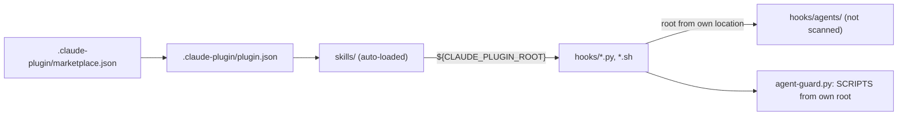

# Install the skills from the Claude Code plugin marketplace

> Superseded on 2026-09-29 by [part 1: plumbing](2026-09-29-plugin-marketplace-1-plumbing.md) (W1, W2) and [part 2: cutover](2026-09-29-plugin-marketplace-2-cutover.md) (W3 to W6), which split this spec at 3,600 words. Kept unchanged below, with [its record](records/2026-09-29-plugin-marketplace-record.md) and [its spike results](spikes/2026-09-29-plugin-marketplace-results.md), because they hold the verifier rounds, both cold reviews and the spike history.

## Goal

This repo becomes a Claude Code plugin named `claude-skills`, published from a marketplace in the same repo, so that `/plugin marketplace add ChrisAdkin8/claude-skills` and `/plugin install claude-skills@claude-skills` give a user `idea`, `research`, `spec` and `cold-review`, working, from Claude Code's plugin cache. The two symlinks the README installs today (`~/.claude/skills` and `~/.claude/hooks`) go away. Every path a skill, script, agent or test uses to find another file in the repo stops depending on them.

## Decision

- **The repo root is the plugin, and its own marketplace** (`source: "./"`), named `claude-skills`, so skills are named `/claude-skills:spec`, `/claude-skills:research`, `/claude-skills:idea` and `/claude-skills:cold-review`; the bare `/spec` and the rest also resolve while no other skill has the name (spike 7). Chosen by the user on 2026-09-29.
- **Plugin only.** The symlink install is retired. Development runs the checkout with `claude --plugin-dir .`. Chosen by the user on 2026-09-29. Rejected: supporting both, because `${CLAUDE_PLUGIN_ROOT}` can't expand under a symlink install, so every `allowed-tools` line would need both path spellings and every test would cover two layouts.
- **The agent files stay in `hooks/agents/`.** The plugin loader scans a top-level `agents/` directory ([plugin components](https://code.claude.com/docs/en/plugins/components.md); confirmed by spike S2, `docs/specs/spikes/2026-09-29-plugin-marketplace-results.md`), so `hooks/agents/` is already outside its reach and nothing moves. This drops the "move the agents" step from the plan discussed before this spec, which assumed the agents had to leave `hooks/`. Rejected: a top-level `agents/`, which would load all four agents into every session, and `hooks/run-agent.sh:55-56` exists to prevent that.
- **`~/notes` stays hardcoded for v1** and is documented as a prerequisite. Rejected for now: `userConfig` for the notes directory, which touches 183 references (`git grep -nE '~/notes|\$HOME/notes'`, excluding `docs/specs/`).
- **Root indirection by two mechanisms**, chosen per file type: scripts locate the repo from their own location (`__file__`, `dirname "$0"`); markdown that names a path uses `${CLAUDE_PLUGIN_ROOT}`. Spike 1 found that `${CLAUDE_PLUGIN_ROOT}` expands in `allowed-tools` too, so no wrapper directory is needed.

## Background

Read at `c05ef6a` on 2026-09-29: the local `main`, fast-forwarded to the head of the branch `sandbox-denylist-and-skill-fixes` (draft PR #27, open, not yet on `origin/main`, whose tip is `90304a5`). Those six commits change the guard, the sandbox settings, their tests and other files this spec edits, so every fact below holds only once PR #27 merges. An earlier draft was read at `90304a5`, where the counts were 129 live references, 61 dated and 178 `~/notes`; the facts were re-read at `0c85bc9`, and `c05ef6a` differs from that only by 71 added lines in `tests/agent-evals/BASELINE.md`, which no citation touches.

**How the repo finds itself today.** `CLAUDE.md:3` and `:33` say `~/.claude/skills` and `hooks` are symlinks into the repo and that files refer to each other by `~/.claude/...` paths. The README's install links them by hand (`README.md:85-86`), and CI does the same (`.github/workflows/tests.yml:21-24`). A grep for `~/.claude/{skills,hooks,agents}`, `$HOME/.claude/...` and `.claude/skills|hooks`, excluding `docs/specs/`, any `records/` directory, `CHANGELOG.md`, `BASELINE.md`, `.git` and `skills/synced/`, finds 141 lines in 40 files (`git grep -InE` for that pattern over tracked files, with those exclusions; a plain `grep -r` also reads the untracked `tests/*/results/` and finds 483); the same references inside those excluded, dated files number 62 (`git grep -InE` with the same pattern over tracked `docs/specs/`, `records/`, `CHANGELOG.md` and `tests/agent-evals/BASELINE.md`).

**Skills.** Each skill's permissions are its `allowed-tools` frontmatter line, with literal `~/.claude/...` patterns for the helper scripts and `git-read.py`: `skills/spec/SKILL.md:6-9`, `skills/research/SKILL.md:6`, `skills/cold-review/SKILL.md:6`. `skills/idea/SKILL.md:5` names no plugin file, so it needs no path change. Skills tell the model to write paths with `~`, not expanded, because the patterns are written that way (`skills/spec/spike-step.md:16`).

**Agents run headless.** `hooks/run-agent.sh` finds its directory from `$0` (`hooks/run-agent.sh:54`) and reads the agent file from `$here/agents` (`hooks/run-agent.sh:57`). It converts the file with `hooks/agent-def.py` (`hooks/run-agent.sh:71`) and starts `claude -p --agents ... --add-dir "$HOME/.claude" ... --settings "$here/agent-sandbox.json"` (`hooks/run-agent.sh:102-106`). The agent files' hook commands are the literal `python3 "$HOME/.claude/hooks/agent-guard.py" <mode>`: `hooks/agents/cold-reviewer.md:10,14`, `hooks/agents/researcher.md:10-26`, `hooks/agents/research-verifier.md:10-22`, `hooks/agents/spec-verifier.md:10,14`. `agent-def.py` copies a hook command through unchanged (`hooks/agent-def.py:56-59`; the docstring's example is at `hooks/agent-def.py:16`).

**The guard.** `hooks/agent-guard.py:78-93` builds its allow-list of scripts (`SCRIPTS`, `NET_SCRIPTS`) as `HOME / ".claude/skills/..."` resolved, so today it matches the symlink target. `hooks/agent-guard.py:214` builds `OUTSIDE_SPELLINGS`, the literal `~/.claude/skills/research/scripts/<name>` spellings a call may use to run outside the sandbox, and the comment above it says a call written with an absolute path ran inside the sandbox, where the script failed (`hooks/agent-guard.py:209-213`). Its secret and history lists name specific `~/.claude` entries (`hooks/agent-guard.py:259-281`), not the whole directory, so a path under `~/.claude/plugins/` is neither denied nor named. `tests/test_agent_guard.py:119-130` (`SymlinkedInstall`) tests exactly the symlink layout.

**Sandbox settings.** `hooks/agent-sandbox.json:5` names three scripts under `~/.claude/skills/research/scripts/` in `excludedCommands`; `:14` denies writes to `~/.claude`. `tests/test_sandbox_settings.py:23-25` loads the file and `:134` derives the skill-eval variant from it, adding `~/.claude/hooks/run-agent.sh *`. `skills/spec/spike-settings.json` also carries five lines that name `~/.claude`: four permission denies and one sandbox `denyRead` list.

**Other absolute paths.** `skills/spec/scripts/check-spec.py:45` reads its template from `~/.claude/skills/spec/template.md`; `skills/spec/scripts/run-spike.sh:41` passes `$HOME/.claude/skills/spec/spiker.md`; `skills/research/scripts/build-index.py:37` writes its own path into every generated index; `skills/cold-review/scripts/review-state.py:175` prints a `~/.claude/hooks/git-read.py` command for the skill to run.

**Tests and evals.** `tests/test_run_agent.py:38-41` builds a fake home with an empty `~/.claude`; the agent evals pass `hooks/agent-sandbox.json` as it is to `--settings` (`tests/agent-evals/run.sh:49`), run with `--add-dir "$HOME/.claude"` and rely on the symlinks (`tests/agent-evals/run.sh:34,78`); the skill evals do the same with `hooks/agent-sandbox.json`, or `agent-case-settings.json` for `research-quick-flow` and `spec-quick`, the two cases that launch agents (`tests/skill-evals/run.sh:68-69`); the skill evals run `claude -p` with a `prompt.txt` that types `/cold-review ...` (`tests/skill-evals/run.sh:73-74`, `tests/skill-evals/cases/cold-review-delta/prompt.txt:1`).

**Plugin behaviour, from the docs (all *(unverified)* until the spikes).** A marketplace needs `.claude-plugin/marketplace.json` with `name`, `owner` and `plugins`; a plugin needs `.claude-plugin/plugin.json` with `name`; a plugin in the marketplace's own repo uses a relative `source` ([marketplace reference](https://code.claude.com/docs/en/plugins/marketplace-reference.md), [manifest reference](https://code.claude.com/docs/en/plugins/manifest-reference.md)). Plugins are copied to `~/.claude/plugins/cache/<marketplace>/<plugin>/<version>/`; a symlink or `..` path leaving the plugin is rejected ([loading](https://code.claude.com/docs/en/plugins/loading.md)). `${CLAUDE_PLUGIN_ROOT}` is expanded in hook commands and in skill, command and agent markdown ([manifest reference](https://code.claude.com/docs/en/plugins/manifest-reference.md)); the docs don't say whether it is expanded in `allowed-tools` frontmatter, and spike 1 found that it is, under `--plugin-dir` (`docs/specs/spikes/2026-09-29-plugin-marketplace-results.md`). Plugins can't ship permission or sandbox settings. `claude plugin validate <path> [--strict]` checks a plugin ([CLI reference](https://code.claude.com/docs/en/plugins/cli-reference.md)).

## Non-goals

- Making `~/notes` configurable, or the plugin usable without it.
- Shipping the user-level deny rules in `~/.claude/settings.json`: plugins can't. The README documents them instead.
- Rewriting dated documents: `docs/specs/`, `records/`, `CHANGELOG.md`, `tests/agent-evals/BASELINE.md`. They keep the paths they were written with.
- Changing what any skill does, or the steps in any skill file beyond its paths.
- Renaming the 107 mentions of `/spec`, `/research`, `/idea` and `/cold-review` in the README, docs and skills (`git grep -nEI '`/(spec|research|idea|cold-review)([ `]|$)|/(spec|research|idea|cold-review) (quick|ideas|finish|spike|done|prompt)' -- . ':!docs/specs' ':!records' ':!CHANGELOG.md' ':!tests/agent-evals/BASELINE.md'` finds 107 lines in 23 files): the bare names still resolve (spike 7), so only the eval prompts and W3's Done when use the namespaced form.
- Submitting to Anthropic's own marketplace.

## Design

- **Scripts** compute the root from their own location: Python `Path(__file__).resolve().parents[n]`, shell `dirname "$0"` (as `hooks/run-agent.sh:54` already does).
- **One settings renderer, three callers.** A new `hooks/agent-settings.py <settings file> <root>` prints the settings with `${CLAUDE_PLUGIN_ROOT}` replaced by the root, written as an absolute path: an `excludedCommands` entry written with `~` does not exclude an absolute-path call, and the skills' calls will be absolute (spikes Q1 and Q6). `hooks/run-agent.sh` writes its output to `$run/settings.json` and passes that to `--settings`; `tests/agent-evals/run.sh` and `tests/skill-evals/run.sh` do the same per run, with the checkout as the root, so no runner passes a placeholder through. `EVAL_SETTINGS` (`tests/agent-evals/run.sh:49`) still overrides the file, and the renderer runs on whatever it names; set empty, it still passes no `--settings`. The committed `hooks/agent-sandbox.json` and `tests/skill-evals/agent-case-settings.json` keep the placeholder in `excludedCommands` (and the skill-eval variant appends `${CLAUDE_PLUGIN_ROOT}/hooks/run-agent.sh *`), so the deny-list agreement test compares like with like; until W3 the same `excludedCommands` also keeps the legacy `~/.claude/skills/research/scripts/<name> *` entries beside the placeholder ones. The renderer fails on any other `${...}`. `run-agent.sh` also exports the root.
- **`agent-def.py`** replaces `${CLAUDE_PLUGIN_ROOT}` in hook commands and in the prompt body with the root it is given (`--root`), so the agent files say `python3 "${CLAUDE_PLUGIN_ROOT}/hooks/agent-guard.py" bash` in their hooks and `${CLAUDE_PLUGIN_ROOT}/skills/research/scripts/repo-health.sh` where their prose names a script (`hooks/agents/researcher.md:56,61,83`, `hooks/agents/research-verifier.md:79-80`, and the mentions of the guard and `ideation-rules.md` at `hooks/agents/researcher.md:33,47,70,78`), so an agent writes the absolute spelling the guard and the sandbox match. New: it exits 2 on any other `${...}` in a command, since today it never inspects a command's text (`hooks/agent-def.py:56-59`), and it takes `--root <dir>` beside its one file argument, which it requires exactly today (`hooks/agent-def.py:122`).
- **`agent-guard.py`** builds `SCRIPTS`, `NET_SCRIPTS` and `OUTSIDE_SPELLINGS` from its own root. `OUTSIDE_SPELLINGS` holds the absolute spelling the skills and agents will write and, until W3, the legacy `~/.claude/skills/research/scripts/<name>` spelling too, because the guard compares a call's `argv[0]` to it literally (`hooks/agent-guard.py:1291-1300`) and a call in the other spelling would run inside the sandbox and fail. The two settings templates likewise list both spellings in `excludedCommands` until W3, since an entry written one way does not exclude a call written the other (spike Q6). W3 removes the legacy spelling from all three. Because its private-path lists don't cover `~/.claude/plugins/`, it adds `.claude/plugins` to the private set, with exactly one exemption: the guard's own root, `Path(__file__).resolve().parents[1]`, when that lies under `~/.claude/plugins/`. Every other path under `~/.claude/plugins/` (other plugins' caches, marketplace clones, `plugins/data/`) is denied to agents. Under `--plugin-dir` the root is the checkout, outside `~/.claude/plugins/`, so the exemption never applies and the checkout is read as any repo is. Its deny lists otherwise don't change.
- **Skills** use `${CLAUDE_PLUGIN_ROOT}/...` in body text and in `allowed-tools` (spike 1). Existing text that says "written with `~`" is corrected for these paths.
- **Cutover order.** Scripts, guard and agent files change first and work under both layouts, since they find the root themselves and accept both path spellings. The skill files change in one item (W3): after it, the old symlink install no longer permits their commands. The author's own session must run `claude --plugin-dir` from the checkout before W3, since `CLAUDE.md:3` says edits here are live.

## Work items

### W1: Manifests and validation

- **Change:** add `.claude-plugin/plugin.json` (`name: claude-skills`, `description`, `author`, `version: 0.1.0`, `repository`, `license`) and `.claude-plugin/marketplace.json` (`name: claude-skills`, `description`, `owner`, one plugin with `source: "./"`). Add a `claude plugin validate . --strict` step to CI, preceded by a step that installs the `claude` CLI pinned to 2.1.285, the version the spikes ran on (`npm install -g @anthropic-ai/claude-code@2.1.285`; *(assumption: that package installs the same CLI, and the macOS runner has npm)*).
- **Files:** `.claude-plugin/plugin.json` (new), `.claude-plugin/marketplace.json` (new), `.github/workflows/tests.yml`.
- **Done when:** `claude plugin validate . --strict` exits 0, and `claude plugin marketplace add <checkout path>` followed by `claude plugin install claude-skills@claude-skills` succeeds in a scratch `HOME`; and the first CI run of the validate step passes without a login secret. If it needs one, the step is removed from CI and W1 says so, leaving validate a local check.

### W2: Scripts, agent files, guard and sandbox find their own root

- **Change:** the mechanisms in Design, for the scripts and settings listed under Background: `run-agent.sh`, `agent-def.py`, the four agent files (their hook commands, and the prose in `researcher.md` and `research-verifier.md` that names scripts), `agent-guard.py` (including `OUTSIDE_SPELLINGS` and the refusal text that names the spelling), `agent-sandbox.json` and its skill-eval variant, the new `agent-settings.py` and its two eval-runner callers, `skills/spec/scripts/check-spec.py:45`, `skills/spec/scripts/run-spike.sh:41`, `skills/research/scripts/build-index.py:37`, `skills/cold-review/scripts/review-state.py:175`, and the comments that name `~/.claude` paths in `check-note.py`, `mdcheck.py` and `reddit-search.sh`.
- **Files:** `hooks/run-agent.sh`, `hooks/agent-def.py`, `hooks/agent-settings.py` (new), `hooks/agent-guard.py`, `hooks/agent-sandbox.json`, `hooks/agents/*.md`, `skills/spec/scripts/check-spec.py`, `skills/spec/scripts/run-spike.sh`, `skills/research/scripts/{build-index.py,check-note.py,mdcheck.py,reddit-search.sh}`, `skills/cold-review/scripts/review-state.py`, `skills/spec/spike-settings.json` (its `~/.claude` entries are denies and stay, so only a check that none is a locator), `tests/skill-evals/agent-case-settings.json`, and the tests that pin the changed strings: `tests/test_agent_def.py` (line 17, the guard hook command, plus new cases for `--root` and for the exit 2 on another `${...}`), `tests/test_review_state.py:203` (the `git-read.py` hint) and `tests/test_sandbox_settings.py`; the runners `tests/agent-evals/run.sh` and `tests/skill-evals/run.sh` (settings only); and the guard and runner tests, rewritten to script paths built from the repo root instead of `~/.claude/skills/...`: `tests/test_agent_guard.py` (the assertions at `tests/test_agent_guard.py:86-128`, `tests/test_agent_guard.py:165-171` and `tests/test_agent_guard.py:335-378`, which name the research and spec scripts) and `tests/test_agent_guard.py:784-803` (the reads of `~/.claude/skills/spec/SKILL.md`, `~/.claude/hooks/agents` and `~/.claude/skills`, rewritten to the plugin root: they assert that an agent may read the plugin's own files, which stays true) `tests/test_run_agent.py` and `tests/test_eval_runners.py` (lines 187, 212 and 283-285 assert that `--settings` ends with `hooks/agent-sandbox.json` or `agent-case-settings.json`; they change to the rendered file). `SymlinkedInstall` (`tests/test_agent_guard.py:118`) stays until W4, since it is still true.
- **Done when:** with the checkout copied (not linked) to a temporary plugin cache path and no `~/.claude/skills` or `hooks` link, `tests/test_run_agent.py` passes against that copy; `agent-guard.py` allows `check-note.py` there and blocks `cat ~/.claude/plugins/other-plugin/x` (a new test, red before, green after); `tests/test_sandbox_settings.py` still passes; and the whole suite, `python3 -m unittest discover -s tests`, passes both with the symlinks CI creates today and in a scratch `HOME` with no `~/.claude` links (a new test in `tests/test_agent_guard.py`, red before W2, green after). A test renders both settings files and finds no `${` left, and that each runner passes a rendered file. Guard tests show that `~/.claude/skills/research/scripts/repo-health.sh o/r` and `<repo root>/skills/research/scripts/repo-health.sh o/r` are each accepted as a call of their own and refused beside another command; a test shows both rendered settings list both spellings; and a test shows the rendered `researcher` and `research-verifier` prompts hold no `~/.claude/skills` spelling. `tests/test_eval_runners.py` passes with its `--settings` assertions changed to the rendered path.

### W3: Skills use the plugin root

- **Change:** in the four skills and the files they load (`spike-step.md`, `done-step.md`, `ideas-finish.md`, `ideation-rules.md`) and `hooks/run-agent.md`, `hooks/agent-sandbox.md`, replace `~/.claude/{skills,hooks,agents}/...` with `${CLAUDE_PLUGIN_ROOT}/...`, in `allowed-tools` too (spike 1). Rewrite the "written with `~`" rule (`skills/spec/spike-step.md:16`) for plugin paths. Remove the legacy `~/.claude/skills/research/scripts/<name>` spelling from `OUTSIDE_SPELLINGS` and from both settings templates' `excludedCommands`.
- **Files:** `skills/*/SKILL.md`, `skills/spec/{spike-step,done-step}.md`, `skills/research/{ideas-finish,ideation-rules}.md`, `hooks/run-agent.md`, `hooks/agent-sandbox.md`, `hooks/agent-guard.py`, `hooks/agent-sandbox.json` and `tests/skill-evals/agent-case-settings.json`.
- **Done when:** a `claude -p --plugin-dir . "/claude-skills:idea a test idea"` in a scratch `HOME` writes the note without a permission prompt; the same for one `/claude-skills:cold-review` on a small markdown file, which launches an agent; `check-spec.py` still passes on every spec in `docs/specs/` (it checks citations at each spec's read-at commit, `skills/spec/scripts/check-spec.py:11`); and the same two runs again after `claude plugin marketplace add` of the checkout and `claude plugin install claude-skills@claude-skills` into a scratch `HOME` (not `--plugin-dir`), where the root is the versioned cache path, with no denial, and with the root the guard derives from `__file__` equal to the `${CLAUDE_PLUGIN_ROOT}` the skill expanded, printed by one `python3 -c` on the cache path *(assumption: a scratch `HOME` has no login, so this run is authenticated by `ANTHROPIC_API_KEY`)*.

### W4: Tests, CI and evals run on the plugin layout

- **Change:** replace `SymlinkedInstall` with a copy-to-cache-path test (the guard and runner tests were already made layout-independent in W2); add a test that fails on any `~/.claude/{skills,hooks,agents}` reference outside the dated documents and an explicit exempt list (the `tests/test_mine_sessions.py` fixtures), scanning tracked files only (`git ls-files`, since a plain walk also reads the untracked `tests/*/results/`), so the 141 don't grow back; drop the symlink step from CI; make `tests/agent-evals/run.sh` and `tests/skill-evals/run.sh` load the plugin (`--plugin-dir`) and type `/claude-skills:<skill>`.
- **Files:** `tests/test_agent_guard.py` (`SymlinkedInstall` only), a new `tests/test_no_stale_paths.py`, `tests/test_mine_sessions.py:16,116,125` (fixtures, listed as exempt), `tests/skill-evals/cases/research-quick-flow/grade.py:18`, `tests/skill-evals/cases/spec-done/grade.py:20`, `tests/skill-evals/cases/spec-quick/grade.py:19`, `tests/agent-evals/run.sh`, `tests/skill-evals/run.sh`, `tests/skill-evals/cases/*/prompt.txt`, `tests/replay_guard.py`, `.github/workflows/tests.yml`.
- **Done when:** `python3 -m unittest discover -s tests` passes with no `~/.claude/skills` or `hooks` link present (also in CI); the stale-path test is red on a scratch commit that reintroduces one reference and green after; `tests/agent-evals/run.sh` and `tests/skill-evals/run.sh` pass on Sonnet and on Opus, run one after the other.

### W5: Docs and conventions

- **Change:** a README "Install" section replacing the symlink one (`README.md:72-90`): marketplace commands, the `~/notes` prerequisite, the user-level deny rules to add by hand, and `claude --plugin-dir .` for development. It says that `/spec` and `/claude-skills:spec` both work, and that with the old symlinks still in place the bare name is defined twice. `README.md:271` names `~/.claude/skills/research/scripts/build-index.py` for a command the user runs by hand, so W5 replaces it with a form that works under the versioned cache path (see Open questions). The new `CLAUDE.md` text about dated documents avoids the literal `~/.claude/skills` and `hooks` paths, so the grep below can print nothing. Revise `CLAUDE.md:3` and `:33`, and add that dated documents keep the paths they were written with. Add a CHANGELOG entry and a dated `- Not reviewed:` line to `records/README-record.md`.
- **Files:** `README.md`, `CLAUDE.md`, `CHANGELOG.md`, `records/README-record.md`, `docs/repo-guide.md`, `docs/containment.md`, `.gitignore:6` (its comment says `~/.claude/skills` links here).
- **Done when:** the README's install commands, run in a scratch `HOME`, leave `/claude-skills:idea` working; `grep -n '~/.claude/\(skills\|hooks\)' README.md CLAUDE.md docs/*.md` prints nothing (today it prints seven lines: `CLAUDE.md:3`, `README.md:81,85,86,271` and `docs/repo-guide.md:6,7`).

### W6: Record the evals and release

- **Change:** a dated `tests/agent-evals/BASELINE.md` section with every case's result and cost on both models, and the skill evals'; tag `v0.1.0` on the merge commit if asked.
- **Files:** `tests/agent-evals/BASELINE.md`.
- **Done when:** the section lists all cases per model with cost, including cases not expected to change, each within its cap ($5, $10 for `research-ideas`, $3 for skill cases, per `CLAUDE.md`).

## Effort

| Item | Estimate | Depends on |
|---|---|---|
| W1 | 0.5 day | spike 5 |
| W2 | 2 days | none; spikes 3 and 4 gate its merge |
| W3 | 1 day, mostly mechanical | W2 |
| W4 | 1.5 days, plus about $12 of evals | W3 |
| W5 | 0.5 day | W3 |
| W6 | 0.5 day of waiting on runs | W4 |

Estimated from reading the code (about 40 files, one security-sensitive), not from doing the work, so trust the ordering more than the numbers. The eval figure is two full agent-eval runs at $3.70-$4.68 each ($7.40-$9.36) plus the four skill-eval cases at about $0.30 each, twice ($2.40), so $10-$12 (`CLAUDE.md:15-19`).

## Spike questions

1. Does `${CLAUDE_PLUGIN_ROOT}` expand in `allowed-tools` frontmatter, and does the expanded absolute path then match the Bash call the model writes, so the command runs without a prompt? Experiment: a scratch plugin with one skill whose `allowed-tools` is `Bash(${CLAUDE_PLUGIN_ROOT}/bin/hello *)` and whose body says to run it; `claude -p --plugin-dir` on it, in default permission mode. If it fails, W3 takes the `bin/` route.
   Answered: yes. Under `--plugin-dir`, a skill with `allowed-tools: Bash(${CLAUDE_PLUGIN_ROOT}/bin/hello *)` ran the command with no denial, the same as one with the literal path, while a skill with no `allowed-tools` was denied; the model wrote the expanded absolute path. W3 takes the `${CLAUDE_PLUGIN_ROOT}` route, not `bin/`. Not tested: a marketplace install's versioned cache path (run by hand, docs/specs/spikes/2026-09-29-plugin-marketplace-results.md)
2. After `claude plugin install` from a marketplace (not `--plugin-dir`), does the cache copy keep the executable bit on `hooks/*.py`, `hooks/*.sh` and `skills/*/scripts/*`, and does `hooks/agents/` stay unloaded as agents? Experiment: install from the checkout as a local marketplace in a scratch `HOME`; `ls -l` the cache; list the session's agents.
   Answered: yes to both. A marketplace install into a scratch `HOME` kept mode 755 on all 14 files git tracks as 100755, and `claude plugin details` listed 4 skills, 0 agents and 0 hooks with `hooks/agents/` present in the cache; a control plugin with a top-level `agents/` showed 1 agent. `claude agents --json` returned `[]` even for the control in the sandbox, so use `claude plugin details` to check components (spike S2, `docs/specs/spikes/2026-09-29-plugin-marketplace-results.md`)
3. Does `run-agent.sh` run an agent end to end from the cache path, with the agent's Read and Bash guarded there? Experiment: after 2, run `run-agent.sh spec-verifier` on a tiny spec from the cache copy, in a scratch `HOME`.
   Open: needs credentials and the API host; run after W2.
4. Which paths under the plugin root do the four agents actually read, so the guard's "own root only" rule for `~/.claude/plugins/` doesn't block one? Experiment: replay the recorded agent sessions (`tests/replay_guard.py`) with the rule in place, and count new denials.
   Open: needs this machine's transcripts and the guard rule W2 builds; run after W2.
5. Does `claude plugin validate` run without credentials, so CI can call it? Experiment: run it with a scratch `HOME` and no `ANTHROPIC_API_KEY`.
   Partly answered: `claude plugin validate . --strict` ran with no API key or login prompt in a scratch `HOME`, but macOS Keychain logins survive that, so only a fresh CI runner proves it; and it exited 1 because the stand-in `marketplace.json` had no top-level `description`, which W1 now adds (run by hand, docs/specs/spikes/2026-09-29-plugin-marketplace-results.md)
6. Does a sandbox `excludedCommands` entry written with the absolute plugin root exclude a call written with that same absolute path? `hooks/agent-guard.py:209-213` says an absolute spelling ran inside the sandbox against the `~` entry. Experiment: in a scratch `HOME`, a settings file whose `excludedCommands` holds `<root>/skills/research/scripts/repo-health.sh *`, and `claude -p` told to run that path with `gh` available, checking the call reaches the network.
   Answered: yes. In a sandbox with no allowed hosts, an `excludedCommands` entry holding the absolute path let a call written with that path reach the network, while an entry holding `~` did not, and neither did no entry (spike Q6, run by hand, with a stand-in for the script, docs/specs/spikes/2026-09-29-plugin-marketplace-results.md)
7. Does a plugin's skill answer to its bare name as well as its namespaced one? Experiment: `claude -p --plugin-dir` on a scratch plugin, typing `/<skill>` instead of `/<plugin>:<skill>`.
   Answered: yes. `/var` ran the plugin's `var` skill with no denial. Not tested: a marketplace install, or a bare name shared with another skill (spike Q7, run by hand, docs/specs/spikes/2026-09-29-plugin-marketplace-results.md)

## Risks and rollback

- **Rollback for any item:** it lands as its own commit on a branch, so revert it.
- **The guard's path change is the security-sensitive part.** A bug that lets `SCRIPTS` match nothing fails closed (scripts blocked); one that matches too much is the danger, so the new tests cover the negative case first. W2 gets its own cold review before merge.
- **The spec is read at a draft PR's head.** Local `main` is at PR #27's head (`c05ef6a`), not `origin/main`. If the PR's history is rewritten again, as it was once during this spec's writing, local `main` diverges from it: reset `main` to `origin/main`, then re-read and re-cite the guard, sandbox and test files. If the PR merges normally on GitHub, `main` fast-forwards to the merge commit.
- **The cutover breaks the author's live session.** The skill files change in W3 alone, after the author has switched to `--plugin-dir`.
- **`~/notes` limits who can use the plugin.** A stranger's first `/claude-skills:research` stops at the README's setup section. Accepted for v1.
- **Users of the old install** keep working only until they pull. The README's new Install section says to remove the two symlinks, since both installs at once would load every skill twice.

## Open questions

- Should `plugin.json` pin `version`? Pinned, users update only when it is bumped; omitted, every commit to main is an update (docs, *unverified*). This spec pins `0.1.0`, because the repo commits often. Say if that is wrong.
- Verifier round 2 said `Plan holds: no`, because W4's stale-path test would fail on `tests/test_agent_guard.py:784-803`, which no work item covered. W2 now covers it; there is no round 3, so that fix has not been re-checked.
- How does a user run a plugin's script by hand under a marketplace install? `README.md:271` does it for `build-index.py`, but the script sits at a versioned cache path. A plugin `bin/` directory would put it on `PATH` *(unverified)*; the alternative is to run it only through the skill. W5 needs one of them, and no spike has tested either.
- Verifier round 3 (`/spec finish`) said `Plan holds: no`, because `tests/test_eval_runners.py` pins the `--settings` path and no work item listed it. W2 now lists it; there is no further round, so that fix has not been re-checked.
