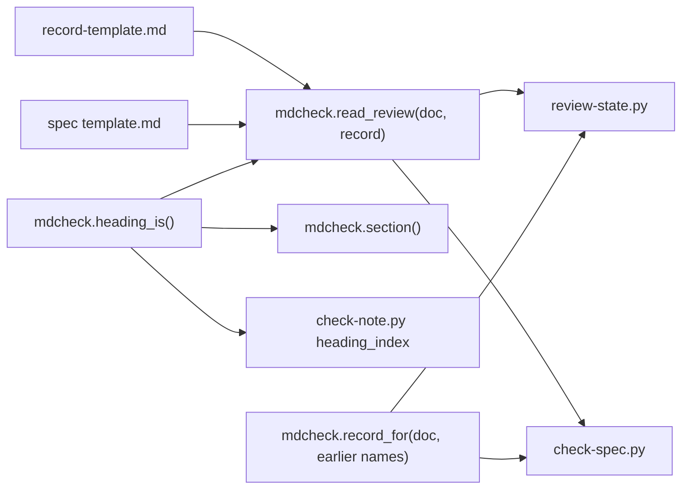

# One review parser for review-state.py and check-spec.py

## Goal

`review-state.py` and `check-spec.py` read a document's saved cold review through one parser in `skills/research/scripts/mdcheck.py`, so they can't disagree, and the reviewer's saved reply can no longer steer either of them. Headings are matched by one rule, shared by `section()`, `check-note.py` and `check-spec.py`. Every document in the repo keeps the review state it has today.

## Decision

One parser, `read_review()` in `mdcheck.py`, which both scripts already load (`skills/cold-review/scripts/review-state.py:37-46`, `skills/spec/scripts/check-spec.py:43-62`). It finds a review only by fixed lines that `/cold-review` writes around the reply (`skills/cold-review/SKILL.md:159-167`), never by text inside it. Choices settled with the user on 2026-10-01:

- **Where a review ends.** In a record, at the next `##` heading the record template names, or `## Changes after the delta review`. In a document, at the next `##` heading the spec template names, else at the end of the file. Rejected: ending at the reply's closing `Needs a run:` line, because the 2026-09-17 review has none (`docs/specs/2026-09-17-spec-spike-phase.md:341-344`); and always at the end of the file, which would swallow a record's later sections.
- **A document moved without its record.** Both scripts look for the record under the document's earlier names, use it, and say to move it. Rejected: failing until it's moved, which needs a new state the cold-review skill would have to handle.
- **An unfilled record template.** It isn't a review, and its placeholders make `check-spec.py` FAIL. Rejected: only a WARN.

## Background

Read at `7158a7b` on 2026-10-01.

**Prefix headings.** `section()` takes the first line that *starts with* the heading (`skills/research/scripts/mdcheck.py:147-160`, the test at :153). So `README.md:278`, `## Cold review of any document`, is a saved review to it. `review-state.py` would read it as one if the README's record had none (`skills/cold-review/scripts/review-state.py:135-137`). `check-note.py`'s `heading_index` matches the same way (`skills/research/scripts/check-note.py:104-105`), and so does `split_cold_review` (`skills/spec/scripts/check-spec.py:149-177`, the test at :158). Every heading these callers ask for was compared, old rule against new, over the 163 markdown files in this repo and `~/notes`: the only difference was `README.md:278`.

**The reply steers both scripts.**

- Any line matching `DELTA_REVIEW` inside the review counts as a delta review (`skills/research/scripts/mdcheck.py:39-40`; `skills/cold-review/scripts/review-state.py:143`; `skills/spec/scripts/check-spec.py:775`). The pattern needs no date, and nothing checks for the delta's own `Reviewed on` line.
- The review ends at the next heading of level 2 or above (`skills/research/scripts/mdcheck.py:156`; `skills/spec/scripts/check-spec.py:164-171`), so a `## Findings` in the reply cuts it short.
- `read_record` counts a `Not reviewed:` line anywhere in the record, the reply included (`skills/spec/scripts/check-spec.py:207`); so does `review-state.py` (`skills/cold-review/scripts/review-state.py:146`).
- The review date is the first `Reviewed on <date> by` anywhere in the review (`skills/cold-review/scripts/review-state.py:48`, :141).
- A record can also hold a review that isn't a delta: `### Guard diff review, 2026-09-30` follows the delta, with its own `Reviewed on` line (`docs/specs/records/2026-09-29-plugin-marketplace-1-plumbing-record.md:57-59`).

**The legacy deadlock.** An older spec keeps `Not reviewed:` lines in Open questions (`skills/spec/SKILL.md:30`). Once its record exists, `review-state.py` ignores them (`skills/cold-review/scripts/review-state.py:145-152`). But `check-spec.py` counts them (`skills/spec/scripts/check-spec.py:772-774`) and FAILs a `reviewed` spec until a delta review has run (:802-807). `/cold-review` then never offers that delta review, so the spec can't move on.

**Unfilled template.** The record template's review line is `Reviewed on {{YYYY-MM-DD}} by cold-reviewer.` (`skills/spec/record-template.md:10-12`). A `## Cold review` section with any lines in it counts as a review in both scripts (`skills/cold-review/scripts/review-state.py:135-140`; `skills/spec/scripts/check-spec.py:206`, :515). The template has 24 distinct `{{…}}` placeholders, counted with `grep -o '{{[^}]*}}' skills/spec/record-template.md | sort -u`. None of them appear in today's records (`grep -F -f` over `docs/specs/records/*.md` and `records/README-record.md`).

**Moved document.** The record is looked up only beside the document's current name (`skills/research/scripts/mdcheck.py:163-165`). After a `git mv` of the document alone, `review-state.py` finds no review and says `full` (`skills/cold-review/scripts/review-state.py:223-224`).

**Where `Not reviewed:` lines are written.** Folds go under `## Changes since the review` (`skills/cold-review/SKILL.md:156-158`; `skills/spec/spike-step.md:65`). Two records also use `## Changes after the delta review` (`docs/specs/records/2026-09-28-skill-best-practices-1-invocation-record.md:68-76`; `docs/specs/records/2026-09-28-skill-best-practices-2-structure-record.md:80`). One record has one under `## Spikes` (`docs/specs/records/2026-09-27-notes-mindmap-index-record.md:62`). Counted per section with awk, every `Not reviewed:` line in today's records sits in one of these three sections.

**Today's states.** Measured at `7158a7b` by running both scripts on each document:

| Document | `review-state.py` | review, delta, not-reviewed | `check-spec.py` INFO |
|---|---|---|---|
| `docs/specs/2026-09-17-spec-spike-phase.md` | unlogged | document 2026-09-17, no, 0 | none; PASS |
| `docs/specs/2026-09-26-implement-skill-1-tools.md` | done | record 2026-09-27, yes, 6 | 6 in its record; PASS |
| `docs/specs/2026-09-26-implement-skill-2-skill.md` | done | record 2026-09-27, yes, 12 | 12 in its record; PASS |
| `docs/specs/2026-09-27-notes-mindmap-index.md` | done | record 2026-09-27, yes, 1 | 1 in its record; PASS |
| `docs/specs/2026-09-28-skill-best-practices-1-invocation.md` | done | record 2026-09-28, yes, 4 | 4 in its record; PASS |
| `docs/specs/2026-09-28-skill-best-practices-2-structure.md` | done | record 2026-09-28, yes, 2 | 2 in its record; PASS |
| `docs/specs/2026-09-29-plugin-marketplace-1-plumbing.md` | done | record 2026-09-30, yes, 4 | 4 in its record; PASS |
| `docs/specs/2026-09-29-plugin-marketplace-2-cutover.md` | full | none, no, 0 | none; PASS |
| `docs/specs/2026-09-29-plugin-marketplace.md` | done | record 2026-09-29, yes, 9 | 9 in its record; PASS |
| `README.md` | done | record 2026-09-25, yes, 44 | not a spec |

**Fixtures that change.** These test fixtures rely on the old rules:

- `tests/test_check_spec.py:199-204`: `DELTA` has no `Reviewed on` line.
- `tests/test_review_state.py:113`: `Reviewed on 2026-09-22.` has no `by`.
- `tests/test_review_state.py:196-197`: a delta with no `Reviewed on` line, and a `Not reviewed:` line under it.
- `tests/test_review_state.py:207-208` also changes, though the request didn't list it: it appends its `Not reviewed:` line straight after the review's table, inside the review.

`tests/test_check_spec.py:126-129` (review not last) and `tests/test_mdcheck.py:141-154` hold under the new rules. So does the skill-eval fixture `tests/skill-evals/cases/cold-review-delta/setup.sh:63-74`, which puts its line under `## Changes since the review`.

## Non-goals

- No change to the record template, the cold-review skill's saving steps for folds and reviews, or where `/spec` writes `Not reviewed:` lines.
- No change to how `review-state.py` finds the review commit, the diff base, or the changed headings (`skills/cold-review/scripts/review-state.py:155-221`), except that the search uses the record `record_for` found, and a rename with no edits isn't a change (W3).
- A spec half-moved into its record, with a review both inline and in the record, isn't handled: the parser reads the record's review only. That matches `review-state.py` today, but `check-spec.py` reads both today (`skills/spec/scripts/check-spec.py:512-515`): for such a spec it would check the inline reply's words and citations, and miss an inline delta. No document has that layout today.
- No move of the 2026-09-17 spec's inline review into a record.

## Design

**`heading_is(line, heading)`.** The line, stripped and lower-cased, equals the heading lower-cased, or starts with it followed by `:` or `,`. So `## Cold Review` and `### Delta review, 2026-09-27` match, but `## Cold review of any document` doesn't. `section()`, `heading_index` and the parser all use it. The parser skips headings in code, as `section()` does now.

**`read_review(doc_lines, record_lines)`** returns one value with these fields:

- `where`: `record`, `document` or `None`. The record is tried first, as now.
- `start`, `end`: the review's span in that file's lines, from its `## Cold review` heading up to where it ends (Decision).
- `date`: taken only when the first non-blank line under the heading matches `Reviewed on (\d{4}-\d{2}-\d{2}) by`. Without it there is no review: `where` is `None`.
- `delta_date`: from the first `### Delta review, <YYYY-MM-DD>` heading in the span, outside code, whose first non-blank line is its own `Reviewed on <date> by` line. The date comes from that line. The delta ends at the next heading of level 3 or above, so `### Guard diff review` is neither a delta nor part of one.
- `not_reviewed`: each `NOT_REVIEWED` line as (source, 1-based line, text). Sources are the document's `## Open questions`, and the record's `## Changes since the review`, `## Changes after the delta review` and `## Spikes`. Both files are always read, which ends the deadlock. Lines inside the review span, or in other sections, don't count.
- `placeholders`: the record template's own `{{…}}` tokens found in the record, as (line, token). The scan skips the review span, fenced code and inline code, so a reply or a fold that quotes a token isn't one. These are read from `skills/spec/record-template.md`, the way `template_prompts` reads a template (`skills/research/scripts/mdcheck.py:180-192`).
- `misplaced`: in a document, the spec-template `##` headings that ended the review early. This keeps `check-spec.py`'s "not the last section" WARN.

**`record_for(doc, earlier)`** returns `record_path(doc)` if that file exists. Otherwise it returns the first existing `record_path` of the document's earlier paths, else `None`. Each script finds the earlier paths two ways: committed moves from `git log --follow --name-only --format= -- <doc>`, and a staged `git mv` from the `R` lines of `git diff --cached -M --name-status` whose new name is the document. For a staged move, the committed history is followed from the staged old name. Checked on 2026-10-01 in a scratch repo: `git log --follow` printed nothing for a move that was only staged, while `git diff --cached -M --name-status` printed `R100	docs/b.md	docs/c.md`. W3 tests both.

**review-state.py** prints the same keys as now. It adds `record-moved: <path>` when the record was found under an earlier name, `not-reviewed-from: <file> <section> (<n>); …`, and one `placeholder: <line>: <token>` per placeholder. A review with placeholders but no date reads as `where: None`, so `state: full`. The `logged:` lines keep their format, because `/cold-review` quotes them (`skills/cold-review/SKILL.md:46-48`).

**check-spec.py** takes the legacy review's span from the parser, in place of `split_cold_review`, and still leaves it out of the word, citation and template checks. `read_record` and the delta gate (`skills/spec/scripts/check-spec.py:770-826`) take `review`, `delta` and the `Not reviewed:` lines from the parser. Each placeholder FAILs, naming the record and the token. A record found under an earlier name gives a WARN to `git mv` it. The INFO line keeps its wording, so today's outputs don't change.

## Work items

### W1: One heading rule

- **Change:** add `heading_is()` to `mdcheck.py`. `section()` and `check-note.py`'s `heading_index` match with it. So do the three heading tests in `check-note.py`'s after-Sources checks (`skills/research/scripts/check-note.py:285`, :306, :314). Otherwise a heading those tests let through, such as `## Verification notes`, would be one `heading_index` can't find. Update the module docstring's list.
- **Files:** `skills/research/scripts/mdcheck.py`, `skills/research/scripts/check-note.py`, `tests/test_mdcheck.py`, `tests/test_check_note.py`.
- **Done when:**
  - A new `test_mdcheck.py` test fails before the change and passes after it: `section(["## Cold review of any document", "x"], "## Cold review")` is `None`, while `## Cold Review`, `## Cold review:` and `## Cold review, 2026-09-01` all match.
  - A `test_check_note.py` test shows `heading_index` skips a `## Sources and notes` line.
  - `python3 -m unittest discover -s tests` passes.
  - `check-note.py` over every `~/notes/research/*.md` prints the same lines before and after the change.
  - `check-spec.py` over each of the 9 specs in Background's table prints the same lines before and after the change, since it calls `section()` for its required headings and its Spike questions (`skills/spec/scripts/check-spec.py:573`, :672).

### W2: The parser

- **Change:** add `read_review()` and `record_for()` to `mdcheck.py`, as the Design says. Add tests of what `read_review` returns in each case below. It is a new function, so these have nothing to fail against first; W3 and W4 show each bug failing first in the script that has it today:
  - a `### Delta review, <date>` with no `Reviewed on` line under it is no delta;
  - a `## Findings` heading inside the reply doesn't end the review;
  - a `- Not reviewed:` line inside the reply isn't counted;
  - `### Guard diff review, <date>` after a delta is neither a delta nor part of it;
  - a `Reviewed on <date> by` line anywhere but first doesn't date the review;
  - the unfilled record template is no review and lists its placeholders;
  - Open questions lines are counted when a record exists;
  - lines under `## Changes after the delta review` and `## Spikes` are counted;
  - a spec-template heading after an inline review ends it and is listed in `misplaced`;
  - `record_for` finds a record under an earlier name;
  - a `{{YYYY-MM-DD}}` quoted in the reply, or in inline code, isn't a placeholder.
- **Files:** `skills/research/scripts/mdcheck.py`, `tests/test_mdcheck.py`.
- **Done when:** the new tests pass under `python3 -m unittest tests.test_mdcheck`. A scratch script calling `read_review` on each document in Background's table gives that row's `where`, review date, delta (yes when `delta_date` is set) and `not_reviewed` count, and no placeholders.

### W3: review-state.py uses the parser

- **Change:** replace `skills/cold-review/scripts/review-state.py:135-153` with `read_review` and `record_for`, and print the new keys. Update its docstring. When `record_for` found the record under an earlier name, the review-commit search (`skills/cold-review/scripts/review-state.py:163-185`) looks in that record, so the diff base is found as before. `changed` comes from `git diff -M --numstat` in place of `--stat` (:214-215): it is `yes` only when a line adds or deletes something. Checked on 2026-10-01 in a scratch repo: after a pure `git mv`, committed or staged, `--stat` printed `docs/{a.md => b.md} | 0` and `1 file changed`, so today's script calls an untouched move a change, while `--numstat` printed `0	0	docs/{a.md => c.md}`. The `stat:` line keeps using `--stat`. Change the fixtures at `tests/test_review_state.py:113`, :196-197 and :207-208, as Background lists them. Add the `Reviewed on … by` lines, and move the `Not reviewed:` lines under `## Changes since the review`. Add tests, each of which fails against today's `review-state.py`:
  - the legacy deadlock: a spec with its review and `Not reviewed:` lines inline, plus a record holding only `## Verification`, is `delta`;
  - a delta heading with no `Reviewed on` line under it is `delta`, not `done`;
  - a `## Findings` heading in the reply, before the delta, still gives `done`;
  - a `- Not reviewed:` line quoted in the reply, and no other, gives `unchanged`, not `delta`;
  - a review whose first line isn't `Reviewed on <date> by`, though its table quotes one, is `full`;
  - a document moved without its record, committed, keeps its state (`unchanged` after an untouched move), prints `record-moved:` and the same `review-commit:` as before the move;
  - the same with the move only staged;
  - the unfilled template is `full` and prints its placeholders.
- **Files:** `skills/cold-review/scripts/review-state.py`, `tests/test_review_state.py`.
- **Done when:**
  - Each new test fails before the change and passes after it.
  - `python3 -m unittest tests.test_review_state` passes.
  - For each row in Background's table, `review-state.py <document>` prints the same `state:`, `review:`, `review-date:`, `delta-review:` and `not-reviewed:` values: done for the 7 specs, unlogged for 2026-09-17, full for the cutover spec, and done for `README.md`.

### W4: check-spec.py uses the parser

- **Change:** `split_cold_review`, `read_record` and the gate at `skills/spec/scripts/check-spec.py:770-826` take their facts from `read_review` and `record_for`. Add the placeholder FAIL and the moved-record WARN. Change `DELTA` at `tests/test_check_spec.py:199-204` to carry a `Reviewed on 2026-09-16 by cold-reviewer: the changes logged as Not reviewed. Saved unchanged.` line under its heading. Add tests:
  - a `reviewed` spec with `Not reviewed:` lines and a `### Delta review, <date>` heading with no `Reviewed on` line under it still FAILs;
  - a `reviewed` spec whose only `Not reviewed:` line is quoted inside the reply PASSes;
  - an inline review whose reply has a `## Findings` heading followed by a bad citation PASSes: the reply isn't checked;
  - one test of the placeholder scan: a record with a placeholder outside the review FAILs and names the token, and the same record with that token only quoted inside the reply PASSes. It fails today on its first half, because today's check never reads the record for placeholders (`skills/spec/scripts/check-spec.py:689`);
  - a record under the spec's earlier name WARNs.
- **Files:** `skills/spec/scripts/check-spec.py`, `tests/test_check_spec.py`.
- **Done when:**
  - Each new test fails against today's `check-spec.py` and passes after the change.
  - `python3 -m unittest discover -s tests` passes.
  - `check-spec.py` over each of the 9 specs in Background's table prints the same output as at `7158a7b`: PASS, with the INFO lines in the table. This spec, the tenth in `docs/specs/`, is left out because its record changes as it's reviewed; it must PASS.

### W5: The cold-review skill relays a moved record and names the section

- **Change:** in step 2 of the cold-review skill (`skills/cold-review/SKILL.md:43-52`), two edits. The `unlogged` item says to add the confirmed lines to the record "under `## Changes since the review`", since lines elsewhere no longer count (`skills/cold-review/SKILL.md:49-50`). And one new line: if `review-state.py` printed `record-moved:`, say the record is still under the document's old name, and give the `git mv` command for the user to run. The skill's `allowed-tools` doesn't allow `git mv` (`skills/cold-review/SKILL.md:6`), and this change doesn't add it.
- **Files:** `skills/cold-review/SKILL.md`, `tests/agent-evals/BASELINE.md`.
- **Done when:**
  - `tests/agent-evals/run.sh` and `tests/skill-evals/run.sh` (including `cold-review-delta`) run once with `EVAL_MODEL=sonnet` and once with `EVAL_MODEL=opus`, one after the other (`CLAUDE.md:22-33`). Every case passes, except failures the baselines already record, each on the same check as there:
    - Opus `implement-basic`: a refused `ls` or `find` of its run files, the two refusals recorded (`tests/agent-evals/BASELINE.md:1382`, :1406-1407). Any other refused command blocks.
    - Sonnet `delta-review` and `delta-review-record`: the decoy-row check, `!(?im)^\|[^\n]*\b2,?000\b`, which both have failed in most sections since 2026-09-29 (:1408-1409; `delta-review-record` at :905, :1157, :1317).
  - Any other failure blocks.
  - A dated `BASELINE.md` section records every case's result and cost, per model.

## Effort

| Item | Estimate | Depends on |
|---|---|---|
| W1 | 1 hour | none |
| W2 | 3 hours | W1 |
| W3 | 3 hours | W2 |
| W4 | 3 hours | W2 |
| W5 | 1 hour, plus about $13 of evals before the agents they launch | W3, W4 |

These come from reading the code; nothing was built to time them. W5's cost adds the two full agent-eval runs, $1.89 and $4.22 (`CLAUDE.md:22-25`), to about $0.40 per skill-eval case per model (`CLAUDE.md:26-29`). The runner runs all 8 cases in `tests/skill-evals/cases/` by default (counted with `ls`), so that is 8 × 2 × $0.40 = $6.40, about $12.51 in all, plus the agents the cases launch.

## Spike questions

None.

## Risks and rollback

- **A heading someone relied on as a prefix.** The scan in Background found only `README.md:278` in this repo and `~/notes`. Other machines' notes weren't scanned; W1's `check-note.py` comparison covers `~/notes` on this one.
- **A rename git doesn't see.** A move that also rewrites most of the file may not show up as a rename in `git log --follow` *(unverified)*. So may a plain `mv` that isn't staged. In either case `record_for` finds nothing, and the state is `full`, as it is today.
- **Rollback.** Revert W5, then W4 and W3 (each script goes back to its own reading), then W2 and W1. Each lands on its own.

## Open questions

- None.
