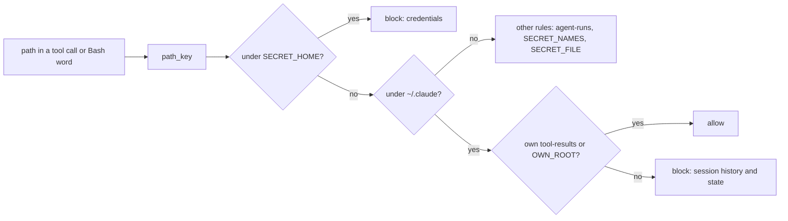

# The guard judges paths as macOS resolves them, and keeps ~/.claude private

## Goal

`hooks/agent-guard.py` compares every path through one helper that treats two spellings of the same file on a case-insensitive APFS volume as the same path, checks the target of an input redirect, and reads `$PWD` as the hook's working directory. Under `~/.claude` it allows only the agent's own saved tool output and the plugin's own root, and refuses the rest. The agents' OS sandbox denies all of `~/.claude` to Bash except the plugin root, and `run-agent.sh` no longer adds `~/.claude` as a working directory.

## Decision

An allow-list for `~/.claude`, held twice: by the guard for every tool, and by the sandbox for Bash. A path-identity helper (`path_key`) at every comparison site, folding case on every platform. Choices settled with the user on 2026-10-02:

- **Saved tool output stays readable to the Read tool only.** The sandbox re-opens only the plugin root, so a Bash read of the agent's own `tool-results` folder fails with `Operation not permitted`; the guard still allows both. Rejected: `run-agent.sh` choosing a `--session-id` and rendering an `allowRead` for that session's folder: more parts, for a read the agents already make with Read (experiment 2(a)).
- **`--add-dir ~/.claude` is dropped** from `hooks/run-agent.sh` and `tests/agent-evals/run.sh`. Rejected: keeping it with a comment.
- **Case is folded always**, not only when the volume is case-insensitive. A fold that refuses more is safe for a deny; the allow side (`write` mode's directory, the own root, the session's results) only gains spellings of the same directory on APFS. Rejected: asking the volume (`pathconf`), which needs the path, or a parent of it, to exist, and a path an agent names often doesn't.
- **The Read tool's permission denies stay a list.** A `Read(~/.claude/**)` deny would beat any allow and hide the agent's own saved output (deny rules win, [settings](https://code.claude.com/docs/en/settings) *(unverified)*), so the guard is the Read tool's allow-list, and `permissions.deny` and `hooks/user-deny.json` are unchanged.
- **A per-run `CLAUDE_CONFIG_DIR`** is rejected: the login doesn't carry over, so it can't run an agent without copying credentials (experiment 3).

## Background

Read at `b9a37ae` on 2026-10-02. M15 (`git-read.py worktree list`, `tests/test_git_read.py:80-85`) and M16 have landed and are out of scope.

**Hand-run experiments, 2026-10-01** (`docs/specs/spikes/2026-10-01-review-fixes-hand-run-results.md`, uncommitted at `b9a37ae`; taken as facts):

1. With `~/.claude` in `sandbox.filesystem.denyRead` and the plugin root in `allowRead`, `git-read.py` from the plugin root ran from the agent's Bash, and `wc -c` of `~/.claude/settings.json` and `~/.claude/plugins/installed_plugins.json` were refused (`docs/specs/spikes/2026-10-01-review-fixes-hand-run-results.md:15-37`). The sandbox covers Bash only.
2. `--session-id` fixes the directory `~/.claude/projects/<cwd slug>/<session ID>/tool-results/`, not the file name. The agent reads it with the Read tool by default; run (a) passed no `--add-dir ~/.claude`. A Bash read of it is refused under a `~/.claude` denyRead and allowed under today's settings. The guard allows both reads for the session's own results and refuses another session's (:39-73).
3. A per-run `CLAUDE_CONFIG_DIR` moves the transcript out of `~/.claude`, but the run says `Not logged in` (:75-91).

The docs say `allowRead` "re-allows reading specific paths within a `denyRead` region", the narrower path winning, and that `allowRead` entries merge from every settings scope the session loads *(unverified)* ([sandboxing](https://code.claude.com/docs/en/sandboxing), "Filesystem" and the managed-settings section). Experiment 1 confirms the first for this repo's settings.

**Probes of the guard at `b9a37ae`**, each a hook event with `cwd` set to the home directory, run from the scratchpad on 2026-10-02 (exit 0 allows, 2 blocks). The home volume here is case-insensitive: `ls -d ~/.CLAUDE ~/NOTES/research` lists both.

| Call | Exit |
|---|---|
| Bash `cat ~/.Claude/projects/x.jsonl`; `cat ~/.claude/projects/x.jsonl` | 0; 2 |
| Bash `cat ~/.AWS/credentials`; Read, Grep and Glob of `~/.AWS` | 0 each |
| Read `~/.Claude/projects/x.jsonl` | 0 |
| Bash `cat /tmp/K.PEM`; `cat /tmp/k.pem` | 0; 2 |
| Bash `curl FILE:///tmp/k.pem`; `curl file:///tmp/k.pem` | 0; 2 |
| Bash `cat < ~/.claude/projects/x.jsonl` | 0 |
| Bash `cat $PWD/.claude/projects/x` | 0 |
| Read `~/.claude/usage-data/x`; Read `~/.claude/settings.json` | 0; 0 |
| Read the session's own `tool-results/b.txt` | 0 |
| `write` mode for the notes research folder: Write `x.md` there spelled `~/NOTES/research`; spelled as configured | 2; 0 |

**Where paths are compared.** Every one is case-sensitive string or `Path` equality:

- `under()` is a string prefix test (`hooks/agent-guard.py:1141-1142`), used by `secret_path` (:1160-1180), `results_spellings` (:1151-1157) and `ancestor_of_secret` (:1229-1238).
- `secret_path` matches a path part against `SECRET_NAMES` with `in` (:1176, the set at :318-326) and `SECRET_FILE` without `re.IGNORECASE` (:1178, the pattern at :329-333).
- `FILE_URL` and `URL` are case-sensitive (:335-336). `secret_word` strips `FILE_URL` and then skips any word `URL` matches (:1201-1203), so `FILE:///...` is skipped as a web URL.
- A glob's fixed stem is compared with `str.startswith` (:1214-1216).
- `OWN_ROOT` tests whether `PLUGINS_HOME` is among the root's parents by `Path` equality (:305-312); `tests/replay_guard.py:202-214` copies that test as `with_root`.
- `check_write` uses `Path.resolve()` and `is_relative_to` (`hooks/agent-guard.py:1508-1514`). `resolve()` follows links but keeps the case as written, which the `~/NOTES` probe shows.
- Script paths are matched against `SCRIPTS` and `NET_SCRIPTS` after `resolve()` (`hooks/agent-guard.py:1332-1333`, :1347, :1407, :1422), and a command path's directory against four system `bin` directories (:1359-1365). A different case there is refused, not allowed.

**Redirects.** `simple_commands` blocks `>` to anything but `/dev/null` or a descriptor (`hooks/agent-guard.py:632-642`), and skips a `<`-only token and the word after it unchecked (:643-645). `check_secrets` sees only what's left (:1241-1261).

**`$PWD`.** `SAFE_VARS` holds `PWD` and `OLDPWD` (`hooks/agent-guard.py:137-140`). `secret_word` skips any word holding `$` unless it starts with `$HOME` or `${HOME}` (:1204-1205), and `expand_home` expands only `~`, `$HOME` and `${HOME}` (:1117-1122).

**`~/.claude` today is a deny list.** `SECRET_HOME` names four entries under `~/.claude` (`hooks/agent-guard.py:279-288`) and `HISTORY_HOME` eight (:296-303), with exceptions for the session's own results (`SESSION_RESULTS`, set at :1528-1530) and the guard's own root under `~/.claude/plugins` (:1167-1173). Anything else under `~/.claude` is readable: `ls ~/.claude` here lists `usage-data`, `jobs`, `daemon`, `telemetry`, `state`, `settings.json` and more. `check_read` applies the same `secret_reason` to Read, Grep and Glob (:1280-1303).

**The sandbox settings.** `hooks/agent-sandbox.json:11-14` denies the same `~/.claude` entries less `projects` and `plugins`, and `:29-34` holds the matching `Read(...)` denies. `tests/test_sandbox_settings.py:40` names those two as `AGENT_NOT_DENIED`; `:117-125` requires every sandbox deny to be known to the guard; `:152-163` requires `denyRead` and the Read denies to match; `:165-178` requires `tests/skill-evals/agent-case-settings.json` to be `agent-sandbox.json` plus three planned changes; `:180-187` requires `implement-case-settings.json` to be it with the sandbox off. `hooks/agent-settings.py:24-30` fills in `${CLAUDE_PLUGIN_ROOT}` in any string of a settings file. `skills/spec/spike-settings.json` already denies all of `~/.claude` (`tests/test_sandbox_settings.py:189-191`).

**`hooks/user-deny.json`** is the agents' `permissions.deny` less the `~/.cache/agent-runs` rule, checked by `tests/test_user_deny.py:64-69`; `:71-81` checks that no rule hides an agent's reply.

**`--add-dir`.** `hooks/run-agent.sh:115-116` passes `--allowedTools "$tools"` and `--add-dir "$HOME/.claude" "$HOME/notes" "$work" "$plugin_root"`; `tools` is the agent's own list, Read included (`hooks/run-agent.sh:79-80`; `tests/test_run_agent.py:117`). `tests/agent-evals/run.sh:125-126` passes the same `--add-dir "$HOME/.claude"`. `tests/test_run_agent.py:138-141` checks the plugin root is among the added dirs.

**The replay.** `tests/replay_guard.py` replays recorded Read, Grep and Glob calls through `check_read` with each run's own results folder (`session_results`, :110-117) and guard root (`with_root`, :202-214), and fails on a refusal not listed in `tests/replay-accepted.txt` by fingerprint (`tests/replay_guard.py:452-475`).

**What agents are told.** `hooks/agent-sandbox.md:8` says session history is unreadable to Bash and the guard refuses the same reads; `hooks/agents/cold-reviewer.md:19` says the guard refuses "transcripts, prompt history and earlier agent runs".

## Non-goals

- Paths built at run time (`cd ~; cat .claude/projects/x`, a variable set from a command) stay best effort in the guard, as its docstring says (`hooks/agent-guard.py:18-21`). The sandbox's `~/.claude` deny (W4) is what holds them for Bash.
- Script and system-tool path matching (`hooks/agent-guard.py:1332-1365`) keeps its case-sensitive test: a different case is refused, which fails closed.
- No change to `permissions.deny` or `hooks/user-deny.json`: users' own sessions keep reading their tool results, plans and todos.
- No change to the spike or verify settings, which already deny all of `~/.claude`.
- Unicode lookalikes beyond what `casefold()` and NFD normalisation make equal.

## Design

**`path_key(path)`**: `unicodedata.normalize("NFD", path).casefold()`, with a trailing `/` stripped. APFS compares names case- and normalisation-insensitively *(assumption: Apple's documented APFS behaviour, not checked here)*. Every comparison goes through it:

- `under(path, parent)` compares keys.
- `SECRET_NAMES` matches `part.casefold()`; `SECRET_FILE` and `FILE_URL` take `re.IGNORECASE`. `URL` needs no flag: its scheme class is already `[a-zA-Z]` (`hooks/agent-guard.py:336`).
- A glob stem is compared by key.
- `own_root(root)`, a new guard function, returns the resolved root if `PLUGINS_HOME` (as written or resolved) is a parent by key, else `None`. `OWN_ROOT = own_root(ROOT)`, and `tests/replay_guard.py`'s `with_root` calls it instead of copying the test.
- `check_write` resolves both paths and uses `under`.

**Redirects.** In `simple_commands`, a `<` token's target goes through `secret_word`, and a reason blocks, as `>` does. Here-strings and here-documents (`<<<`, `<<`) are skipped as now: their next word is text, not a path.

**`$PWD`.** `expand_home` also expands a leading `$PWD/`, `${PWD}/` or a bare `$PWD` to the hook's `CWD`, and `secret_word` judges such words instead of skipping them.

**`~/.claude` as an allow-list.** A new `CLAUDE_HOME = HOME / ".claude"`. In `secret_path`, after `SECRET_HOME` (so credentials keep their own message), a path under `CLAUDE_HOME` is allowed only under `SESSION_RESULTS` (`results_spellings`) or `OWN_ROOT`; otherwise the reason is "`~/.claude` holds session history and Claude Code's own state; agents may read only their own saved tool output and the plugin's files". `HISTORY_HOME` keeps `~/.cache/agent-runs`, and its `~/.claude` entries go, now covered. `PRIVATE_HOME` gains `CLAUDE_HOME`, so recursive searches and glob stems above it are refused as before.

**Sandbox.** `agent-sandbox.json` keeps its `denyRead` entries and adds `"~/.claude"`, and gains `"allowRead": ["${CLAUDE_PLUGIN_ROOT}"]`. `agent-case-settings.json` takes the same two changes. Under `--plugin-dir` the root is a checkout outside `~/.claude`. In the agent evals that checkout is the repo itself, and `deny_answer_keys` adds `denyRead` entries inside it for the answer keys (`tests/agent-evals/run.sh:82-98`). The docs say a narrower deny holds inside a wider allow ([sandboxing](https://code.claude.com/docs/en/sandboxing)), so the keys should stay hidden; spike question 2 checks it before W4 lands.

## Work items

### W1: One path-identity helper at every comparison site

- **Change:** add `path_key` and `own_root`; route `under`, `SECRET_NAMES`, the glob-stem test and `check_write` through them; make `SECRET_FILE` and `FILE_URL` case-insensitive; set `OWN_ROOT = own_root(ROOT)`. `with_root` in the replay sets `OWN_ROOT = None` when it has no root, and calls `guard.own_root(root)` only otherwise: the replay also passes the old guard from `--base`, which has no `own_root`, through `with_root(old, None)` (`tests/replay_guard.py:217-233`, :426). Update the module docstring's paragraph on paths (`hooks/agent-guard.py:39-40`). Tests first, in a new `CaseInsensitive` class, and the `PluginRoot` fixtures move to the `checked-plans/checked-plans/<version>` cache path, since the plugin was renamed in `788cec9` and an installed copy's root now has that shape (`docs/specs/spikes/2026-10-01-review-fixes-hand-run-results.md:10`).
- **Files:** `hooks/agent-guard.py`, `tests/test_agent_guard.py`, `tests/replay_guard.py`, `tests/replay-accepted.txt`.
- **Done when:** the new tests fail at `b9a37ae` and pass after: Bash `cat ~/.Claude/projects/x.jsonl`, `cat ~/.AWS/credentials`, `cat /tmp/X.TFVARS`, `cat /tmp/K.PEM` and `curl FILE:///tmp/k.pem` exit 2; Read, Grep and Glob of `~/.AWS` exit 2; `write` mode for the research folder allows a file under it spelled `~/NOTES/research` and still refuses one directly under `~/notes`; a plugin root under `~/.Claude/plugins/cache/...` is `OWN_ROOT`. `python3 -m unittest discover -s tests` passes. `python3 tests/replay_guard.py` exits 0, with each new difference added to `tests/replay-accepted.txt` with a reason naming W1.

### W2: Check input redirects, and read `$PWD`

- **Change:** `simple_commands` runs a `<` target through `secret_word`; `expand_home` and `secret_word` handle `$PWD`.
- **Files:** `hooks/agent-guard.py`, `tests/test_agent_guard.py`, `tests/replay-accepted.txt`.
- **Done when:** with `cwd` the home directory, `cat < ~/.claude/projects/x.jsonl`, `wc -l < ~/.aws/credentials` and `cat $PWD/.claude/projects/x` exit 2, and `cat ${PWD}/.aws/config` exits 2; with `cwd` the home directory, `grep x <<< "$PWD"` and `sort < /dev/null` exit 0; with `cwd` the repo root, `cat < README.md` exits 0. The unit tests pass, and `python3 tests/replay_guard.py` exits 0 with each new difference accepted with a reason naming W2.

### W3: `~/.claude` is an allow-list in the guard

- **Change:** `CLAUDE_HOME` and the `secret_path` rule above; drop the `~/.claude` entries from `HISTORY_HOME`. Keep "session history" in the message, which `tests/test_agent_guard.py:1132-1144` checks. `~/.claude` itself is now refused by `secret_word` before the recursive-search check runs (`hooks/agent-guard.py:1254-1277`), so `test_recursive_search_over_history_blocked` (`tests/test_agent_guard.py:1146-1151`) changes: `grep -rn spec ~/.claude` expects the new message, checked by "Claude Code's own state" (every block message already ends in "session history", `hooks/agent-guard.py:1256-1260`), and a `grep -rn spec ~` case keeps the "narrower directory" check. In `tests/test_sandbox_settings.py`, `test_agent_denies_known_to_guard` builds `known` from `guard.PRIVATE_HOME` (which gains `CLAUDE_HOME`) instead of `SECRET_HOME | HISTORY_HOME` (:117-125), and `AGENT_NOT_DENIED` (:40) is deleted, with the comment above it (:38-39): with no `~/.claude` entries left in `HISTORY_HOME` it removes nothing. Its one use, the loop over `self.history - AGENT_NOT_DENIED` in `test_history_denied_to_agents_and_spikes` (:98), becomes a loop over `self.history`. Update the module docstring's session-history paragraph (`hooks/agent-guard.py:18-24`).
- **Files:** `hooks/agent-guard.py`, `tests/test_agent_guard.py`, `tests/test_sandbox_settings.py` (the guard's lists now cover `.claude` whole, and its docstring at :1-2 names `HISTORY_HOME`), `tests/mine-sessions.py` (the comment at :20 names `HISTORY_HOME` for `~/.claude/projects`), `tests/replay-accepted.txt`. No agent file changes here, so no eval run is due (the wording moves in W4).
- **Done when:** Read of `~/.claude/usage-data/x`, `~/.claude/settings.json`, `~/.claude/jobs/x`, `~/.claude/plans/x.md`, `~/.claude/todos/x`, `~/.claude/debug/x` and `~/.claude/daemon/x` exit 2, and Bash `cat` of each too; Read and Bash `sed -n 1p` of the session's own `tool-results/b.txt` exit 0; another session's exit 2; a file under `OWN_ROOT` exits 0 and a sibling version's exits 2 (the existing `PluginRoot` and `SessionResultsLink` tests still pass). Unit tests pass; `python3 tests/replay_guard.py` exits 0 with each newly refused recorded read accepted with a reason naming W3.

### W4: The sandbox denies `~/.claude` and re-opens the plugin root

- **Change:** add `"~/.claude"` to `denyRead` and `"allowRead": ["${CLAUDE_PLUGIN_ROOT}"]` in `hooks/agent-sandbox.json` and `tests/skill-evals/agent-case-settings.json`. Reword `hooks/agent-sandbox.md:8` and `hooks/agents/cold-reviewer.md:19`: all of `~/.claude` is unreadable to Bash except the plugin's files, and the agent reads its own saved output with the Read tool. In `tests/test_sandbox_settings.py`: `test_os_and_read_denies_match` expects `agent-sandbox.json`'s `denyRead` to be its Read denies plus `.claude`; a new test requires `allowRead == ["${CLAUDE_PLUGIN_ROOT}"]`; `test_no_settings_file_locates_the_repo_through_home` also covers `allowRead`. `tests/test_user_deny.py` gains a check that no rule hides `~/.claude/projects/<slug>/<session>/tool-results/b.txt`. `implement-case-settings.json` and `hooks/user-deny.json` don't change; their tests show it.
- **Files:** `hooks/agent-sandbox.json`, `tests/skill-evals/agent-case-settings.json`, `hooks/agent-sandbox.md`, `hooks/agents/cold-reviewer.md`, `tests/test_sandbox_settings.py`, `tests/test_user_deny.py`, `hooks/run-agent.sh` (the header comment at `hooks/run-agent.sh:29-33`), `tests/agent-evals/BASELINE.md`.
- **Done when:** unit tests pass, including the unchanged `test_agent_case_settings_differ_only_as_planned` and `test_implement_case_settings_differ_only_in_the_sandbox`; `hooks/agent-settings.py hooks/agent-sandbox.json <root>` prints `allowRead` holding the absolute root; `tests/agent-evals/run.sh` and the skill-eval cases that run sandboxed (all but `implement-basic` and `implement-trap`, whose `implement-case-settings.json` turns the sandbox off and doesn't change) pass on Sonnet and Opus, recorded in a dated `tests/agent-evals/BASELINE.md` section. Spike questions 1–3 have been answered first, with question 2's answer yes.

### W5: Drop `--add-dir ~/.claude`

- **Change:** remove `"$HOME/.claude"` from the `--add-dir` lists in `hooks/run-agent.sh:116` and `tests/agent-evals/run.sh:126`, and the "read access to ~/.claude" wording in the latter's header (:42-43). `tests/test_run_agent.py` asserts no added dir is `~/.claude` or under it, beside the plugin-root check at :138-141, whose comment (:138-139, "not covered by the $HOME/.claude entry") is reworded. `tests/test_eval_runners.py:329-331` asserts the agent evals' first two added dirs are `~/.claude` and `~/notes`; it changes to assert `~/notes` first and no `~/.claude`.
- **Files:** `hooks/run-agent.sh`, `tests/agent-evals/run.sh`, `tests/test_run_agent.py`, `tests/test_eval_runners.py`, `tests/agent-evals/BASELINE.md`.
- **Done when:** the new assertions in `tests/test_run_agent.py` and `tests/test_eval_runners.py` fail before and pass after; unit tests pass; `tests/agent-evals/run.sh` passes on both models (W4's run may be this one if they land together), recorded in `BASELINE.md`.

## Effort

| Item | Estimate | Depends on |
|---|---|---|
| W1 | half a day: about a dozen call sites, one test class, the replay's accepted list | — |
| W2 | 2 hours | W1 |
| W3 | half a day, most of it the replay's newly refused reads | W1 |
| W4 | 2 hours, plus both eval sets on both models: $6.11 for the agent evals ($1.89 Sonnet + $4.22 Opus, `CLAUDE.md:22-23`) and the 6 sandboxed skill-eval cases × about $0.40 × 2 models = $4.80, plus the agents those cases launch (capped at $2 each, `CLAUDE.md:26-27`). The two implement cases are left out: W4 changes nothing they run with, and each would add an implementer and up to two verifiers at $5 each (`CLAUDE.md:34-37`) | W3; spike questions 1–3 |
| W5 | 1 hour | W4 |

These come from reading the code; the work itself may differ, so the order is firmer than the hours.

## Spike questions

All three were answered on 2026-10-02, before W4: question 1 by a spike, and questions 2 and 3 by hand, each in its own `claude -p` run, since a spike can't start a logged-in one. Together they cost about $0.31 (`docs/specs/spikes/2026-10-02-guard-path-identity-results.md`).

1. Does the macOS sandbox refuse `~/.AWS/credentials` and `~/.CLAUDE/settings.json` to Bash when `denyRead` lists `~/.aws` and `~/.claude`, and does a `Read(~/.aws/**)` permission deny refuse the Read tool `~/.AWS/credentials`? A no changes no work item: Risks then says the guard is the only check for case variants. Experiment: `wc -c` of both case-variant paths from Bash, and a Read of a scratch file under a case-variant denied directory, with no guard.
   Answered: yes, on this case-insensitive volume. Bash `wc -c ~/.CLAUDE/settings.json` and `ls` of `~/.AWS`, `~/.Aws` and `~/.cLaUdE` gave `Operation not permitted`, as the lowercase spellings did; the Read tool refused `~/.AWS/credentials` and a missing file under `~/.CLAUDE/` as "in a directory that is denied by your permission settings", while a missing file elsewhere gave "File does not exist" (spike S1, `docs/specs/spikes/2026-10-02-guard-path-identity-results.md`).
2. With the root set to the repo and `deny_answer_keys` applied, as `tests/agent-evals/run.sh` renders it, is `wc -c` of a `tests/agent-evals/<case>/expect.txt` from Bash refused under `allowRead: [<repo>]`? A no blocks W4 as written: `allowRead` would then name only the root's `hooks` and `skills` directories. Experiment: the same run, rendered through `deny_answer_keys`.
   Answered: yes. Under W4's settings rendered with the repo as root and `deny_answer_keys`' paths added, Bash `wc -c` of `tests/agent-evals/cases/absence-claim/expect.txt` and of `~/.claude/settings.json` gave `Operation not permitted`, and of `hooks/agent-guard.py` a byte count: the narrower deny holds inside `allowRead: [<repo>]` (hand-run S2, `docs/specs/spikes/2026-10-02-guard-path-identity-results.md`).
3. With `run-agent.sh`'s flags, `--settings` and the guard, but no `--add-dir ~/.claude`, does an agent read its own saved tool output with the Read tool after `seq 1 300000` overflows? A no means W5 keeps the flag. Experiment: the same run, through `--agents` with the guard's hooks, asking for line 150000 of the saved copy.
   Answered: yes. The cold-reviewer agent, run with `run-agent.sh`'s flags less `--add-dir ~/.claude`, W4's settings and the guard's hooks, ran `cat` of a 300,000-line file, and the Read tool returned line 150000 of the saved copy under `~/.claude/projects/<cwd slug>/<session ID>/tool-results/`, with no permission denials. (A first run asked for `seq`, which the guard refuses, and tested nothing.) (hand-run S3, `docs/specs/spikes/2026-10-02-guard-path-identity-results.md`)

## Risks and rollback

- **The agents' own reads.** A recorded agent read under `~/.claude` that the allow-list now refuses shows up in the replay; if an agent needs it, W3 is wrong, not the accepted list.
- **User `allowRead` entries merge in.** The agents load user settings (`--setting-sources user`, `hooks/run-agent.sh:118`), and `allowRead` merges from every scope ([sandboxing](https://code.claude.com/docs/en/sandboxing)), so a user's own `allowRead` could re-open part of `~/.claude` to Bash. The guard still refuses it to Bash words and the tools.
- **Case variants on a case-sensitive volume.** On this case-insensitive APFS volume the sandbox and the Read tool's permission denies both refuse case variants (spike S1, `docs/specs/spikes/2026-10-02-guard-path-identity-results.md`); a case-sensitive volume wasn't tested. There the guard's fold still covers the deny side, but widens the allow side: `write` mode would accept `~/NOTES/research`, a different directory from `~/notes/research` on such a volume. Accepted, since the agents and CI run on macOS's default case-insensitive APFS (`.github/workflows/tests.yml:16-17`).
- **Rollback:** each work item is one commit; reverting W4 and W5 restores today's sandbox and flags, and W1–W3 are guard-only.

## Open questions

- None.
