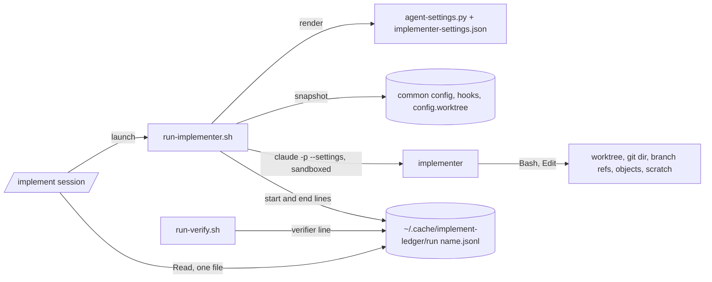

# The implementer runs sandboxed, and its spend goes in a ledger it can't write

## Goal

`/implement`'s implementer runs under an OS sandbox of its own: its Bash can write only its worktree, its own git dir, its branch's refs and objects, and a scratch dir, and its Edit and Write tools are pre-approved only in the worktree and that scratch dir. The launcher refuses to hand back a run that changed the shared git config or hooks, and counts spend in an append-only ledger outside everything the implementer can write, which the cost report reads as one file. A forged, missing or reset cost no longer raises the $20 cap.

## Decision

A sandboxed implementer with scoped edit rules, chosen with the user on 2026-10-02 over the starting proposal (a `--settings` deny file with the implementer's Bash left unsandboxed). An unsandboxed Bash can rewrite any ledger and the common dir's `config` and `hooks/`, so denies alone can't hold the cap or the user's checkout. The other parts of the proposal stay: settings rendered by `hooks/agent-settings.py`, before-and-after snapshots of the shared git config and hooks, a ledger in `~/.cache/implement-ledger/`, cap validation, `--` before the prompt, and no `--add-dir` of the plugin root. Choices settled with the user:

- **No network.** The implementer's Bash gets no allowed domains, as the verifier's (`skills/implement/verify-settings.json:5`). A repo check that needs the network fails at baseline and is logged there. Rejected: an `IMPLEMENT_ALLOWED_DOMAINS` list, more parts to review.
- **The ledger never resets by script.** One file per `<repo dir>--<spec basename>`; every implementer call ever made for it counts. To go past the cap, the user raises `IMPLEMENT_MAX_USD` or removes the file by hand, and the refusal says so. Rejected: a ledger per branch start, keyed by a commit the implementer can move.
- **The eval session's sandbox stays off.** `tests/skill-evals/implement-case-settings.json` gains only Write and Edit denies of the ledger, and the eval runner cleans up eval ledgers. Rejected: turning its sandbox on with the launchers excluded, a bigger change to the harness.
- **Only the user's settings load** (`--setting-sources user`). A hook from the worktree's project settings runs outside the sandbox, and a script it runs that the implementer can rewrite writes where its Bash can't, the ledger included (hand-run Q6, `docs/specs/spikes/2026-10-02-implementer-sandbox-results.md`). Rejected: keeping `user,project` with the repo's `.claude/` write-denied, since a hook can run any file in the worktree. The implementer still reads the repo's `CLAUDE.md` and rules files itself, as its steps say (`hooks/agents/implementer.md:29`).
- **Not the agent sandbox.** `hooks/agent-sandbox.json:15` denies writes under `~/code`, and `allowWrite` doesn't re-open a path under `denyWrite` (experiment 6 below), so the implementer gets a settings file of its own, built from the verifier's.

## Background

Read at `b4e9749` on 2026-10-02. Already landed and out of scope: auto memory off (`skills/implement/scripts/run-implementer.sh:47-49`), M9, M10, and Edit rules in place of Write in allowed-tools (`skills/implement/SKILL.md:6`).

**The launcher today.**
- It runs `claude -p` with `--allowedTools "$tools"`, `--permission-mode acceptEdits`, `--setting-sources user,project`, `--add-dir "$(dirname "$run")" "$plugin_root"`, and the prompt as the last argument with no `--` before it (`skills/implement/scripts/run-implementer.sh:121-127`). No `--settings` is passed, so no sandbox or deny rule applies (`tests/test_run_implementer.py:179-182`), as the script's comment intends (`skills/implement/scripts/run-implementer.sh:30-34`) and the agent file tells the implementer (`hooks/agents/implementer.md:7`).
- `$tools` is the agent file's tool list, bare (`skills/implement/scripts/run-implementer.sh:112-118`): `Read,Edit,Write,Glob,Grep,Bash,Skill` (`hooks/agents/implementer.md:4`, `tests/test_run_implementer.py:176-178`). A bare tool name pre-approves every use of it *(assumption)*, so the Edit and Write tools may write anywhere the user can.
- `--add-dir` of `$(dirname "$run")` is `~/.cache/implement-runs/<run name>/`, which holds the run dir `implementer/` with its `run-<n>.json` files (`skills/implement/scripts/run-implementer.sh:9-12`) and `baseline.txt` (`skills/implement/SKILL.md:43`).

**The cap today** (`skills/implement/scripts/run-implementer.sh:22-25`, :74-110). It sums `total_cost_usd` over `run-*.json` in the run dir, skipping files it can't parse (:76-88); a resume gets the cap less that sum (:93-98); a fresh run deletes the `run-*.json` files first (:105). `IMPLEMENT_MAX_USD` goes through `float()` unchecked (:74, :90). So a 0-byte `run-<n>.json` counts $0; a fresh run clears the history (pinned by `tests/test_run_implementer.py:276-284`); a planted negative cost raises what's left; `IMPLEMENT_MAX_USD=inf` passes, and `abc` stops the script on a Python traceback. The user reproduced all four on 2026-10-02.

**Shared git config and hooks.** In this checkout, itself a linked worktree, `git rev-parse --git-path hooks --git-path config` printed the main checkout's `~/code/github.com/claude-skills/.git/hooks` and `.git/config` (run 2026-10-02). The launcher already finds both dirs (`skills/implement/scripts/run-implementer.sh:61-64`). A `core.fsmonitor` or `post-commit` hook planted there from a worktree runs on the next `git status` or commit in the user's own checkout (reproduced by the user, and by spike S5, `docs/specs/spikes/2026-10-02-implementer-sandbox-results.md`). `/implement`'s own `git -C <worktree> add` and `commit` turn both off with `-c` flags (`skills/implement/SKILL.md:99`), as its `git-read.py` calls do (`hooks/git-read.py:22-24`, :43); the user's own git commands don't.

**The cost report** totals `total_cost_usd` from the run files, found with Glob (`skills/implement/SKILL.md:100`); in evals, Opus and Sonnet each built it with a `find` that allowed-tools refused (`tests/agent-evals/BASELINE.md:1382`, :1446).

**Settings files.** `hooks/agent-settings.py:25-35` replaces only `${CLAUDE_PLUGIN_ROOT}` and refuses any other `${...}`. The verifier's sandbox has no network, denies reads of secrets, `~/code`, `~/notes` and `~/.claude`, and denies Write and Edit of `~/notes`, `~/code`, `~/.claude`, `~/.ssh` and `~/.aws` and of shell start-up files (`skills/implement/verify-settings.json:1-47`, :37-40). `tests/test_sandbox_settings.py:69-163` keeps the deny lists in step, and `tests/test_sandbox_settings.py:194-201` pins `implement-case-settings.json` as `agent-sandbox.json` with the sandbox off. The eval runner exports `IMPLEMENT_MAX_USD=5` (`tests/skill-evals/run.sh:62`), and cleans up and copies run dirs by name (:57, :124-130).

**Hand-run experiments, 2026-10-01**, taken as facts (`docs/specs/spikes/2026-10-01-review-fixes-hand-run-results.md`):

4. With `gh` and the web denied and no network, `/simplify` and `/code-review medium --fix` finished and fixed the planted bug; `git add -A` committed `__pycache__` files (`docs/specs/spikes/2026-10-01-review-fixes-hand-run-results.md:88-112`).
5. A `--settings` deny of `Bash(gh *)` beats a project allow and `--allowedTools`; a `--settings` sandbox stays on when the project file sets `sandbox.enabled: false`; `-p` loads project settings under `--setting-sources user,project` (`docs/specs/spikes/2026-10-01-review-fixes-hand-run-results.md:114-134`).
6. With the sandbox on and `allowWrite` of the worktree, the common `.git` and the run dir, the commit landed; with `agent-sandbox.json`'s `denyWrite` of `~/code` kept, `git add` was refused. The Edit tool isn't held by the sandbox (`docs/specs/spikes/2026-10-01-review-fixes-hand-run-results.md:136-159`).

S1 has landed (`docs/specs/2026-10-02-guard-path-identity.md`, merge `0546620`): `hooks/agent-sandbox.json` denies `~/.claude` to Bash with `allowRead` of `${CLAUDE_PLUGIN_ROOT}` (`hooks/agent-sandbox.json:13-14`). Experiment 1 showed that `allowRead` re-opens the plugin root inside it (`docs/specs/spikes/2026-10-01-review-fixes-hand-run-results.md:15-37`).

## Non-goals

- The guard (`hooks/agent-guard.py`), whose rules are for read-only agents. The Read tool stays open outside the Read denies, so the implementer can still read `~/.claude/projects` (other sessions' transcripts); denying it would hide its own saved tool output (`docs/specs/spikes/2026-10-01-review-fixes-hand-run-results.md:52-68`).
- Git config that the common `config` includes from elsewhere (`include.path`), and `core.hooksPath` pointing into the main checkout's tree: the implementer can't write either under the sandbox, and the snapshot doesn't cover them.
- Repo checks that need the network or caches outside the worktree: they fail at baseline.
- The verifier's own cost: run-verify.sh's `--max-budget-usd 5` is claude's, and its `run.json` sits in a scratch dir the code under test can write (`skills/implement/scripts/run-verify.sh:132-138`), so the ledger records it as reported.
- The `git add -A` that commits build output (experiment 4).
- Managed (organisation) settings: they can add sandbox entries too, and the launcher's check reads only `~/.claude/settings.json`.

## Design

**Settings.** A new `skills/implement/implementer-settings.json`, rendered per call into the run dir by `agent-settings.py` with the plugin root and five more variables: `${IMPLEMENT_WORKTREE}`, `${IMPLEMENT_GIT_DIR}` (the worktree's own git dir), `${IMPLEMENT_COMMON_DIR}`, `${IMPLEMENT_SCRATCH}` (`~/.cache/implement-runs/<run name>/scratch`) and `${IMPLEMENT_TMP}` (the macOS per-user temp dir, from `getconf DARWIN_USER_TEMP_DIR`). It holds:
- `sandbox`: on, `allowUnsandboxedCommands: false`, no network; the verifier's `denyRead` without `~/code` and with all of `~/.config` in place of its four `~/.config` folders, plus `allowRead` of `${CLAUDE_PLUGIN_ROOT}`, so `scan-diff.py` runs from an installed plugin, and of `~/.config/git`, which git reads *(assumption: it re-opens it as experiment 1's did the plugin root, `docs/specs/spikes/2026-10-01-review-fixes-hand-run-results.md:15-37`, though Q1 found `~/.config/git/ignore` already unreadable, `docs/specs/spikes/2026-10-02-implementer-sandbox-results.md`; W4's hand run would show a failure)*; the verifier's hidden environment variables.
- `allowWrite`: the worktree, its git dir, `<common>/objects`, `<common>/refs/heads/implement` and `<common>/logs/refs/heads/implement`, the scratch dir, and `${IMPLEMENT_TMP}`: without it, 18 of this repo's 552 tests fail (11 failures, 7 errors), visibly on `mktemp` there, and with it the suite passes (hand-run Q2 and its follow-up, `docs/specs/spikes/2026-10-02-implementer-sandbox-results.md`). It doesn't hold the rest of the common dir: Bash could still write the main checkout's `HEAD` (Q1), so `denyWrite` does that work, and with it commits still worked (Q8, `docs/specs/spikes/2026-10-02-implementer-sandbox-results.md`). A new file beside `index`, and other branches' refs, can still be made; nothing runs from either, and the user's own git use changes them too, so neither is watched (Q1's follow-up and Q8, `docs/specs/spikes/2026-10-02-implementer-sandbox-results.md`).
- `denyWrite`: `<common>/config`, `<common>/hooks`, `<common>/HEAD`, `<common>/index` and `<common>/packed-refs` (the main checkout's own), `<git dir>/config.worktree`, `<git dir>/commondir` and `<git dir>/gitdir` (which tell git where the shared dir and the worktree are), `<worktree>/.git`, `<worktree>/.claude`, `~/.cache/implement-ledger`, `~/.claude`, `~/notes`; `<common>/modules` (submodules' config and hooks); and, for every other worktree listed under `<common>/worktrees/` at launch, its `commondir`, `gitdir`, `HEAD`, `config.worktree` and `index`. Without the last two, another worktree's `HEAD` and a submodule's `config` were writable; with them, all were refused and commits still worked (delta review row 2, `docs/specs/spikes/2026-10-02-implementer-sandbox-results.md`). The launcher adds the per-worktree entries to the rendered file itself, since their number varies.
- `permissions.deny`: the agents' Read denies (`hooks/agent-sandbox.json:31-34`), which deny the Read tool `~/.claude`'s credentials and history but not the rest of it, so the session's own saved tool output and an installed plugin's files stay readable; `Read(~/notes/**)`; the verifier's Write and Edit denies without `~/code` (`skills/implement/verify-settings.json:37-40`); Write and Edit of `./.git`, `./.claude/**` and `~/.cache/implement-ledger/**`; `Bash(gh *)`, `WebFetch`, `WebSearch`; its cloud CLI denies.

The launcher passes `--setting-sources user` in place of `user,project`, `--settings <run dir>/settings.json`, `--add-dir <scratch>` only, and `--allowedTools` with `Edit` and `Write` replaced by `Edit(./**)` and `Edit(~/.cache/implement-runs/<run name>/scratch/**)` (an Edit rule covers Write, `CLAUDE.md`), then `--` and the prompt. `baseline.txt` moves into the scratch dir.

**Snapshot.** Before and after each call, the launcher records, without running git, only what can make git run a program or point a checkout elsewhere, none of which the user's own git use changes: `<common>/config`, `<common>/config.worktree`, `<worktree>/.git`, for every dir under `<common>/worktrees/` (its own included) its `config.worktree`, `commondir` and `gitdir`, every `config` and `hooks/` entry under `<common>/modules/`, and every entry under `<common>/hooks/` (name, type, mode, sha256; a link as its target). If any differs, it exits 4 naming each path, and writes no reply for `/implement` to act on. It also notes `<common>/HEAD` and every ref under `<common>/refs/` and in `<common>/packed-refs` but the branch's own, and names any that moved in a `run-implementer: moved during the run: <ref> <old> -> <new>` line, without stopping: the user's own commits and fetches move them too. The implementer's own submodules keep their git dirs under `<git dir>/modules/`, not `<common>/modules/` (submodule follow-up, `docs/specs/spikes/2026-10-02-implementer-sandbox-results.md`), and `git submodule update --init` writes there, so those can't be denied or compared; instead, after each call the launcher reads every `config` under `<git dir>/modules/` and exits 4 if one sets a key that names a program, as `git-read.py`'s list does (`hooks/git-read.py:48-52`), or `core.fsmonitor` or `core.hooksPath`, or if a `hooks/` dir there holds an entry: `/implement`'s own unsandboxed `git -C <worktree> add` and `commit` (`skills/implement/SKILL.md:99`) would read them, their `-c` flags covering only `core.fsmonitor` and `core.hooksPath`. A worktree added during the run gets no `denyWrite` entries, but the snapshot covers its `commondir`, `gitdir` and `config.worktree`.

**Ledger.** `~/.cache/implement-ledger/<run name>.jsonl`, in a 0700 dir, opened `O_APPEND | O_NOFOLLOW`. Before a call: `{"at", "who": "implementer", "call": <n>, "event": "start", "budget": <usd>}`, where `<n>` is one more than the number of start lines already in the ledger, so it never repeats across fresh runs. After it: `{"event": "end", "call": <n>, "usd": <cost>}`, with the same `<n>`; an end line whose `call` has no start line, or a second end line for one, refuses the run (exit 2), where a missing, non-numeric, negative or non-finite `total_cost_usd` is charged the call's whole budget. Spent is the sum over implementer calls of the end line's `usd`, or the start's `budget` if no end line follows. `run-verify.sh` appends `{"at", "who": "verifier V<n>", "usd": <cost or null>, "note"}`; on exit 4 it reads nothing and writes `null`. Verifier lines don't count toward the cap and are checked only for shape. Any other line, or a non-finite or negative number in any line, refuses the run (exit 2). The launcher keeps the ledger's sha256 from just after its start line and checks it before writing the end line; a change exits 4, as a changed git config does, so a write the sandbox should have stopped can't go unseen. Both scripts write and read the ledger through one new helper, `skills/implement/scripts/ledger.py` (`append <run name> <json>`, `spent <run name>`, `path <run name>`), so the format and the path rule live in one place. `IMPLEMENT_MAX_USD` must match `^[0-9]+(\.[0-9]+)?$` and be above 0.

**User settings.** `--setting-sources user` still loads `~/.claude/settings.json`. Whether its sandbox keys widen a `--settings` sandbox is untested (delta review row 3; a test needs an edit to the user's real file), so the launcher reads that file before each call and refuses to run (exit 2, naming the key) if it sets `sandbox.enabled` false, `sandbox.allowUnsandboxedCommands` true, or any `sandbox.excludedCommands` or `sandbox.filesystem.allowWrite` entry.

## Work items

### W1: agent-settings.py takes named variables

- **Change:** `agent-settings.py <file> <root> [NAME=VALUE ...]` replaces `${NAME}` for each `NAME` given (`[A-Z][A-Z0-9_]*`), as well as `${CLAUDE_PLUGIN_ROOT}`. A `${...}` with no value given still exits 2. A malformed argument exits 2.
- **Files:** `hooks/agent-settings.py`, `tests/test_agent_settings.py`.
- **Done when:** `python3 -m unittest tests.test_agent_settings` passes, with new tests that `X=/a b` renders `${X}/c` as `/a b/c`, that `${Y}` with only `X` given exits 2, and that `x=1` and `X` exit 2; each fails before the change.

### W2: the cap counts a ledger the run can't reset

- **Change:** `run-implementer.sh` validates `IMPLEMENT_MAX_USD` (empty or unset still means the default, $20, as `${IMPLEMENT_MAX_USD:-20}` does today, `skills/implement/scripts/run-implementer.sh:74`), writes the ledger's start and end lines, exits 4 if the ledger changed between them, reads spent from the ledger on every call (fresh or resume), refuses at or past the cap with a message naming the ledger file and `IMPLEMENT_MAX_USD`, and passes `--` before the prompt. It no longer deletes or reads `run-*.json` for the cap (it still keeps them).
- **Files:** `skills/implement/scripts/ledger.py` (new), `skills/implement/scripts/run-implementer.sh`, `tests/test_ledger.py` (new), `tests/test_run_implementer.py` (:187, :246, :276-284, and new tests), `CLAUDE.md` (its list of tested scripts, `CLAUDE.md:10-14`, gains `ledger.py`).
- **Done when:** `python3 -m unittest tests.test_run_implementer` passes, with tests that each fail first: `IMPLEMENT_MAX_USD` of `inf`, `nan`, `abc`, `-1`, `0` and `1e3` exits 2 with no call made; a stub run with no `total_cost_usd` is charged its budget; a planted `run-1.json` with `-100` changes nothing; a second fresh run gets the cap less the first's cost and a third, past the cap, exits 2 naming `implement-ledger`; a ledger line with a negative cost exits 2; a call with a start line and no end line counts its budget; two fresh runs number their calls 1 and 2, and with the second's end line missing it is charged its budget and the first its cost; an end line with an unknown `call` exits 2; a stub that appends a line to the ledger during the call exits 4 and writes no end line; a ledger holding a `verifier V1` line, with `usd` a number or `null`, still lets a resume run and doesn't change its budget; `argv[-2] == "--"`.

### W3: verifier costs in the ledger

- **Change:** `run-verify.sh` appends a `verifier V<n>` line, through `ledger.py`, to the ledger of `<repo dir>--<spec basename>`, the run name taken from its scratch path's `<repo>/<spec>/V<n>` layout (`skills/implement/scripts/run-verify.sh:34-35`), after each run: the cost from the `run.json` it already reads, or `null` on exit 4 without reading anything.
- **Files:** `skills/implement/scripts/run-verify.sh`, `tests/test_prepare_verify.py`, `tests/test_run_implementer.py`.
- **Done when:** `python3 -m unittest tests.test_prepare_verify` passes, with new tests, red first, that a run leaves one `verifier V1` line with `usd` `0.01` (the stub's cost, `tests/test_prepare_verify.py:41`), and a refused run one with `usd` `null`; and in `tests/test_run_implementer.py`, a `--resume` after `run-verify.sh` has written its line makes its call with the same budget as before it.

### W4: the implementer runs sandboxed with scoped edits

- **Change:** add `implementer-settings.json` as Design says; `run-implementer.sh` renders it per call with W1's variables (`IMPLEMENT_TMP` from `getconf DARWIN_USER_TEMP_DIR`), adds each other worktree's entries to `denyWrite`, refuses to run on a widening user setting, passes `--settings` and `--setting-sources user`, scopes Edit, adds only the scratch dir, and drops `--add-dir` of the plugin root and of `$(dirname "$run")`. Comments at :30-34 say why it's now sandboxed.
- **Files:** `skills/implement/implementer-settings.json` (new), `skills/implement/scripts/run-implementer.sh`, `docs/containment.md` (`docs/containment.md:60-64` says the implementer runs outside the sandbox), `README.md` (`README.md:357-361` says the same), `records/README-record.md` (a dated `Not reviewed:` line for each README change, as `CLAUDE.md` asks), `tests/test_run_implementer.py` (`tests/test_run_implementer.py:177`, `tests/test_run_implementer.py:179-182`), `tests/test_sandbox_settings.py`, `tests/test_agent_settings.py`, `CLAUDE.md` (`CLAUDE.md:14-15` counts "all three sandbox settings"; this is a fourth).
- **Done when:** `python3 -m unittest discover -s tests` passes, with tests that fail first: the call's `--settings` file has `sandbox.enabled` true, no `${`, the worktree and common objects in `allowWrite`, and neither `<common>/config` nor `<common>/hooks`; `--allowedTools` has no bare `Edit` or `Write`; `--add-dir` is the scratch dir alone; `--setting-sources` is `user`; `denyWrite` holds `<common>/HEAD` and `<common>/index`; `allowWrite` holds the per-user temp dir; `denyWrite` holds `<common>/modules` and a second worktree's `commondir` and `HEAD`; a `~/.claude/settings.json` under the test's home with `sandbox.excludedCommands` exits 2 with no call made. And by hand: `python3 -m unittest discover -s tests`, run by `claude -p` from a worktree of this repo under the rendered settings, prints `OK`. `tests/test_sandbox_settings.py` checks the new file: its `denyRead` covers the guard's `SECRET_HOME` and `HISTORY_HOME` and all of `~/.config`; its `allowRead` is the plugin root and `~/.config/git`; its Read denies equal `hooks/agent-sandbox.json`'s plus `Read(~/notes/**)`; its hidden variables equal the agents'.

### W5: a run that changes the shared git config or hooks exits 4

- **Change:** the snapshot of Design, before and after each call; exit 4 before writing `reply.md`, with each changed path named, ahead of exit 3 and of claude's own status.
- **Files:** `skills/implement/scripts/run-implementer.sh`, `tests/test_run_implementer.py`.
- **Done when:** `python3 -m unittest tests.test_run_implementer` passes, with tests that fail first: a stub that sets `core.fsmonitor` in the common config, one that adds `hooks/post-commit`, one that rewrites the worktree's `.git` file, one that writes `config.worktree`, one that points `<git dir>/commondir` at a repo inside the worktree, one that rewrites a second worktree's `commondir`, one that writes `<common>/modules/sub/config`, and one that sets `core.fsmonitor` in `<git dir>/modules/sub/config`, each exit 4 naming the path, with a `post-commit` hook that writes a marker file left unrun; and a stub that commits in the main checkout during the call, moving its branch and `HEAD`'s target and writing `COMMIT_EDITMSG`, exits 0 and prints a `moved during the run:` line naming that branch.

### W6: the skill, the agent file and the evals

- **Change:** `SKILL.md`: `<baseline>` moves to `<run name>/scratch/baseline.txt` (`skills/implement/SKILL.md:43`); step 4.3 handles exit 4 (stop, run no git command in the repo or the worktree, tell the user which paths changed); the report names each `moved during the run:` line, for the user to confirm they made it; the cost report reads `~/.cache/implement-ledger/<run name>.jsonl` with Read and totals its lines, a refused verifier's as unknown (`skills/implement/SKILL.md:100`). `implementer.md`: :7 says it runs in a sandbox with no network and with the user's settings, not the repo's, and rule 1 (`hooks/agents/implementer.md:20`) names the scratch dir. `tests/skill-evals/run.sh`: the EXIT trap (`tests/skill-evals/run.sh:57`) also removes `~/.cache/implement-ledger/eval-*-<stamp>*.jsonl`, and the copy loop (:124-130), which takes directories only, gains a step for these files, copied to `<case>.implement-ledger/` and removed. `README.md:368-370`: the cap covers every run of that spec until its ledger is removed, not only its resumes. `implement-case-settings.json`: add `Write` and `Edit` denies of `~/.cache/implement-ledger/**`, with `tests/test_sandbox_settings.py:194-201` saying so.
- **Files:** `skills/implement/SKILL.md`, `hooks/agents/implementer.md`, `tests/skill-evals/run.sh`, `tests/skill-evals/implement-case-settings.json`, `tests/test_sandbox_settings.py`, `tests/test_eval_runners.py` (`tests/test_eval_runners.py:677` tests the run dirs' clean-up; it gains a ledger file, copied to the results and removed), `README.md`, `records/README-record.md`, `tests/agent-evals/BASELINE.md`.
- **Done when:** `python3 -m unittest discover -s tests` and `python3 tests/replay_guard.py` pass; `EVAL_MODEL=sonnet tests/skill-evals/run.sh implement-basic implement-trap`, then the same with `EVAL_MODEL=opus`, print `PASS` for both cases on both models (a case with any entry in `permission_denials` fails, `tests/skill-evals/run.sh:103-117`); `tests/agent-evals/run.sh` runs in full on both models, one set after the other, as `CLAUDE.md:23-26` and `CLAUDE.md:31-34` ask for a changed agent file; and every case's result and cost, the implementer's and verifiers' included, is in a dated `BASELINE.md` section with a column per model.

## Effort

| Item | Estimate | Depends on |
|---|---|---|
| W1 | 1 hour | — |
| W2 | 3 hours | — |
| W3 | 1 hour | W2 |
| W4 | 3 hours | W1 |
| W5 | 2 hours | W2 |
| W6 | 2 hours, plus about $10.30 of evals on two models | W2-W5 |

From reading the code, not building it: the order is firmer than the hours. The eval cost is from the last passing run of `implement-basic` and `implement-trap` on both models, agents included: $1.04 + $1.71 + $0.44 + $0.74 = $3.93 (`tests/agent-evals/BASELINE.md:1446-1447`, the reruns and the passing first runs), plus a full agent-eval run at $1.91 on Sonnet and $4.46 on Opus, the latest (`tests/agent-evals/BASELINE.md:1453-1454`; `CLAUDE.md:23-24` gives $1.89 and $4.22 from 2026-10-01): $10.30 in all.

## Spike questions

All answered; the setups, commands and output are in `docs/specs/spikes/2026-10-02-implementer-sandbox-results.md`, each under its question number.

1. Under Design's `allowWrite`, do add, commit and revert work, and are Bash writes to the common `config`, `hooks/`, `config.worktree` and `commondir` refused? Experiment: one Bash call each, from a scratch worktree.
   Answered: partly. Both hold, but the rest of the common dir (`HEAD`, beside `index`, other refs) is writable though not in `allowWrite` (hand-run Q1, `docs/specs/spikes/2026-10-02-implementer-sandbox-results.md`)
2. Does this repo's suite pass under the implementer's sandbox? Experiment: run it once from a worktree.
   Answered: yes, with the per-user temp dir in `allowWrite` (18 of 552 fail without it); two earlier stalls didn't recur (hand-run Q2, `docs/specs/spikes/2026-10-02-implementer-sandbox-results.md`)
3. Do `Edit(./**)` and `Edit(<scratch>/**)` approve Write there and nowhere else? Experiment: five Write calls.
   Answered: yes; writes outside, in the common dir and to `./.claude/settings.json` were refused (hand-run Q3, `docs/specs/spikes/2026-10-02-implementer-sandbox-results.md`)
4. Does a project `.claude/settings.json` widen the `--settings` sandbox? Experiment: each widening key in turn, then a `touch` outside.
   Answered: no (hand-run Q4, `docs/specs/spikes/2026-10-02-implementer-sandbox-results.md`)
5. Does a `core.fsmonitor` or `post-commit` hook planted from a worktree run in the main checkout? Experiment: plant each, then `git status` and a commit there.
   Answered: yes, both ran (spike S5, `docs/specs/spikes/2026-10-02-implementer-sandbox-results.md`)
6. Does a project hook run outside the sandbox, running a script the implementer rewrote? Experiment: a `PostToolUse` hook whose script the agent rewrites to write a `denyWrite` dir.
   Answered: yes; the file was written (hand-run Q6, `docs/specs/spikes/2026-10-02-implementer-sandbox-results.md`)
7. Do `/simplify` and `/code-review medium --fix` finish under the implementer's settings? Experiment: experiment 4 again.
   Answered: yes, and the planted bug was fixed (hand-run Q7, `docs/specs/spikes/2026-10-02-implementer-sandbox-results.md`)
8. Under the final `denyWrite`, are writes to the common `HEAD`, `index` and `packed-refs` refused, with commits still working? Experiment: Q1 again.
   Answered: yes; a new file beside `index` could still be made (hand-run Q8, `docs/specs/spikes/2026-10-02-implementer-sandbox-results.md`)

## Risks and rollback

- Rollback: revert W4, which leaves W2's ledger and W5's snapshot in place.
- The user's global git ignore file can't be read in the sandbox (Q1, `docs/specs/spikes/2026-10-02-implementer-sandbox-results.md`), so `git add -A` may stage files it would otherwise skip.
- `${IMPLEMENT_TMP}` is shared with the user's other programs, so the implementer's Bash can write their temp files too.
- This repo's suite stalled twice under the sandbox, then passed in full twice; the cause wasn't found (`docs/specs/spikes/2026-10-02-implementer-sandbox-results.md`). The Bash timeout bounds a stall.
- The user's own hooks and enabled plugins' hooks still run outside the sandbox, as project hooks did (Q6, `docs/specs/spikes/2026-10-02-implementer-sandbox-results.md`). One that runs a tool loading code or config from the worktree (a formatter with plugins, `pre-commit`, `make`) gives the implementer the same way out. The launcher can't see what a hook runs; the user should know which hooks they have.
- A ref the implementer moves doesn't stop the run, since the user's own git use moves refs too; it's named in the report, and the reflog keeps the old value. New files in the common dir aren't watched; nothing runs from them.
- A user who edits the main checkout's git config during a run gets exit 4. The message says to check the change and resume.

## Open questions

- **Does Bash run unsandboxed when the sandbox fails to start?** Once, with `TMPDIR` in the scratch dir, the sandbox couldn't start ("couldn't create a socket file"), and the agent said it was off for the rest of the session. Repeats with a 71- and a 132-character `TMPDIR` started normally and refused writes outside `allowWrite`, so the failure wasn't reproduced (`docs/specs/spikes/2026-10-02-implementer-sandbox-results.md`, Q2 follow-ups). If it fails open despite `allowUnsandboxedCommands: false`, the implementer's Bash could write the ledger and the shared git config. Settle it if the failure is seen again: then try a write outside `allowWrite` in that session. If it fails open, W2's ledger check and W5's snapshot catch a change to the ledger or to what they watch, but not other writes, including an edit to the launcher's own scripts mid-run.
